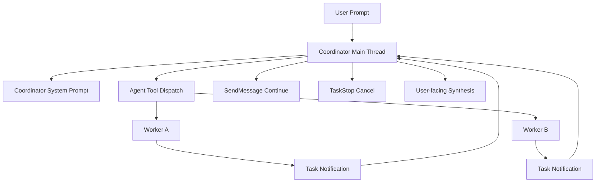

# COORDINATOR_MODE 深度分析

> **Source Commit**: `4b9d30f`
> **分析日期**: 2026-04-04
> **复杂度等级**: A-Tier
> **涉及文件数**: ~45
> **相关 Feature Flags**: `tengu_scratch`（协调器本体无独立运行期 gate，主要由环境变量驱动）

## 概述

COORDINATOR_MODE 的本质不是“多开几个 agent”，而是把主线程身份切到“编排器”：主线程负责拆解任务、并发调度、汇总结果，worker 负责执行与回传。该身份切换由 `isCoordinatorMode()` 读取 `CLAUDE_CODE_COORDINATOR_MODE` 决定，并在 session 恢复时由 `matchSessionMode()` 自动纠偏，避免“恢复后模式漂移”。（`src/coordinator/coordinatorMode.ts:isCoordinatorMode (L36)`, `src/coordinator/coordinatorMode.ts:matchSessionMode (L49)`）

系统提示词层面，协调器被明确约束为“只对用户说话”，把 worker 通知视为内部信号，并要求在同一轮里优先并发发车、禁止预测未返回结果。这个约束来自 369 行的 `getCoordinatorSystemPrompt()`，其内容直接替代默认系统提示词并进入主循环。（`src/coordinator/coordinatorMode.ts:getCoordinatorSystemPrompt (L111)`, `src/utils/systemPrompt.ts:buildEffectiveSystemPrompt (L41)`）

工具面上，协调器拿到的是受限工具池：主线程重点保留 Agent/SendMessage/TaskStop 等编排能力，具体过滤逻辑由 `applyCoordinatorToolFilter()` 与 `getTools()` 协同完成；worker 再由独立工具池组装，不继承主线程受限集合，从而形成“编排面收口、执行面放开”的双层结构。（`src/utils/toolPool.ts:applyCoordinatorToolFilter (L35)`, `src/tools.ts:getTools (L271)`, `src/tools/AgentTool/AgentTool.tsx:AgentTool.call (L239)`）

## 架构图

### 协调器-Worker 主链路（中文标题，英文节点）



图中 `Task Notification` 是回流关键：worker 结果以 `<task-notification>` 入队，协调器在后续轮次消费并继续调度，而不是在同轮“猜测结果”。（`src/coordinator/coordinatorMode.ts:getCoordinatorSystemPrompt (L111)`, `src/tasks/LocalAgentTask/LocalAgentTask.tsx:enqueueAgentNotification (L224)`, `src/query.ts:processPendingInput` 附近逻辑见 task-notification 过滤点（L1575））

## 核心文件清单

| 文件 | 角色 | 关键点 |
|---|---|---|
| `src/coordinator/coordinatorMode.ts` | 协调器模式内核 | 模式判定、恢复纠偏、worker context 注入、369 行系统提示词 |
| `src/utils/systemPrompt.ts` | 系统提示词装配 | 协调器提示词优先级高于默认 prompt |
| `src/tools/AgentTool/AgentTool.tsx` | worker 启动与续跑入口 | 协调器模式下 model 参数被抑制、异步任务注册、通知回流 |
| `src/tools/AgentTool/runAgent.ts` | worker 执行引擎 | runAgent 主循环、上下文继承、工具池应用 |
| `src/tools/AgentTool/resumeAgent.ts` | worker 生命周期延续 | 停止后自动 resume、转后台续跑 |
| `src/tools/SendMessageTool/SendMessageTool.ts` | 定向续跑/队列投递 | to=name/id 路由、running 时排队、stopped 时恢复 |
| `src/tools/TeamCreateTool/TeamCreateTool.ts` | team 上下文建立 | leader 唯一性、team/tasklist 同步初始化 |
| `src/tools/TeamDeleteTool/TeamDeleteTool.ts` | team 清理 | 活跃成员防误删、状态回收 |
| `src/utils/toolPool.ts` | 协调器工具过滤 | coordinator allowlist 与 PR 订阅工具白放行 |
| `src/tools.ts` | 全局工具编排 | simple/coordinator 组合路径、worker 工具来源 |
| `src/state/AppStateStore.ts` | 状态总线 | coordinatorTaskIndex、teamContext、workerPermission 队列 |
| `src/tasks/LocalAgentTask/LocalAgentTask.tsx` | worker 通知协议 | `<task-notification>` 结构化消息封装 |
| `src/utils/messages.ts` | 通知语义包装 | task-notification 转用户可读上下文前缀 |
| `src/utils/permissions/filesystem.ts` | scratchpad 能力开关 | `tengu_scratch` gate 与 scratchpad 路径计算 |
| `src/entrypoints/init.ts` | 启动期 scratchpad 初始化 | gate 打开时创建 scratchpad 目录 |

## 启动与初始化流程

1. **模式判定**：`isCoordinatorMode()` 在编译期开关开启后，实时读取 `CLAUDE_CODE_COORDINATOR_MODE`，无缓存。（`src/coordinator/coordinatorMode.ts:isCoordinatorMode (L36)`）
2. **会话恢复对齐**：恢复日志若记录为 coordinator，则 `matchSessionMode()` 反向修正环境变量并打点模式切换事件。（`src/coordinator/coordinatorMode.ts:matchSessionMode (L49)`）
3. **系统提示词切换**：`buildEffectiveSystemPrompt()` 在 coordinator 模式且非主线程 agent 时，直接采用 `getCoordinatorSystemPrompt()`，覆盖默认系统提示词。（`src/utils/systemPrompt.ts:buildEffectiveSystemPrompt (L41)`）
4. **用户上下文注入**：`getCoordinatorUserContext()` 把 worker 工具清单、MCP server 名称、以及可选 scratchpad 路径注入到 userContext，成为每轮可见约束。（`src/coordinator/coordinatorMode.ts:getCoordinatorUserContext (L80)`, `src/QueryEngine.ts:submitMessage (L209)`）
5. **scratchpad 启动创建**：若 gate 开启，入口初始化创建 session 级 scratchpad，随后协调器才会在上下文里提示该目录。（`src/utils/permissions/filesystem.ts:ensureScratchpadDir (L394)`, `src/entrypoints/init.ts:init (L202)`）

## 运行时行为

协调器运行时的核心行为是“异步 fan-out + 事件回流 + 定向续跑”。`AgentTool.call` 在协调器态会禁用 tool 侧 model override（保持默认模型策略），并将大部分 worker 任务走后台任务路径；完成后由 `enqueueAgentNotification()` 产出结构化 `<task-notification>`，再进入下一轮调度。（`src/tools/AgentTool/AgentTool.tsx:AgentTool.call (L239)`, `src/tasks/LocalAgentTask/LocalAgentTask.tsx:enqueueAgentNotification (L224)`）

并发上限在工具执行层由 `getMaxToolUseConcurrency()` 控制，默认值 10（可由 `CLAUDE_CODE_MAX_TOOL_USE_CONCURRENCY` 覆盖），这是协调器“并行能力”的硬阈值之一。（`src/services/tools/toolOrchestration.ts:getMaxToolUseConcurrency (L8)`）

worker 生命周期由“running→queued message→resume”三段式组成：SendMessage 在 worker 运行中写 pending 队列，worker 停止时自动触发 `resumeAgentBackground()`，避免重新冷启动上下文。（`src/tools/SendMessageTool/SendMessageTool.ts:call (L741)`, `src/tools/AgentTool/resumeAgent.ts:resumeAgentBackground (L42)`）

## Feature Flag 门控

本功能的分层门控机制不在此文重复展开，统一以 `../infra/20-feature-flag-arch.md` 为准。

与 COORDINATOR_MODE 直接相关的落地点是：编译期开关决定相关模块是否保留；运行期 scratchpad 能力由 `tengu_scratch` 影响。（`src/coordinator/coordinatorMode.ts:isScratchpadGateEnabled (L25)`, `src/utils/permissions/filesystem.ts:isScratchpadEnabled (L298)`）

> 本节仅做定位引用：详见 `../infra/20-feature-flag-arch.md`。

## 关键代码片段

### 1) 协调器模式判定与恢复纠偏
```ts
export function isCoordinatorMode(): boolean {
  if (feature('COORDINATOR_MODE')) {
    return isEnvTruthy(process.env.CLAUDE_CODE_COORDINATOR_MODE)
  }
  return false
}

export function matchSessionMode(sessionMode: 'coordinator' | 'normal' | undefined) {
  // ...flip env var and log switch event...
}
```
（`src/coordinator/coordinatorMode.ts:isCoordinatorMode (L36)`, `src/coordinator/coordinatorMode.ts:matchSessionMode (L49)`）

### 2) 协调器专用 userContext 注入
```ts
export function getCoordinatorUserContext(mcpClients, scratchpadDir?) {
  if (!isCoordinatorMode()) return {}
  // build worker tool list
  // append MCP server names
  // append scratchpad directory when gate enabled
  return { workerToolsContext: content }
}
```
（`src/coordinator/coordinatorMode.ts:getCoordinatorUserContext (L80)`）

### 3) 系统提示词优先级切换
```ts
if (
  feature('COORDINATOR_MODE') &&
  isEnvTruthy(process.env.CLAUDE_CODE_COORDINATOR_MODE) &&
  !mainThreadAgentDefinition
) {
  const { getCoordinatorSystemPrompt } = require('../coordinator/coordinatorMode.js')
  return asSystemPrompt([getCoordinatorSystemPrompt(), ...(appendSystemPrompt ? [appendSystemPrompt] : [])])
}
```
（`src/utils/systemPrompt.ts:buildEffectiveSystemPrompt (L41)`）

### 4) 协调器工具池过滤
```ts
export function applyCoordinatorToolFilter(tools: Tools): Tools {
  return tools.filter(
    t => COORDINATOR_MODE_ALLOWED_TOOLS.has(t.name) || isPrActivitySubscriptionTool(t.name),
  )
}
```
（`src/utils/toolPool.ts:applyCoordinatorToolFilter (L35)`）

### 5) 并发上限默认 10
```ts
function getMaxToolUseConcurrency(): number {
  return parseInt(process.env.CLAUDE_CODE_MAX_TOOL_USE_CONCURRENCY || '', 10) || 10
}
```
（`src/services/tools/toolOrchestration.ts:getMaxToolUseConcurrency (L8)`）

### 6) worker 完成通知封装为 task-notification
```ts
const message = `<task-notification>
<task-id>${taskId}</task-id>
<output_file>${outputPath}</output_file>
<status>${status}</status>
<summary>${summary}</summary>
</task-notification>`
enqueuePendingNotification({ value: message, mode: 'task-notification' })
```
（`src/tasks/LocalAgentTask/LocalAgentTask.tsx:enqueueAgentNotification (L224)`）

## 状态管理

协调器状态不是单字段，而是“调度选择 + 团队拓扑 + 权限请求”三层：

- `coordinatorTaskIndex`：用于键盘/焦点在 coordinator task panel 的选择状态，支撑“主线程与子任务”视图切换。（`src/state/AppStateStore.ts:AppState (L103)`）
- `teamContext`：持久记录 teamName、leadAgentId、teammates 元信息，是 TeamCreate/SendMessage/TaskList 协同的基础。（`src/state/AppStateStore.ts:AppState (L323)`, `src/tools/TeamCreateTool/TeamCreateTool.ts:call (L128)`）
- `agentNameRegistry`：name→agentId 映射，保障 SendMessage 可按人类可读名称路由到任务实体。（`src/state/AppStateStore.ts:AppState (L161)`, `src/tools/AgentTool/AgentTool.tsx:AgentTool.call (L703)`）
- `workerSandboxPermissions` 与 `pendingWorkerRequest`：把 worker 的权限申请显式排队，避免隐式放行。（`src/state/AppStateStore.ts:AppState (L363)`）

## 安全与权限模型

1. **主线程收口**：协调器工具池收敛到编排工具，减少“主线程直接执行高风险操作”的攻击面。（`src/utils/toolPool.ts:applyCoordinatorToolFilter (L35)`, `src/constants/tools.ts:COORDINATOR_MODE_ALLOWED_TOOLS (L107)`）
2. **worker 权限隔离**：worker 工具池在 `AgentTool.call` 中按 worker permission context 单独组装，不复用主线程工具限制，避免策略串扰。（`src/tools/AgentTool/AgentTool.tsx:AgentTool.call (L573)`, `src/tools.ts:assembleToolPool (L345)`）
3. **SendMessage 安全检查**：跨 session 的 bridge 地址需要显式 ask 权限，且 structured message 被限制，防止跨机会话注入扩大化。（`src/tools/SendMessageTool/SendMessageTool.ts:checkPermissions (L585)`, `src/tools/SendMessageTool/SendMessageTool.ts:validateInput (L604)`）
4. **scratchpad 目录边界**：scratchpad 仅在 gate 开启时生效，并通过路径归一化防 traversal 绕过。（`src/utils/permissions/filesystem.ts:isScratchpadEnabled (L298)`, `src/utils/permissions/filesystem.ts:isScratchpadPath (L409)`）

## 与其他功能的交互

COORDINATOR_MODE 与 KAIROS 的关键耦合点是 `AgentTool.call` 中的 `assistantForceAsync`，当 `kairosEnabled` 为真时也会强制异步 worker，从而保证主循环不被同步子任务长时间阻塞。（`src/tools/AgentTool/AgentTool.tsx:AgentTool.call (L559)`）
此外，系统提示词构建里 coordinator 分支优先于常规默认提示词分支，因此在同会话内具有更高指导优先级。（`src/utils/systemPrompt.ts:buildEffectiveSystemPrompt (L41)`）
二者并不是互相替代关系：一个定义“谁来编排”，一个定义“是否持续自治”。（`src/state/AppStateStore.ts:AppState (L116)`）

## 错误处理与恢复

- **任务方向错误可中断**：协调器可用 TaskStop 对在途 worker 终止，再通过 SendMessage 原 task_id 继续，减少上下文损失。（`src/coordinator/coordinatorMode.ts:getCoordinatorSystemPrompt (L235)`）
- **worker 失败后原地修复**：系统提示词明确要求失败优先继续同一 worker（保留错误上下文），而非盲目重开。（`src/coordinator/coordinatorMode.ts:getCoordinatorSystemPrompt (L229)`）
- **停止任务可自动续跑**：SendMessage 对 stopped/evicted task 会尝试 transcript resume，降低人工恢复成本。（`src/tools/SendMessageTool/SendMessageTool.ts:call (L823)`, `src/tools/AgentTool/resumeAgent.ts:resumeAgentBackground (L42)`）
- **通知通道统一**：所有后台完成/失败/停止状态都会归一到 `task-notification`，主线程消费路径单一，恢复逻辑更可预测。（`src/tasks/LocalAgentTask/LocalAgentTask.tsx:enqueueAgentNotification (L224)`, `src/utils/messages.ts:wrapCommandText (L5496)`）

## UI/UX

协调器 UI 的重点不是“酷炫展示”，而是“可操纵的并发面板”：`CoordinatorTaskPanel` 提供 main/agent 行切换、运行时长、token、queued 数可见化，支持 Enter 进入查看与 x 清理。（`src/components/CoordinatorAgentStatus.tsx:CoordinatorTaskPanel (L34)`）

`BackgroundTasksDialog` 在协调器态会使用灰指针与分组视图呈现 leader/teammate 层次，并把 task 类型统一映射为可选条目，减少多任务会话中的认知切换成本。（`src/components/tasks/BackgroundTasksDialog.tsx:Item (L552)`, `src/components/tasks/BackgroundTasksDialog.tsx:TeammateTaskGroups (L612)`）

## 限制与已知问题

1. **协调器无独立 runtime gate**：当前主要靠环境变量切换模式，缺少与模式本体直接绑定的运行期开关（仅 scratchpad 有独立 gate），灰度粒度偏粗。（`src/coordinator/coordinatorMode.ts:isCoordinatorMode (L36)`, `src/coordinator/coordinatorMode.ts:isScratchpadGateEnabled (L25)`）
2. **并发上限是全局常量语义**：默认 10 的并发控制在工具执行层统一生效，复杂任务高峰期可能需要依赖环境变量人工调节。（`src/services/tools/toolOrchestration.ts:getMaxToolUseConcurrency (L8)`）
3. **Team 结构为扁平 roster**：teammate 不能再 spawn teammate，层级协作被刻意限制，适合稳定编排但不适合深层组织树。（`src/tools/AgentTool/AgentTool.tsx:AgentTool.call (L266)`）
4. **跨会话 structured message 受限**：bridge/uds 路径下 structured message 被拒绝，只支持纯文本，协议表达能力有意收缩。（`src/tools/SendMessageTool/SendMessageTool.ts:validateInput (L631)`）

## 技术亮点

1. **369 行协调器提示词即“软编排引擎”**：把并发策略、失败恢复、continue/spawn 决策、通知协议统一成可执行指令面，显著降低 orchestration 走偏概率。（`src/coordinator/coordinatorMode.ts:getCoordinatorSystemPrompt (L111)`）
2. **“编排收口 + 执行放开”的双层工具池**：主线程过滤到编排工具，worker 再按独立上下文组装能力，兼顾可控性与执行力。（`src/utils/toolPool.ts:applyCoordinatorToolFilter (L35)`, `src/tools/AgentTool/AgentTool.tsx:AgentTool.call (L573)`）
3. **通知协议与恢复路径天然对齐**：task-notification、SendMessage、resume 三者闭环，让“中断后继续”成为默认路径而不是异常路径。（`src/tasks/LocalAgentTask/LocalAgentTask.tsx:enqueueAgentNotification (L224)`, `src/tools/SendMessageTool/SendMessageTool.ts:call (L823)`）
