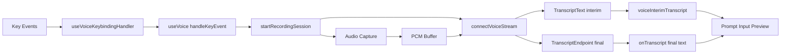

# VOICE_MODE 深度分析

> **Source Commit**: `4b9d30f`
> **分析日期**: 2026-04-04
> **复杂度等级**: A-Tier
> **涉及文件数**: ~38
> **相关 Feature Flags**: `tengu_amber_quartz_disabled`, `tengu_cobalt_frost`

## 概述

VOICE_MODE 是一个“按住说话（hold-to-talk）→ 实时转写 → 回填输入框”的端到端链路，不是单点录音功能。运行入口位于 `useVoiceIntegration` 与 `useVoice` 两层：前者负责键盘语义与输入框锚点，后者负责录音会话、STT 会话、最终提交与清理。（`src/hooks/useVoiceIntegration.tsx:useVoiceIntegration (L118)`, `src/hooks/useVoice.ts:useVoice (L199)`）

该能力的可见性与可用性被拆成三部分：命令注册/显示层、认证资格层、平台录音可用层。命令是否显示由 `/voice` 命令对象中的 `isEnabled/isHidden` 决定；真实可录音则依赖 `checkRecordingAvailability()` 动态探测。（`src/commands/voice/index.ts:voice.isEnabled (L12)`, `src/commands/voice/index.ts:voice.isHidden (L14)`, `src/services/voice.ts:checkRecordingAvailability (L259)`）

## 架构图

下面的图只描述已实现链路：键盘事件进入前端状态机，触发录音与 WebSocket 识别，结果以 interim/final 两段回写输入框。



图中节点对应实现：键位处理在 `useVoiceKeybindingHandler`，录音会话在 `startRecordingSession`，WebSocket STT 在 `connectVoiceStream`，最终 UI 回填在 `handleVoiceTranscript`。（`src/hooks/useVoiceIntegration.tsx:useVoiceKeybindingHandler (L373)`, `src/hooks/useVoice.ts:startRecordingSession (L633)`, `src/services/voiceStreamSTT.ts:connectVoiceStream (L111)`, `src/hooks/useVoiceIntegration.tsx:handleVoiceTranscript (L281)`）

## 核心文件清单

| 文件 | 关键职责 |
|---|---|
| `src/voice/voiceModeEnabled.ts` | VOICE_MODE 运行时总开关与鉴权判定 |
| `src/hooks/useVoiceEnabled.ts` | 用户意图 + 鉴权 + kill-switch 合并 |
| `src/hooks/useVoiceIntegration.tsx` | Hold-to-talk 按键识别、warmup、输入锚点 |
| `src/hooks/useVoice.ts` | 录音会话生命周期、重试、silent-drop replay |
| `src/services/voice.ts` | 录音后端选择（native/arecord/SoX） |
| `src/services/voiceStreamSTT.ts` | WebSocket STT 协议、finalize、KeepAlive |
| `src/services/voiceKeyterms.ts` | STT 关键词注入与裁剪 |
| `src/context/voice.tsx` | voice store（state/interim/levels/warmup） |
| `src/components/PromptInput/VoiceIndicator.tsx` | recording/processing 状态提示 |
| `src/components/TextInput.tsx` | 录音光标波形与静音阈值显示 |
| `src/commands/voice/voice.ts` | `/voice` 开关与预检流程 |
| `src/tools/ConfigTool/ConfigTool.ts` | `voiceEnabled` 配置写入时同等预检 |

文件分工可在实现中直接对齐：开关逻辑在 `isVoiceModeEnabled`，录音后端在 `startRecording`，协议层在 `connectVoiceStream`。（`src/voice/voiceModeEnabled.ts:isVoiceModeEnabled (L52)`, `src/services/voice.ts:startRecording (L335)`, `src/services/voiceStreamSTT.ts:connectVoiceStream (L111)`）

## 启动与初始化流程

1. 命令路径：用户执行 `/voice` 时，先做 `isVoiceModeEnabled()`，再依次检查录音可用、STT 可连、依赖存在、麦克风权限，全部通过才写入 `voiceEnabled=true`。（`src/commands/voice/voice.ts:call (L16)`, `src/commands/voice/voice.ts:call (L64)`, `src/commands/voice/voice.ts:call (L74)`, `src/commands/voice/voice.ts:call (L86)`, `src/commands/voice/voice.ts:call (L99)`, `src/commands/voice/voice.ts:call (L115)`）
2. 配置路径：ConfigTool 对 `voiceEnabled=true` 做同样预检，避免绕过 `/voice` 入口直接打开不可用状态。（`src/tools/ConfigTool/ConfigTool.ts:call (L232)`）
3. 运行路径：组件层通过 `useVoiceEnabled()` 组合用户意图、auth、kill-switch；录音逻辑按需 lazy load，不在普通输入场景提前拉起音频模块。（`src/hooks/useVoiceEnabled.ts:useVoiceEnabled (L19)`, `src/hooks/useVoice.ts:useEffect (L530)`）

## 运行时行为

`useVoice` 的状态机固定为 `idle -> recording -> processing -> idle`。`handleKeyEvent()` 在 `idle` 首次触发时立刻起会话，后续重复按键仅用于释放检测计时刷新。（`src/hooks/useVoice.ts:handleKeyEvent (L1022)`, `src/hooks/useVoice.ts:startRecordingSession (L633)`）

`finishRecording()` 不是同步收尾：它会先 `finalize()` 等服务端端点或超时，再汇总 transcript、上报指标、按条件提示错误。（`src/hooks/useVoice.ts:finishRecording (L322)`, `src/services/voiceStreamSTT.ts:connectVoiceStream.finalize (L239)`）

focus mode 也已实现：终端聚焦时自动开始，失焦或静音超时结束；超时阈值固定 5s。（`src/hooks/useVoice.ts:armFocusSilenceTimer (L542)`, `src/hooks/useVoice.ts:useEffect (L576)`）

## Feature Flag 门控

本功能遵循统一的三层门控，不在本文重复机制细节；仅做 VOICE_MODE 映射：

- 编译期是否打包语音分支；
- 运行期 kill-switch（`tengu_amber_quartz_disabled`）与参数化开关（如 `tengu_cobalt_frost`）；
- 资格层（登录态/订阅能力）与平台可用性。

完整机制请直接参考：`../infra/20-feature-flag-arch.md`。

## 关键代码片段

### 1) Triple Gate 合并（开关 + 资格）

```ts
// src/voice/voiceModeEnabled.ts
export function isVoiceModeEnabled(): boolean {
  return hasVoiceAuth() && isVoiceGrowthBookEnabled()
}
```

这里把“账号资格”与“远端开关”合并，命令层和公告层都复用同一判定。（`src/voice/voiceModeEnabled.ts:isVoiceModeEnabled (L52)`）

### 2) Linux 后端选择：优先 arecord，再 SoX

```ts
// src/services/voice.ts
if (
  process.platform === 'linux' &&
  hasCommand('arecord') &&
  (await probeArecord()).ok
) {
  return startArecordRecording(onData, onEnd)
}
return startSoxRecording(onData, onEnd, options)
```

`hasCommand` 只看 PATH，不代表可开设备；因此必须 probe。（`src/services/voice.ts:probeArecord (L75)`, `src/services/voice.ts:startRecording (L381)`）

### 3) STT 端点检测 + finalize 快速收敛

```ts
// src/services/voiceStreamSTT.ts
case 'TranscriptEndpoint': {
  if (finalized) {
    resolveFinalize?.('post_closestream_endpoint')
  }
  break
}
```

收到 endpoint 且已发 CloseStream 时，立即结束 finalize，避免额外等待 close 事件。（`src/services/voiceStreamSTT.ts:connectVoiceStream (L417)`）

## 状态管理

语音状态集中在 `VoiceContext`：`voiceState`、`voiceInterimTranscript`、`voiceAudioLevels`、`voiceWarmingUp` 四类核心字段分别服务于流程、文案、波形、warmup 提示。（`src/context/voice.tsx:VoiceState (L4)`）

`useVoiceIntegration` 通过 `voicePrefixRef/voiceSuffixRef` 维护插入锚点，确保转写文本插入光标位置而不是覆盖整行输入；并用 `lastSetInputRef` 防止用户提交后被晚到 transcript 回填覆盖。（`src/hooks/useVoiceIntegration.tsx:useVoiceIntegration (L118)`, `src/hooks/useVoiceIntegration.tsx:handleVoiceTranscript (L281)`）

## 安全与权限模型

权限面主要体现在“谁能开、何时报错”而非额外沙箱：

- 未登录时，命令与配置写入都返回明确引导 `/login`；
- 录音不可用时返回平台化错误（remote/WSL/缺少依赖）；
- 麦克风权限拒绝时返回平台化系统设置路径。（`src/commands/voice/voice.ts:call (L21)`, `src/services/voice.ts:checkRecordingAvailability (L259)`, `src/commands/voice/voice.ts:call (L99)`）

另外，命令对象把语音限制在 `availability: ['claude-ai']`，避免 API-key 路径误入。（`src/commands/voice/index.ts:voice (L11)`）

## 与其他功能的交互

1. 与 PromptInput：录音中由 `VoiceIndicator` 覆盖普通通知，processing 状态显示 shimmer 文案。（`src/components/PromptInput/Notifications.tsx:NotificationContent (L283)`, `src/components/PromptInput/VoiceIndicator.tsx:VoiceIndicatorImpl (L39)`）
2. 与 TextInput：录音期间光标替换为单柱波形，使用 `computeLevel` 结果驱动、静音阈值时灰色显示。（`src/components/TextInput.tsx:TextInput (L37)`, `src/hooks/useVoice.ts:computeLevel (L185)`）
3. 与 Keybinding：默认 `space` 绑定 `voice:pushToTalk`，且对“裸字母绑定”给出警告以降低误触与输入污染。（`src/keybindings/defaultBindings.ts:DEFAULT_BINDINGS (L96)`, `src/keybindings/validate.ts:validateBlock (L220)`）

## 错误处理与恢复

语音链路有三层恢复：

- 连接早错重试一次：在“尚无 transcript 且仍在 recording”时，250ms 回退后重连；
- silent-drop replay：`no_data_timeout + hadAudioSignal + wsConnected` 命中时，用缓存音频重放一次；
- finalize 多出口：endpoint/no-data/safety/ws-close 多路收敛，保证最终一定返回。（`src/hooks/useVoice.ts:attemptConnect.onError (L841)`, `src/hooks/useVoice.ts:finishRecording (L379)`, `src/services/voiceStreamSTT.ts:FinalizeSource (L60)`）

`unexpected-response` 分支会把 HTTP upgrade 拒绝直接转为错误，并标记 fatal（4xx）。这能和普通网络抖动区分开。（`src/services/voiceStreamSTT.ts:connectVoiceStream (L511)`）

## UI/UX

Hold-to-talk 交互分两类：

- 修饰键组合：首按即激活；
- 裸字符（如 space）：需达到阈值才激活，期间有 warmup，并执行 trailing 字符清理。（`src/hooks/useVoiceIntegration.tsx:useVoiceKeybindingHandler (L373)`, `src/hooks/useVoiceIntegration.tsx:stripTrailing (L152)`）

底部提示策略也做了节流：语音提示展示计数写入全局配置，避免每次会话都重复出现。（`src/components/PromptInput/PromptInputFooterLeftSide.tsx:ModeIndicator (L291)`, `src/components/LogoV2/VoiceModeNotice.tsx:VoiceModeNoticeInner (L23)`）

## 限制与已知问题

1. 真正的“降噪 DSP”在当前 CLI 侧未实现，现有策略是输入抑制、阈值判定与关键词增强，属于“流程降噪”而非声学降噪。（`src/hooks/useVoiceIntegration.tsx:useVoiceKeybindingHandler (L373)`, `src/components/TextInput.tsx:TextInput (L30)`, `src/services/voiceKeyterms.ts:getVoiceKeyterms (L63)`）
2. `arecord` 后端不支持内建静音检测，自动停录能力依赖其他后端路径。（`src/services/voice.ts:startArecordRecording (L468)`）
3. 绑定层已明确 `modifier+space` 与 chord 按住语义不可靠，验证器只给警告不做强拦截。（`src/hooks/useVoiceIntegration.tsx:useVoiceKeybindingHandler (L370)`, `src/keybindings/validate.ts:validateBlock (L220)`）
4. UI/UX 章节之外的“安全模型”没有独立鉴权中间件，主要依赖入口判定与错误分流；这是当前实现边界，不是缺失实现。N/A（独立策略引擎）。（`src/commands/voice/voice.ts:call (L16)`, `src/tools/ConfigTool/ConfigTool.ts:call (L232)`）

## 技术亮点

1. **Triple Gate 实用化**：开关、账号资格、平台录音能力三层同时命中才进入可用态，避免“按钮可见但不可用”。（`src/voice/voiceModeEnabled.ts:isVoiceModeEnabled (L52)`, `src/services/voice.ts:checkRecordingAvailability (L259)`）
2. **弱网与后端异常恢复链完整**：早错重试 + silent-drop replay + finalize 多出口，覆盖连接失败到无文本返回的关键故障面。（`src/hooks/useVoice.ts:finishRecording (L322)`, `src/hooks/useVoice.ts:attemptConnect.onError (L841)`, `src/services/voiceStreamSTT.ts:connectVoiceStream.finalize (L239)`）
3. **输入框一致性保护到位**：anchor + lastSetInputRef 组合显著降低“用户提交后被晚到转写覆盖”的竞态风险。（`src/hooks/useVoiceIntegration.tsx:useVoiceIntegration (L130)`, `src/hooks/useVoiceIntegration.tsx:handleVoiceTranscript (L287)`）
