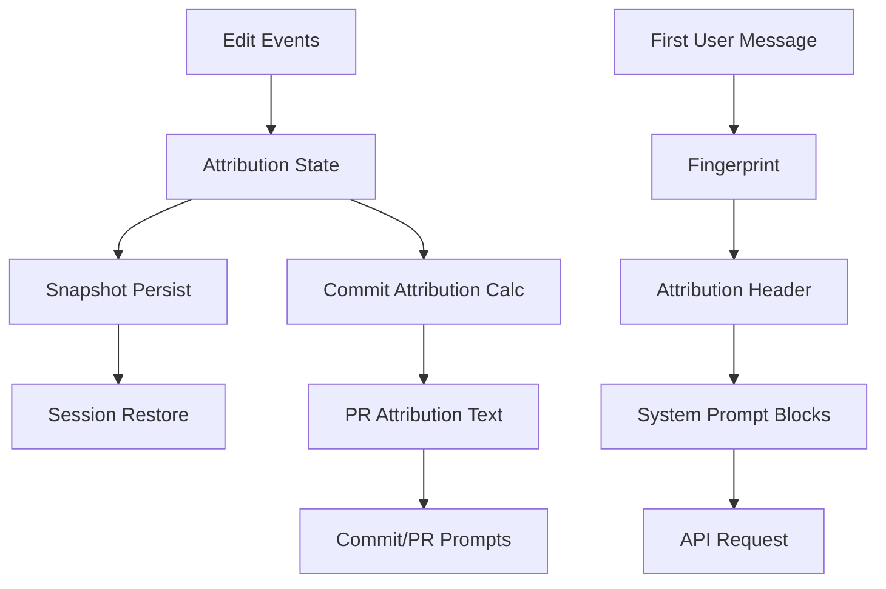

# ATTRIBUTION 深度分析

> **Source Commit**: `4b9d30f`
> **分析日期**: 2026-04-04
> **复杂度等级**: A-Tier
> **涉及文件数**: ~52
> **相关 Feature Flags**: `tengu_attribution_header`, `COMMIT_ATTRIBUTION`

## 概述

ATTRIBUTION 在这份代码快照里不是一个“单点功能”，而是一条横跨 **提示词注入、会话状态、API 头传递、提交文案拼装、恢复链路** 的闭环。其核心目标是两件事：

1. 在 **commit / PR 文本层** 提供可读归因（如 `Co-Authored-By` 或 PR summary）(src/utils/attribution.ts:getAttributionTexts (L52), src/commands/commit.ts:getPromptContent (L12), src/commands/commit-push-pr.ts:getPromptContent (L26))。
2. 在 **请求链路层** 提供机器可解析归因（`x-anthropic-billing-header`）并与指纹、入口点、workload 绑定 (src/constants/system.ts:getAttributionHeader (L73), src/services/api/claude.ts:queryModel (L1322), src/utils/sideQuery.ts:sideQuery (L107))。

值得强调：该系统中的“提交归因”主要是 **通过 prompt 约束驱动模型执行 git 命令时附带 trailer**，而不是一个统一的“提交前强制重写器”(src/commands/commit.ts:getPromptContent (L46), src/tools/BashTool/prompt.ts:getCommitAndPRInstructions (L81))。

## 架构图

下图给出 ATTRIBUTION 的主数据流：从会话侧累计贡献，到 commit/PR 文案拼装，再到 API 请求头透传。



图中 B/C/D 分别对应 `AttributionState`、`recordAttributionSnapshot`、`restoreAttributionStateFromSnapshots` (src/utils/commitAttribution.ts:createEmptyAttributionState (L306), src/utils/sessionStorage.ts:recordAttributionSnapshot (L1488), src/utils/commitAttribution.ts:restoreAttributionStateFromSnapshots (L899))；E/F/G 对应 `calculateCommitAttribution` 与 PR/commit 文案函数 (src/utils/commitAttribution.ts:calculateCommitAttribution (L548), src/utils/attribution.ts:getEnhancedPRAttribution (L297), src/utils/attribution.ts:getAttributionTexts (L52))；I/J/K/L 对应指纹与系统提示拼装路径 (src/services/api/claude.ts:queryModel (L1325), src/constants/system.ts:getAttributionHeader (L73), src/services/api/claude.ts:buildSystemPromptBlocks (L3213))。

## 核心文件清单

| 文件路径 | 职责 |
|---|---|
| `src/utils/commitAttribution.ts` | 贡献字符计算、聚合、快照序列化与恢复主实现 |
| `src/utils/attribution.ts` | commit/PR 文本归因、PR 增强摘要、转录统计 |
| `src/constants/system.ts` | attribution header 生成与 `tengu_attribution_header` 开关 |
| `src/services/api/claude.ts` | 主请求链路中注入 attribution header |
| `src/utils/sideQuery.ts` | side query 链路注入 attribution header |
| `src/utils/api.ts` | 系统提示分块时单独识别 billing header |
| `src/commands/commit.ts` | `/commit` 文本模板中插入 commit attribution |
| `src/commands/commit-push-pr.ts` | `/commit-push-pr` 同时拼 commit attribution 与增强 PR attribution |
| `src/tools/BashTool/prompt.ts` | 通用 git 操作指导中的 trailer 拼装规范 |
| `src/setup.ts` | 条件注册 attribution hooks（动态导入） |
| `src/screens/REPL.tsx` | 每次 prompt 递增 promptCount 并落盘 attribution snapshot |
| `src/cli/print.ts` | 非交互路径同样递增 promptCount 并落盘 |
| `src/utils/sessionRestore.ts` | 恢复时从 attribution snapshots 重建状态 |
| `src/utils/worktree.ts` | worktree 创建后尝试安装 prepare-commit-msg hook |

以上文件覆盖了“采集-存储-恢复-计算-呈现-传输”六个阶段 (src/utils/commitAttribution.ts:stateToSnapshotMessage (L872), src/utils/commitAttribution.ts:calculateCommitAttribution (L548), src/utils/attribution.ts:getEnhancedPRAttribution (L297), src/constants/system.ts:getAttributionHeader (L73))。

## 启动与初始化流程

初始化分三层：

1. **状态基线初始化**：应用状态中默认创建空 attribution state，保证后续工具调用可直接增量更新 (src/state/AppStateStore.ts:createInitialAppState (L511), src/main.tsx:initialState (L2993))。
2. **后台注册阶段**：当 `COMMIT_ATTRIBUTION` 可用时，`setup()` 会异步加载并注册 attribution hooks (src/setup.ts:setup (L350))。
3. **会话恢复阶段**：恢复逻辑会从已存储 snapshots 计算初始 attribution state，避免长会话中断后丢失累计贡献 (src/utils/sessionRestore.ts:computeRestoredAttributionState (L157), src/utils/commitAttribution.ts:restoreAttributionStateFromSnapshots (L899))。

关键点是：恢复使用“**最后一条快照覆盖式恢复**”而非快照求和，代码中有明确注释说明历史上曾出现过恢复时计数爆炸风险 (src/utils/commitAttribution.ts:restoreAttributionStateFromSnapshots (L904))。

## 运行时行为

运行态里，归因系统主要由三类事件推进：

- **文件改动事件**：`trackFileModification/trackBulkFileChanges/trackFileDeletion` 累计 Claude 的字符贡献 (src/utils/commitAttribution.ts:trackFileModification (L402), src/utils/commitAttribution.ts:trackBulkFileChanges (L489), src/utils/commitAttribution.ts:trackFileDeletion (L453))。
- **用户 prompt 事件**：每轮用户输入会 `incrementPromptCount`，并立刻持久化快照，确保 compact/中断后可恢复 `promptCount` (src/screens/REPL.tsx:handlePromptSubmit (L3377), src/cli/print.ts:message loop (L4110), src/utils/commitAttribution.ts:incrementPromptCount (L950))。
- **缓存维护事件**：compact 与 `/clear` 会清理 attribution 相关缓存，避免跨会话脏状态 (src/services/compact/postCompactCleanup.ts:postCompactCleanup (L71), src/commands/clear/caches.ts:clearSessionCaches (L104))。

短代码（贡献增量核心）如下：

```ts
// src/utils/commitAttribution.ts:computeFileModificationState (L325)
const oldChangedLen = oldContent.length - prefixEnd - suffixLen
const newChangedLen = newContent.length - prefixEnd - suffixLen
claudeContribution = Math.max(oldChangedLen, newChangedLen)

const existingContribution = existingState?.claudeContribution ?? 0
return {
  contentHash: computeContentHash(newContent),
  claudeContribution: existingContribution + claudeContribution,
  mtime,
}
```

## Feature Flag 门控

门控架构细节见：[`../infra/20-feature-flag-arch.md`](../infra/20-feature-flag-arch.md)。

针对 ATTRIBUTION，本快照可直接看到两类门控：

1. **请求头门控**：`getAttributionHeader()` 先检查环境变量，再读取 `tengu_attribution_header`，关闭时返回空字符串 (src/constants/system.ts:isAttributionHeaderEnabled (L52), src/constants/system.ts:getAttributionHeader (L73))。
2. **能力编译门控**：多处 `feature('COMMIT_ATTRIBUTION')` 保护 hooks 注册、PR trailer 增强、worktree hook 安装与 promptCount 快照逻辑 (src/setup.ts:setup (L350), src/utils/attribution.ts:getEnhancedPRAttribution (L383), src/utils/worktree.ts:setupWorktreeHooks (L603), src/screens/REPL.tsx:handlePromptSubmit (L3379))。

## Co-Authored-By trailer 注入机制与触发时机

`Co-Authored-By` 默认文本由 `getAttributionTexts()` 生成：

```ts
// src/utils/attribution.ts:getAttributionTexts (L79)
const defaultCommit = `Co-Authored-By: ${modelName} <noreply@anthropic.com>`
...
return { commit: settings.attribution.commit ?? defaultCommit, ... }
```

触发时机并不是“git 提交钩子强制注入”，而是三条 prompt 链路：

1. `/commit` 模板把 `commitAttribution` 放到 heredoc 示例尾部，指导模型提交时附带 trailer (src/commands/commit.ts:getPromptContent (L46))。
2. `/commit-push-pr` 也在提交示例里附带同样的 `commitAttribution` (src/commands/commit-push-pr.ts:getPromptContent (L82))。
3. 通用 Bash tool 的 git 指南模板同样把该 trailer 作为 commit message 末尾规范 (src/tools/BashTool/prompt.ts:getCommitAndPRInstructions (L107))。

因此这套机制属于“**提示词约束型注入**”，并非在 `git commit` 子进程层统一重写 message body。

## 贡献百分比计算算法

百分比计算由 `calculateCommitAttribution(states, stagedFiles)` 完成，流程可概括为：

1. 合并多状态的 `fileStates` 与 `sessionBaselines`（支持 Map 与序列化对象双形态）(src/utils/commitAttribution.ts:calculateCommitAttribution (L563))。
2. 对 staged files 并行处理，跳过 generated files (src/utils/commitAttribution.ts:calculateCommitAttribution (L617), src/utils/commitAttribution.ts:calculateCommitAttribution (L620))。
3. 文件级 `claudeChars/humanChars` 计算：
   - 有追踪状态：优先使用 `claudeContribution`。
   - 人工改动：用 `git diff --cached --stat` 估算，行数乘以 40 字符近似。
   - 删除文件：区分被追踪删除与未追踪删除两种路径。  
   (src/utils/commitAttribution.ts:calculateCommitAttribution (L656), src/utils/commitAttribution.ts:getGitDiffSize (L751), src/utils/commitAttribution.ts:isFileDeleted (L793))。
4. 全局百分比 `claudePercent = round(totalClaude / total * 100)`，并输出 `surfaceBreakdown` (src/utils/commitAttribution.ts:calculateCommitAttribution (L715), src/utils/commitAttribution.ts:calculateCommitAttribution (L720))。

算法实现有两个明显工程取舍：

- `git diff --stat` 近似法牺牲精确字符计数以换取性能与通用性 (src/utils/commitAttribution.ts:getGitDiffSize (L777))。
- 同长度替换（例如大小写改动）通过前后缀收缩检测真实改动区间，避免 `abs(lenDiff)=0` 误判 (src/utils/commitAttribution.ts:computeFileModificationState (L343))。

## git blame 相关能力（N/A）

N/A（未在 ATTRIBUTION 主实现中发现 `git blame` 参与归因计算）。

当前快照中，`git blame` 只出现在“只读命令允许列表/校验规则”相关代码，不参与 attribution 百分比算法、trailer 生成或 header 传输 (src/tools/BashTool/readOnlyValidation.ts:READONLY_COMMAND_REGEXES (L1522), src/utils/shell/readOnlyCommandValidation.ts:COMMAND_ALLOWLIST (L371))。

## attribution header 在 API 请求中的传递

主链路（`queryModel`）与 sideQuery 链路都在系统提示中注入 billing header：

```ts
// src/services/api/claude.ts:queryModel (L1360)
systemPrompt = asSystemPrompt([
  getAttributionHeader(fingerprint),
  getCLISyspromptPrefix(...),
  ...systemPrompt,
].filter(Boolean))
```

header 格式由 `getAttributionHeader()` 统一生成，包含 `cc_version`、`cc_entrypoint`，并可带 `cc_workload` (src/constants/system.ts:getAttributionHeader (L78), src/constants/system.ts:getAttributionHeader (L89))。当门控关闭时返回空字符串，从源头禁用注入 (src/constants/system.ts:getAttributionHeader (L74))。

在 system prompt 拆分时，`x-anthropic-billing-header` 被单独识别并设为 `cacheScope: null`，避免与其他提示块共用缓存策略：

```ts
// src/utils/api.ts:splitSysPromptPrefix (L418)
if (block.startsWith('x-anthropic-billing-header')) {
  attributionHeader = block
}
...
if (attributionHeader)
  result.push({ text: attributionHeader, cacheScope: null })
```

sideQuery 路径同样先算 fingerprint，再把 attribution header 放进独立 text block，注释里明确强调这样可避免服务端误把系统提示正文吞进 `cc_entrypoint` 解析 (src/utils/sideQuery.ts:sideQuery (L139), src/utils/sideQuery.ts:sideQuery (L146))。

## 与 git commit 流程的集成点

集成点有“文案引导层”与“仓库辅助层”两部分：

1. **文案引导层**
   - `/commit`：约束模型先看 `git status/git diff/git log`，再按 heredoc 提交，末尾带 attribution（若存在）(src/commands/commit.ts:getPromptContent (L20), src/commands/commit.ts:getPromptContent (L49))。
   - `/commit-push-pr`：同样在 commit 样例追加 attribution，同时 PR body 可接入增强归因摘要 (src/commands/commit-push-pr.ts:getPromptContent (L82), src/commands/commit-push-pr.ts:getPromptForCommand (L121))。
   - Bash 全局 git 指南：给“直接让助手 commit/开 PR”的路径补同一规则，减少入口分叉造成的归因缺失 (src/tools/BashTool/prompt.ts:getCommitAndPRInstructions (L81), src/tools/BashTool/prompt.ts:getCommitAndPRInstructions (L127))。

2. **仓库辅助层**
   - worktree 初始化时会尝试安装 `prepare-commit-msg` 归因 hook（通过动态导入模块执行），用于提升 worktree 场景的一致性 (src/utils/worktree.ts:setupWorktreeHooks (L603), src/utils/worktree.ts:setupWorktreeHooks (L609))。
   - compact/clear 会清除 attribution 缓存，降低“旧状态污染新提交”的风险 (src/services/compact/postCompactCleanup.ts:postCompactCleanup (L71), src/commands/clear/caches.ts:clearSessionCaches (L105))。

## 状态持久化与恢复

ATTRIBUTION 的可持续性依赖 `AttributionSnapshotMessage`：

- 类型定义里包含 `fileStates` 以及 prompt/permission/escape 计数器，足够支撑提交摘要与行为统计 (src/types/logs.ts:AttributionSnapshotMessage (L208))。
- `incrementPromptCount()` 在更新计数后立即生成快照消息并交给调用方落盘 (src/utils/commitAttribution.ts:incrementPromptCount (L950), src/utils/commitAttribution.ts:stateToSnapshotMessage (L872))。
- REPL 与 print 两条输入路径都执行相同的“计数+持久化”策略，避免交互与非交互行为偏差 (src/screens/REPL.tsx:handlePromptSubmit (L3379), src/cli/print.ts:message loop (L4112))。
- 恢复时读取最后快照作为全量状态，避免对历史快照进行累加导致指数膨胀 (src/utils/commitAttribution.ts:restoreAttributionStateFromSnapshots (L904))。

这个设计让归因数据在长会话、compact、resume 后依旧连贯。

## 限制与已知问题

1. **源码快照缺口**：`setup.ts` 与 `worktree.ts` 中动态导入的 attribution 相关模块文件并未出现在当前快照中，导致 hook 安装/回调细节不可直接审计 (src/setup.ts:setup (L355), src/utils/worktree.ts:setupWorktreeHooks (L606))。
2. **提交 trailer 依赖模型遵循提示词**：`Co-Authored-By` 主要靠 prompt 模板约束，不是统一的提交消息拦截器，因此存在“模型未按模板输出”的理论偏差空间 (src/commands/commit.ts:getPromptContent (L46), src/tools/BashTool/prompt.ts:getCommitAndPRInstructions (L119))。
3. **人类改动估算是近似值**：`getGitDiffSize` 按行变更乘固定系数估算字符数，不是 AST/逐字符精算 (src/utils/commitAttribution.ts:getGitDiffSize (L777))。
4. **N/A 能力边界**：当前 attribution 主流程没有把 `git blame` 作为归因输入，这意味着“历史作者追责”与“当前会话贡献估算”是两条独立能力线。

## 技术亮点

1. **同长度替换识别**：通过前后缀收缩计算改动区间，修复传统 `lenDiff` 算法对等长替换失真问题 (src/utils/commitAttribution.ts:computeFileModificationState (L343))。
2. **双链路一致注入**：主查询与 sideQuery 都统一注入 attribution header，降低“旁路请求无归因”的可观测性断点 (src/services/api/claude.ts:queryModel (L1360), src/utils/sideQuery.ts:sideQuery (L144))。
3. **快照恢复防爆炸**：明确采用“最后快照覆盖”避免累计恢复，属于处理长会话数值稳定性的关键工程修正 (src/utils/commitAttribution.ts:restoreAttributionStateFromSnapshots (L904))。
