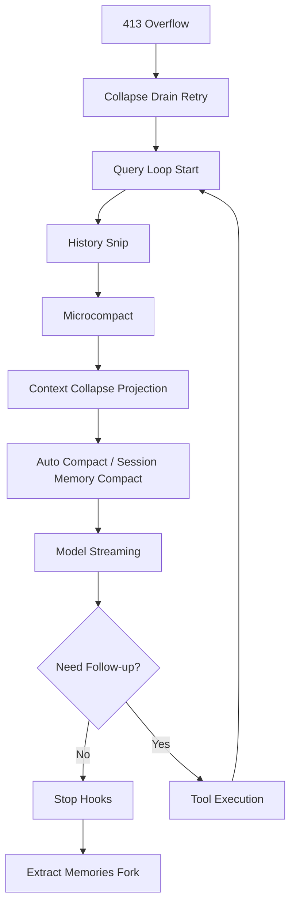

# CONTEXT_MGMT 深度分析

> **Source Commit**: `4b9d30f`
> **分析日期**: 2026-04-04
> **复杂度等级**: A-Tier
> **涉及文件数**: ~32
> **相关 Feature Flags**: `tengu_cobalt_raccoon`, `tengu_passport_quail`, `tengu_bramble_lintel`, `tengu_moth_copse`, `tengu_slate_thimble`

## 概述

CONTEXT_MGMT 不是单一模块，而是 query 主循环中的四段式上下文治理链：先做 **HISTORY_SNIP**（历史裁剪），再做 **TOKEN_BUDGET 相关工具结果预算与续跑决策**，并在中段插入 **CONTEXT_COLLAPSE / microcompact / autocompact** 的多级压缩，最终在 stop hooks 阶段触发 **EXTRACT_MEMORIES** 将高价值信息写入持久记忆目录。这个顺序由 `queryLoop` 明确编码，而不是“按需随机触发”。(src/query.ts:queryLoop (L396-L447), src/query.ts:queryLoop (L1267-L1357), src/query/stopHooks.ts:handleStopHooks (L65-L157))

从实现形态看，四个子系统分别解决不同问题域：

- CONTEXT_COLLAPSE：在发送 API 前对上下文视图做可恢复投影，并在 413 溢出时尝试“先排空 collapse 提交队列、再重试”。(src/query.ts:queryLoop (L429-L447), src/query.ts:queryLoop (L1085-L1116))
- HISTORY_SNIP：在保留 UI 历史的前提下，对“模型可见历史”做投影裁剪，且 SDK 回放路径提供 snip 边界重放，避免僵尸标记反复触发。(src/query.ts:queryLoop (L396-L410), src/utils/messages.ts:getMessagesAfterCompactBoundary (L4635-L4655), src/QueryEngine.ts:snipReplay hook path (L898-L913, L1276-L1282))
- TOKEN_BUDGET：以每轮输出 token 预算驱动“继续工作”或“停止”的自动判断，避免在接近目标前过早总结。(src/query/tokenBudget.ts:checkTokenBudget (L45-L93), src/query.ts:queryLoop (L1308-L1354), src/bootstrap/state.ts:snapshotOutputTokensForTurn (L733-L742))
- EXTRACT_MEMORIES：在主回合结束后异步 fork 子代理，按权限白名单读取/归纳/写入 memory 文件，并用节流与并发合并避免抖动。(src/query/stopHooks.ts:handleStopHooks (L141-L153), src/services/extractMemories/extractMemories.ts:initExtractMemories (L296-L327), src/services/extractMemories/extractMemories.ts:runExtraction (L329-L523))

## 架构图



上图对应真实调用顺序：snip → microcompact → collapse projection → autocompact 都发生在 `queryLoop` 的同一轮请求准备阶段，stop hooks（含 memory extraction）发生在“无 follow-up 工具调用”的尾段。(src/query.ts:queryLoop (L396-L447, L1062-L1074, L1267-L1276), src/query/stopHooks.ts:handleStopHooks (L65-L157))

## 核心文件清单

| 文件路径 | 角色 |
|---|---|
| `src/query.ts` | 四子系统编排主干（snip/microcompact/collapse/autocompact + token budget） |
| `src/query/tokenBudget.ts` | token 预算决策状态机 |
| `src/utils/tokenBudget.ts` | 预算文本解析与 continuation 提示模板 |
| `src/bootstrap/state.ts` | 每轮预算快照与 continuation 计数 |
| `src/services/compact/autoCompact.ts` | 自动压缩阈值、禁用条件、失败熔断 |
| `src/services/compact/compact.ts` | 全量/部分压缩执行、后处理附件重建 |
| `src/services/compact/microCompact.ts` | cached/time-based microcompact、`cache_edits` 预处理 |
| `src/services/compact/postCompactCleanup.ts` | 压缩后状态清理与重置 |
| `src/services/api/claude.ts` | `cache_edits` 注入、cache_reference 放置与去重 |
| `src/services/api/promptCacheBreakDetection.ts` | microcompact/compaction 的缓存读数误报抑制 |
| `src/utils/messages.ts` | compact 边界切片 + snip 投影过滤 |
| `src/QueryEngine.ts` | SDK 路径下 snip 边界重放 |
| `src/query/stopHooks.ts` | stop hooks 触发 EXTRACT_MEMORIES |
| `src/services/extractMemories/extractMemories.ts` | 记忆提取主流程（fork agent + gate + throttle） |
| `src/services/extractMemories/prompts.ts` | 提取提示词构建 |
| `src/memdir/paths.ts` | extract mode gate（含 non-interactive flag） |
| `src/memdir/memdir.ts` | `tengu_moth_copse` 跳过 MEMORY.md 相关分支 |

以上路径均为本仓库可解析文件；本快照里存在 `contextCollapse/index.js` 的调用点，但其源码目录未落入当前 snapshot，因此下文仅分析“可观察行为与接口契约”。(src/query.ts:queryLoop (L18-L20, L441-L447), src/services/compact/postCompactCleanup.ts:runPostCompactCleanup (L42-L49))

## 启动与初始化流程

此能力族并非一次性“启动开关”，而是在每轮 query 的 setup 阶段按固定次序初始化运行态：

1. 从历史切片开始，先拿到 compact boundary 之后的可见消息集合（默认还会过滤 snipped）。(src/utils/messages.ts:getMessagesAfterCompactBoundary (L4632-L4655))
2. 对工具结果应用预算替换，再进入 snip 计算，记录 `snipTokensFreed` 供后续阈值判断使用。(src/query.ts:queryLoop (L369-L406))
3. 执行 microcompact（可能返回 pending cache edits），再执行 collapse projection（若可用）。(src/query.ts:queryLoop (L412-L447))
4. 执行 autocompact（含 session memory compact 优先分支），必要时替换当前上下文为 post-compact messages。(src/query.ts:queryLoop (L453-L536), src/services/compact/autoCompact.ts:autoCompactIfNeeded (L287-L333))
5. 当模型本轮无需后续工具调用时，执行 stop hooks，并在满足条件时异步触发 extract memories。(src/query.ts:queryLoop (L1062-L1276), src/query/stopHooks.ts:handleStopHooks (L141-L153))

这条链路意味着 CONTEXT_MGMT 是“循环内治理”，不是命令式附加功能。

## 运行时行为

### 1) CONTEXT_COLLAPSE（紧急压缩）

- 常态路径：在每轮请求前调用 `applyCollapsesIfNeeded` 生成投影视图，用以降低后续请求的上下文压力。(src/query.ts:queryLoop (L440-L447))
- 溢出恢复路径：若收到被抑制的 413，先调用 `recoverFromOverflow` 尝试提交 staged collapses；若提交成功立即以新消息集重试，不立刻落入 reactive compact。(src/query.ts:queryLoop (L1085-L1116))
- 与 autocompact 的关系：当 collapse 模式“拥有上下文管理”时，阻止 blocking-limit 预拦截，让真实 API 413 触发 collapse/recovery 链路。(src/query.ts:queryLoop (L609-L647))

### 2) HISTORY_SNIP（历史修剪）

- 触发位置在 microcompact 之前，输出 `tokensFreed` 参与后续 autocompact 阈值判断，避免“已裁剪但估算仍超阈值”的误判。(src/query.ts:queryLoop (L396-L406), src/services/compact/autoCompact.ts:shouldAutoCompact (L164-L167, L225-L239))
- REPL/SDK 分离策略：UI 保留完整滚动历史，而模型路径通过 `getMessagesAfterCompactBoundary` 默认过滤 snipped 消息。(src/utils/messages.ts:getMessagesAfterCompactBoundary (L4635-L4655))
- SDK 防僵尸边界：QueryEngine 在收到 snip boundary 系统消息时会回放 snip 结果并覆写 `mutableMessages`，否则边界会反复重放并造成内存增长。(src/QueryEngine.ts:snip replay block (L898-L913), src/QueryEngine.ts:engine config injection (L1276-L1282))

### 3) TOKEN_BUDGET（预算分配）

- 预算状态由 `BudgetTracker` 维护 continuation 次数、上次增量和起始时间；当 `<90%` 且非收益递减时继续推进，否则停止并记录完成事件。(src/query/tokenBudget.ts:createBudgetTracker (L13-L20), src/query/tokenBudget.ts:checkTokenBudget (L45-L93))
- 收益递减判定：当 continuation ≥3 且连续两次增量都小于 500 tokens 时触发 early stop。(src/query/tokenBudget.ts:checkTokenBudget (L59-L63, L78-L88))
- 执行层会注入 meta user message 继续工作提示，并递增全局 continuation 计数；完成时上报 `tengu_token_budget_completed`。(src/query.ts:queryLoop (L1308-L1354), src/bootstrap/state.ts:incrementBudgetContinuationCount (L741-L742))
- 预算文本由系统提示和用户输入解析联动：系统提示声明“目标是 hard minimum”；输入端支持 `+500k` / `spend 2M tokens` 解析。(src/constants/prompts.ts:token_budget section (L538-L549), src/utils/tokenBudget.ts:parseTokenBudget (L21-L29))

### 4) EXTRACT_MEMORIES（自动记忆提取）

- 触发条件：仅主代理、extract mode 开启、非 remote、auto-memory 开启，且 stop hooks 结束阶段 fire-and-forget 调用。(src/query/stopHooks.ts:handleStopHooks (L141-L153), src/services/extractMemories/extractMemories.ts:executeExtractMemoriesImpl (L531-L552), src/memdir/paths.ts:isExtractModeActive (L69-L77))
- 执行方式：使用 `runForkedAgent` 共享主会话缓存上下文，限制最多 5 turns，避免验证型“无限打磨”。(src/services/extractMemories/extractMemories.ts:runExtraction (L415-L427))
- 并发控制：若 extraction 正在运行，新请求只保留最新 context 作为 trailing run，避免堆积多个并发提取。(src/services/extractMemories/extractMemories.ts:executeExtractMemoriesImpl (L554-L564), src/services/extractMemories/extractMemories.ts:runExtraction finally (L506-L521))

## Feature Flag 门控

本节只给出 CONTEXT_MGMT 对门控层的“消费关系”，不重复机制细节；完整三层架构见：`../infra/20-feature-flag-arch.md`。

- CONTEXT_COLLAPSE 路径在 query 与 autocompact 里都有条件门控分支。(src/query.ts:queryLoop (L18-L20, L440-L447), src/services/compact/autoCompact.ts:shouldAutoCompact (L215-L223))
- EXTRACT_MEMORIES 通过 stop hook 条件与 `isExtractModeActive` 双重约束；`tengu_slate_thimble` 决定非交互场景是否允许提取。(src/query/stopHooks.ts:handleStopHooks (L141-L145), src/memdir/paths.ts:isExtractModeActive (L69-L77))
- 抽取节流由 `tengu_bramble_lintel` 控制，每 N 个 eligible turns 执行一次（trailing run 跳过节流）。(src/services/extractMemories/extractMemories.ts:runExtraction (L374-L385, L516-L520))
- `tengu_moth_copse` 参与“是否跳过 MEMORY.md 索引更新”的行为分支，提取提示词会感知该参数。(src/services/extractMemories/extractMemories.ts:runExtraction (L366-L413), src/memdir/memdir.ts (L423))

## 关键代码片段

### 1) query 主循环中的四段治理顺序
```ts
// src/query.ts:queryLoop (L396-L447)
let snipTokensFreed = 0
if (feature('HISTORY_SNIP')) {
  const snipResult = snipModule!.snipCompactIfNeeded(messagesForQuery)
  messagesForQuery = snipResult.messages
  snipTokensFreed = snipResult.tokensFreed
}

const microcompactResult = await deps.microcompact(messagesForQuery, toolUseContext, querySource)
messagesForQuery = microcompactResult.messages

if (feature('CONTEXT_COLLAPSE') && contextCollapse) {
  const collapseResult = await contextCollapse.applyCollapsesIfNeeded(messagesForQuery, toolUseContext, querySource)
  messagesForQuery = collapseResult.messages
}
```

### 2) 413 时优先 drain collapse 再重试
```ts
// src/query.ts:queryLoop (L1085-L1116)
if (isWithheld413 && feature('CONTEXT_COLLAPSE') && contextCollapse) {
  const drained = contextCollapse.recoverFromOverflow(messagesForQuery, querySource)
  if (drained.committed > 0) {
    state = { ...state, messages: drained.messages, transition: { reason: 'collapse_drain_retry', committed: drained.committed } }
    continue
  }
}
```

### 3) TOKEN_BUDGET 决策与续跑
```ts
// src/query/tokenBudget.ts:checkTokenBudget (L59-L88)
const isDiminishing =
  tracker.continuationCount >= 3 &&
  deltaSinceLastCheck < DIMINISHING_THRESHOLD &&
  tracker.lastDeltaTokens < DIMINISHING_THRESHOLD

if (!isDiminishing && turnTokens < budget * COMPLETION_THRESHOLD) {
  tracker.continuationCount++
  return { action: 'continue', nudgeMessage: getBudgetContinuationMessage(pct, turnTokens, budget), ... }
}
```

### 4) memory extraction 的节流与 trailing run
```ts
// src/services/extractMemories/extractMemories.ts:runExtraction (L374-L385, L506-L521)
if (!isTrailingRun) {
  turnsSinceLastExtraction++
  if (turnsSinceLastExtraction < (getFeatureValue_CACHED_MAY_BE_STALE('tengu_bramble_lintel', null) ?? 1)) {
    return
  }
}
turnsSinceLastExtraction = 0

// finally: if pendingContext exists, run trailing extraction once
```

### 5) cached microcompact 生成待注入编辑块
```ts
// src/services/compact/microCompact.ts:cachedMicrocompactPath (L332-L394)
const toolsToDelete = mod.getToolResultsToDelete(state)
if (toolsToDelete.length > 0) {
  const cacheEdits = mod.createCacheEditsBlock(state, toolsToDelete)
  if (cacheEdits) pendingCacheEdits = cacheEdits
  return {
    messages,
    compactionInfo: { pendingCacheEdits: { trigger: 'auto', deletedToolIds: toolsToDelete, baselineCacheDeletedTokens: baseline } },
  }
}
```

### 6) API 层将 pending edits 与 pinned edits 拼回请求
```ts
// src/services/api/claude.ts:addCacheBreakpoints (L3127-L3166)
for (const pinned of pinnedEdits ?? []) {
  insertBlockAfterToolResults(msg.content, dedupedBlock)
}
if (newCacheEdits) {
  insertBlockAfterToolResults(msg.content, dedupedNewEdits)
  pinCacheEdits(i, newCacheEdits)
}
// then add cache_reference before last cache_control
```

## 状态管理

CONTEXT_MGMT 的关键状态不是集中在单 store，而是“短生命周期 + 模块局部状态”组合：

- Query loop 状态：`State` 结构携带 `autoCompactTracking`、`hasAttemptedReactiveCompact`、`transition` 等跨迭代控制变量。(src/query.ts:State type (L204-L217), src/query.ts:queryLoop (L268-L279))
- Token budget 状态：`BudgetTracker` 内含 continuation 与增量信息；全局侧还维护 `currentTurnTokenBudget` 与 `budgetContinuationCount`。(src/query/tokenBudget.ts:BudgetTracker (L6-L11), src/bootstrap/state.ts:snapshotOutputTokensForTurn (L724-L742))
- Microcompact 状态：`cachedMCState` 与 `pendingCacheEdits` 保存在模块级，成功后由 API 层消费并清空 pending，再把新 edits pin 回 state。(src/services/compact/microCompact.ts:state vars (L56-L61), src/services/compact/microCompact.ts:consumePendingCacheEdits (L88-L94), src/services/api/claude.ts:paramsFromContext prelude (L1528-L1533))
- Extract memories 状态：通过 `initExtractMemories()` 创建 closure（cursor、inProgress、pendingContext），避免全局污染并提升可测试性。(src/services/extractMemories/extractMemories.ts:initExtractMemories (L296-L327))

## 安全与权限模型

EXTRACT_MEMORIES 的安全边界非常明确：

1. 工具许可白名单：仅允许 read-only 查询类工具、只读 Bash，以及限定目录下的 edit/write。(src/services/extractMemories/extractMemories.ts:createAutoMemCanUseTool (L171-L221))
2. Bash 二次校验：不是按命令字符串粗暴放行，而是走 `tool.inputSchema.safeParse` + `tool.isReadOnly()`。(src/services/extractMemories/extractMemories.ts:createAutoMemCanUseTool (L193-L200))
3. 路径边界：写入必须命中 `isAutoMemPath`，而 auto-memory 根目录解析包含绝对路径、根路径、UNC、空字节等防护。(src/services/extractMemories/extractMemories.ts:createAutoMemCanUseTool (L206-L220), src/memdir/paths.ts:validateMemoryPath (L96-L149))
4. 运行域限制：remote mode、subagent、非激活 extract mode 场景均不会触发提取。(src/services/extractMemories/extractMemories.ts:executeExtractMemoriesImpl (L531-L552), src/query/stopHooks.ts:handleStopHooks (L141-L145))

## 与其他功能的交互

- 与 prompt cache 诊断交互：microcompact 触发删除后会调用 `notifyCacheDeletion`，避免后续 cache read 下降被误报为 cache break。(src/services/compact/microCompact.ts:cachedMicrocompactPath (L361-L367), src/services/api/promptCacheBreakDetection.ts:notifyCacheDeletion (L669-L682))
- 与 compaction 清理交互：任何 compaction 完成后都会 reset microcompact state，并按 main-thread 条件清理 collapse 与 memory cache。(src/services/compact/postCompactCleanup.ts:runPostCompactCleanup (L31-L61))
- 与 task_budget API 参数交互：query loop 维护 `taskBudgetRemaining`，在 compaction 边界上扣减“压缩前最终上下文窗口”以维持跨压缩累计预算一致性。(src/query.ts:queryLoop (L282-L291, L504-L515, L1135-L1145))
- 与 stop hook 生态交互：extract memories 作为 stop hooks 尾段的后台工作，与 prompt suggestion/auto dream 同时并行发起。(src/query/stopHooks.ts:handleStopHooks (L133-L156))

## 错误处理与恢复

CONTEXT_MGMT 的恢复策略呈“分层兜底”结构：

1. 先本地恢复：413 时优先 `recoverFromOverflow`，成功则直接重试，不触发更重的全量压缩。(src/query.ts:queryLoop (L1085-L1116))
2. 再 reactive compact：若本地 drain 不足，则进入 reactive compact 路径；仍失败则直接透传错误并执行 stop-failure hooks，避免死循环。(src/query.ts:queryLoop (L1119-L1183))
3. autocompact 熔断：连续失败达到阈值（3）后停止自动重试，防止每轮都打 doomed 请求。(src/services/compact/autoCompact.ts:autoCompactIfNeeded (L257-L265, L341-L349))
4. extraction best-effort：extract memories 出错只打日志和事件，不中断主对话流程。(src/services/extractMemories/extractMemories.ts:runExtraction (L497-L503))

## UI/UX

CONTEXT_MGMT 的 UI 反馈以“低打扰状态提示”为主，而非高频弹窗：

- microcompact 边界消息：当收到真实 `cache_deleted_input_tokens` 增量时，才生成 `microcompact_boundary` 系统消息，避免用户看到估算值噪音。(src/query.ts:queryLoop (L866-L891), src/utils/messages.ts:createMicrocompactBoundaryMessage (L4557-L4583))
- token budget 续跑文案：采用固定格式提醒“继续工作，不要总结”，并带实时百分比与绝对值。(src/utils/tokenBudget.ts:getBudgetContinuationMessage (L66-L73), src/query.ts:queryLoop (L1318-L1329))
- token warning 侧：阈值与 blocking limit 的计算来自 `calculateTokenWarningState`，UI 只读状态，不重复推导逻辑。(src/services/compact/autoCompact.ts:calculateTokenWarningState (L93-L144), src/components/TokenWarning.tsx (L19, L156))

## 限制与已知问题

1. **CONTEXT_COLLAPSE 源文件缺失**：当前 snapshot 可见调用接口（`applyCollapsesIfNeeded` / `recoverFromOverflow`），但实现目录未包含在仓库中，因此无法下钻其内部算法，仅能基于调用语义分析。(src/query.ts:queryLoop (L18-L20, L441-L447, L1094-L1098))
2. **HISTORY_SNIP 实现体同样不可见**：`snipCompactIfNeeded` 与 `snipProjection` 被调用，但对应 require 目标仅以字符串路径出现，源码文件不在当前快照内。(src/query.ts:queryLoop (L115-L117, L403-L406), src/utils/messages.ts:getMessagesAfterCompactBoundary (L4648-L4653))
3. **跨路径状态共享风险需要靠约定**：post-compact cleanup 用 querySource 判定“是否 main thread”来决定是否 reset module-level 状态，错误调用会污染主线程状态。(src/services/compact/postCompactCleanup.ts:runPostCompactCleanup (L31-L49))

## 技术亮点

1. **分层降压链路**：snip、microcompact、collapse、autocompact 串联在同一轮请求前，且 413 恢复优先走最小破坏路径（collapse drain）。(src/query.ts:queryLoop (L396-L447, L1085-L1116))
2. **prefix cache 保护式压缩**：通过“消息不改写 + API 层注入编辑块 + pinned edits 重放”实现对旧工具结果的选择性删除，兼顾语义与缓存命中。(src/services/compact/microCompact.ts:cachedMicrocompactPath (L335-L394), src/services/api/claude.ts:addCacheBreakpoints (L3127-L3203))
3. **提取子代理的工程化约束**：权限白名单、节流、并发合并、best-effort 错误策略四者组合，使 EXTRACT_MEMORIES 能后台运行而不破坏主会话稳定性。(src/services/extractMemories/extractMemories.ts:createAutoMemCanUseTool (L171-L221), src/services/extractMemories/extractMemories.ts:runExtraction (L374-L385, L497-L521))
