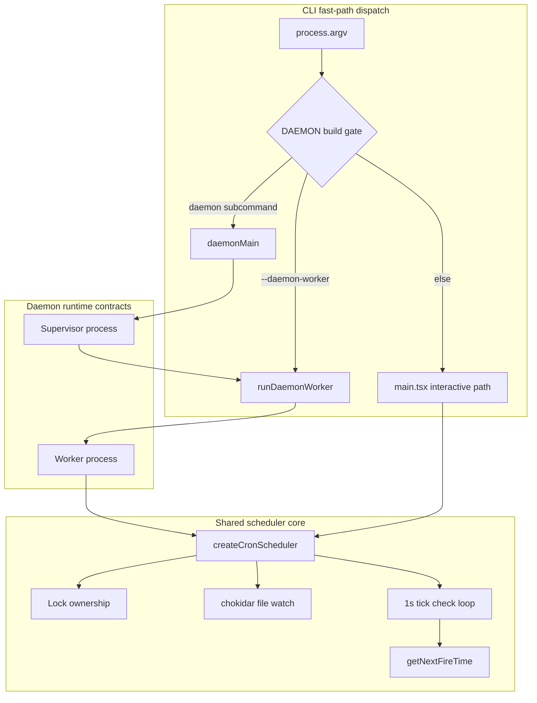

# DAEMON 深度分析

> **Source Commit**: `4b9d30f`
> **分析日期**: 2026-04-04
> **复杂度等级**: A-Tier
> **涉及文件数**: ~29
> **相关 Feature Flags**: `DAEMON`（编译期开关），运行期未发现 `tengu_daemon`；与定时调度协作的 gate 为 `tengu_kairos_cron`

## 概述

DAEMON 在本仓库快照中的可观测形态，是一套“**CLI 快速分流 + 长驻 supervisor 入口 + 轻量 worker 入口 + 共享调度内核**”的后台执行架构。最关键的事实是：`cli.tsx` 在极早阶段将 `daemon` 与 `--daemon-worker` 路径从常规 CLI 启动链路中剥离，避免进入 `main.tsx` 的重型交互初始化，从而形成“守护进程专用冷启动路径”。该分流发生在 `src/entrypoints/cli.tsx:main (L95-L106, L164-L179)`。

从行为上看，DAEMON 的目标不是替代 REPL，而是承接“长周期、无 TUI、可重启、可接管”的后台执行场景。其调度能力与 REPL 共享 `cronScheduler`/`cronTasks` 代码，而通过 `dir`、`lockIdentity`、`onFireTask` 等参数实现 daemon 专用行为注入，避免对 bootstrap 全局状态的依赖。该设计集中体现在 `src/utils/cronScheduler.ts:createCronScheduler (L89-L99, L142-L157, L465-L473)` 与 `src/utils/cronTasks.ts:getCronFilePath (L77-L83)`。

此外，DAEMON 与 KAIROS 的关系是“**运行容器与任务策略协作**”而非“同一层实现”：KAIROS 在 `main.tsx` 侧控制 assistant 模式、队列节奏与工具策略；DAEMON 侧负责长期进程化与 worker 编排，两者通过 `--assistant`、cron 事件、bridge worker type 等接口耦合。关键连接点可见 `src/main.tsx:program.action (L1050-L1087)` 与 `src/bridge/initReplBridge.ts:initReplBridge (L473-L485)`。

## 架构图

下图展示当前快照中可直接验证的 DAEMON 控制流与关键共享组件。



图中节点证据：`src/entrypoints/cli.tsx:main (L95-L106, L164-L179)`、`src/utils/cronScheduler.ts:createCronScheduler (L142-L460)`。

## 核心文件清单

| 文件路径 | 职责 | 关键证据 |
|---|---|---|
| `src/entrypoints/cli.tsx` | DAEMON/worker 的最早分流入口，动态加载 supervisor/worker | `main (L95-L106, L164-L179)` |
| `src/main.tsx` | 常规交互入口（对照组），含 assistant/kairos 激活逻辑 | `program.action (L1033-L1087)` |
| `src/entrypoints/init.ts` | 常规路径的初始化集合（配置、遥测、网络预热等） | `init (L57-L215)` |
| `src/utils/cronScheduler.ts` | 调度主循环、锁接管、missed task、idle next-fire 计算 | `createCronScheduler (L142-L530)` |
| `src/utils/cronTasks.ts` | 任务文件读写、durable/session 任务分层、jitter 与过期策略 | `readCronTasks (L91-L140)`, `addCronTask (L194-L219)` |
| `src/utils/cronTasksLock.ts` | 调度锁文件、PID 存活探测、抢占恢复 | `tryAcquireSchedulerLock (L111-L173)` |
| `src/utils/concurrentSessions.ts` | 会话 PID 注册，支持 `daemon`/`daemon-worker` 类型 | `SessionKind (L18)`, `registerSession (L59-L109)` |
| `src/utils/conversationRecovery.ts` | 会话恢复、打断检测、resume 路径 | `loadConversationForResume (L456-L592)` |
| `src/hooks/useScheduledTasks.ts` | REPL 对共享调度器的封装（对照 daemon 调用风格） | `useScheduledTasks (L40-L127)` |
| `src/bridge/bridgeMain.ts` | headless bridge worker 的非交互执行模型 | `runBridgeHeadless (L2810-L2965)` |
| `src/bridge/initReplBridge.ts` | assistant 会话 worker_type 与 bridge 对接 | `initReplBridge (L473-L485)` |
| `src/entrypoints/agentSdkTypes.ts` | daemon 对外契约类型：watchScheduledTasks/connectRemoteControl | `watchScheduledTasks (L350-L355)`, `connectRemoteControl (L439-L442)` |

## 启动与初始化流程（daemon vs 标准路径）

1. **CLI 首层分流**：`--daemon-worker` 与 `daemon` 在 `main.tsx` 之前被拦截，减少无关模块评估，属于启动性能敏感路径。证据：`src/entrypoints/cli.tsx:main (L95-L106, L164-L179)`。
2. **worker 路径**：`--daemon-worker` 动态导入 `../daemon/workerRegistry.js` 并执行 `runDaemonWorker(args[1])`，体现“按 worker kind 精细分配”的 supervisor/worker 架构契约。证据：`src/entrypoints/cli.tsx:main (L100-L105)`。
3. **supervisor 路径**：`claude daemon ...` 动态导入 `../daemon/main.js` 并执行 `daemonMain(args.slice(1))`。证据：`src/entrypoints/cli.tsx:main (L165-L179)`。
4. **标准路径对照**：若不命中 daemon 分支，才继续加载 `../main.js`，进入交互式 action handler。证据：`src/entrypoints/cli.tsx:main (L287-L299)`。
5. **标准路径初始化开销**：常规入口会经历 `init()` 的配置系统、网络代理、遥测初始化等步骤。证据：`src/entrypoints/init.ts:init (L62-L151, L185-L215)`。

结论：daemon 分流的核心收益是“**启动路径最小化**”，而不是单一功能开关。

## Supervisor/Worker 模式实现细节

在当前快照中，`daemon` 源码目录不可见，但 supervisor/worker 协议可从调用边界与注释可靠反推：

- `--daemon-worker` 注释明确写明“internal — supervisor spawns this”。证据：`src/entrypoints/cli.tsx:main (L95-L99)`。
- `daemon` 子命令注释明确写明“long-running supervisor”。证据：`src/entrypoints/cli.tsx:main (L164-L165)`。
- bridge 子系统提供 `runBridgeHeadless`，并将“永久错误/瞬时错误”分级给 supervisor 决策（park 或 backoff-respawn）。证据：`src/bridge/bridgeMain.ts:BridgeHeadlessPermanentError (L2773-L2777)`, `runBridgeHeadless (L2800-L2806, L2912-L2913)`。
- 会话注册层支持 `daemon` 与 `daemon-worker` 两类会话，便于统一被 `claude ps` 观察。证据：`src/utils/concurrentSessions.ts:SessionKind (L18)`, `envSessionKind (L31-L35)`。

这说明 supervisor/worker 不是“注释设想”，而是跨入口、桥接、会话注册三处共同约束的真实架构。

## 精简启动路径与跳过初始化

daemon 快速路径显式避免了常规入口的大量初始化工作，主要体现在以下差异：

1. **不进入 `main.tsx` action handler**，因此不会触发 REPL 相关状态注入、UI 渲染链路。对照：`src/entrypoints/cli.tsx:main (L287-L299)` vs `src/main.tsx:program.action (L1006-L1087)`。
2. **worker 快速路径不在入口层调用 `enableConfigs()` / `initSinks()`**，仅在具体 worker 内按需执行，注释写明“workers are lean”。证据：`src/entrypoints/cli.tsx:main (L95-L100)`。
3. **daemon supervisor 路径只做必要配置与 sinks 初始化** 后进入 `daemonMain`。证据：`src/entrypoints/cli.tsx:main (L166-L178)`。
4. **常规 `init.ts` 的网络、遥测、插件清理、scratchpad 等流程**不属于 daemon 快速入口默认负担。证据：`src/entrypoints/init.ts:init (L57-L215)`。

该“精简”并非功能缺失，而是把初始化责任下沉到 worker 运行面，保持守护进程冷启动可控。

## 调度核心：cronScheduler / cronTasks

DAEMON 的可持续执行能力在当前快照里主要由共享 cron 内核承载，且为 daemon 预留了专门参数化接口：

- `createCronScheduler` 支持 `dir`（脱离 bootstrap）、`lockIdentity`（无 session 场景稳定 owner key）、`onFireTask`/`onMissed`（daemon 自定义呈现）、`filter`（任务可见性切片）。证据：`src/utils/cronScheduler.ts:createCronScheduler (L89-L127, L142-L157)`。
- daemon 路径下 `start()` 直接 `enable()`，不会轮询 `getScheduledTasksEnabled()`。证据：`src/utils/cronScheduler.ts:createCronScheduler.start (L465-L473)`。
- 主循环为 1 秒 tick，配合 chokidar 文件监听与 in-memory `nextFireAt` 索引。证据：`src/utils/cronScheduler.ts:createCronScheduler (L40, L441-L456)`。
- 持久层由 `scheduled_tasks.json` 承载，支持 recurring / one-shot、`lastFiredAt` 持久化恢复、`durable` 与 session 任务区分。证据：`src/utils/cronTasks.ts:CronTask (L30-L70)`, `markCronTasksFired (L261-L278)`。

简化示例（daemon 侧接口能力）：

```ts
// src/utils/cronScheduler.ts:createCronScheduler (L89-L127)
type CronSchedulerOptions = {
  onFire: (prompt: string) => void
  onFireTask?: (task: CronTask) => void
  onMissed?: (tasks: CronTask[]) => void
  dir?: string
  lockIdentity?: string
  filter?: (t: CronTask) => boolean
}
```

## 进程生命周期管理（PID 文件、进程锁）

DAEMON 生命周期治理由两套机制协同：

### 1) 会话 PID 注册（可观测）

- 会话类型包含 `daemon` / `daemon-worker`，并从 `CLAUDE_CODE_SESSION_KIND` 注入。证据：`src/utils/concurrentSessions.ts:SessionKind (L18)`, `envSessionKind (L31-L35)`。
- `registerSession()` 将 PID 元数据写入 `~/.claude/sessions/<pid>.json`，并注册退出清理。证据：`src/utils/concurrentSessions.ts:registerSession (L59-L109)`。

### 2) 调度锁（互斥 + 接管）

- `.claude/scheduled_tasks.lock` 使用 `wx` 原子创建，防止多会话双触发。证据：`src/utils/cronTasksLock.ts:tryCreateExclusive (L64-L91)`。
- 锁内容包含 `sessionId/pid/acquiredAt`，并以 PID 存活为主 liveness 信号。证据：`src/utils/cronTasksLock.ts:schedulerLockSchema (L25-L31)`, `tryAcquireSchedulerLock (L115-L123)`。
- owner 失活时，非 owner 会话执行 stale lock recovery 并抢占。证据：`src/utils/cronTasksLock.ts:tryAcquireSchedulerLock (L159-L173)`。

这使 daemon 场景具备“可恢复主从”行为：单 owner 调度、失活自动接管。

## 崩溃恢复机制（conversationRecovery）

DAEMON 的后台运行价值，依赖“进程重启后上下文可续”。当前恢复管线在 `conversationRecovery.ts` 中体现为：

1. **恢复入口统一**：`loadConversationForResume()` 支持最近会话、指定 session、jsonl 路径三种来源。证据：`src/utils/conversationRecovery.ts:loadConversationForResume (L456-L527)`。
2. **中断判定与续写**：`deserializeMessagesWithInterruptDetection()` 会识别 interrupted turn，并插入“Continue from where you left off.” 元消息。证据：`src/utils/conversationRecovery.ts:deserializeMessagesWithInterruptDetection (L164-L224)`。
3. **工具结果终止判定**：`isTerminalToolResult()` 对 Brief/legacy brief/send-user-file 做终止语义识别，避免误判“未完成回合”。证据：`src/utils/conversationRecovery.ts:isTerminalToolResult (L348-L373)`。
4. **live daemon 会话跳过 continue**：`--continue` 会跳过 live 的 bg/daemon 会话，避免读取正在写入的会话链。证据：`src/utils/conversationRecovery.ts:loadConversationForResume (L488-L505)`。

这套恢复机制不是 daemon 专属文件，但正是 daemon 崩溃可恢复的关键基础设施。

## Idle Teardown 策略

daemon 侧 idle 策略在当前可见代码中由调度器“下一次触发时间”接口提供决策依据：

- `getNextFireTime()` 返回最早 fire epoch；若无待执行则返回 `null`。证据：`src/utils/cronScheduler.ts:createCronScheduler.getNextFireTime (L520-L529)`。
- 注释明确指出 daemon caller 用该值决定“tear down idle agent subprocess or keep it warm”。证据：`src/utils/cronScheduler.ts:CronScheduler.getNextFireTime doc (L136-L139)`。
- 当本 tick 没有任何 live task，`nextFireAt.clear()`，确保不会因陈旧值阻止 idle 回收。证据：`src/utils/cronScheduler.ts:check (L380-L386)`。
- 在 worker/bridge 侧，`runBridgeHeadless()` 采用 abort-signal 驱动的干净收尾，与 supervisor 的重启策略配套。证据：`src/bridge/bridgeMain.ts:runBridgeHeadless (L2808-L2813, L2953-L2965)`。

因此，idle teardown 在实现上是“**调度器提供时间边界 + supervisor 负责进程策略**”的二段式模型。

## 与 KAIROS proactive loop 的协作关系

DAEMON 与 KAIROS 的协作不是重复轮子，而是接口层互补：

1. KAIROS 在 `main.tsx` 侧激活 assistant 模式（含 `setKairosActive(true)`），daemon 侧可通过 `--assistant` 直接锁定 assistant 强制路径。证据：`src/main.tsx:program.action (L1050-L1087)`。
2. KAIROS cron gate 由 `isKairosCronEnabled()` 控制，REPL 与 headless print 路径都使用同一 gate 语义。证据：`src/hooks/useScheduledTasks.ts:useScheduledTasks (L61-L62, L119-L120)`, `src/cli/print.ts (L2705-L2732)`。
3. bridge 层在 assistant 模式下暴露 `claude_code_assistant` worker_type，方便远端会话识别 daemon assistant worker。证据：`src/bridge/initReplBridge.ts:initReplBridge (L473-L485)`。
4. SDK 类型定义为 daemon 提供 `watchScheduledTasks()`、`connectRemoteControl()` 这类“父进程持有控制面、子进程执行 query”模式的契约。证据：`src/entrypoints/agentSdkTypes.ts:watchScheduledTasks (L331-L355)`, `connectRemoteControl (L420-L442)`。

可见协作方式是：KAIROS定义执行策略，DAEMON提供常驻进程化与重启稳定性。

## Feature Flag 门控

DAEMON 的门控机制遵循统一基础设施，不在本文重复解释；完整机制请直接参考：[`../infra/20-feature-flag-arch.md`](../infra/20-feature-flag-arch.md)。

在本功能范围内，仅记录与 DAEMON 直接相关的最小事实：

- 入口分流受 `feature('DAEMON')` 控制。证据：`src/entrypoints/cli.tsx:main (L100, L165)`。
- 当前源码未检索到 `tengu_daemon` 字符串；daemon 相关运行时 gate 主要通过 cron gate（`tengu_kairos_cron`）间接影响调度行为。证据：`src/hooks/useScheduledTasks.ts:useScheduledTasks (L61-L62, L119-L120)`。

## 限制与已知边界

1. **daemon 实现目录缺失**：入口明确指向 `../daemon/main.js` 与 `../daemon/workerRegistry.js`，但快照中对应源码不可读，因此 supervisor 内部重试策略、worker registry 细节只能按调用契约分析。证据：`src/entrypoints/cli.tsx:main (L101-L103, L176-L177)`。
2. **部分 daemon 能力以类型契约暴露而非源码实现暴露**：`watchScheduledTasks()`、`connectRemoteControl()` 在 `agentSdkTypes.ts` 中是“not implemented in SDK”占位，体现 API surface 而非此仓库实现体。证据：`src/entrypoints/agentSdkTypes.ts:watchScheduledTasks (L350-L355)`, `connectRemoteControl (L439-L442)`。
3. **bridge headless 与 daemon worker 之间的错误语义分层可见，但 supervisor park/backoff 细节在缺失模块内**。证据：`src/bridge/bridgeMain.ts:BridgeHeadlessPermanentError (L2773-L2777)`。

这些边界已在本文显式标注，避免把“推测”写成“实现事实”。

## 技术亮点

1. **极早分流、最小冷启动**：daemon/worker 在 `cli.tsx` 顶层快速路径完成派发，避免进入主交互初始化链路，适合长驻后台场景。证据：`src/entrypoints/cli.tsx:main (L95-L106, L164-L179)`。
2. **共享调度内核 + daemon 参数化扩展**：同一套 scheduler 同时服务 REPL 与 daemon，通过 `dir/lockIdentity/onFireTask/filter` 实现无 bootstrap 依赖的后台模式。证据：`src/utils/cronScheduler.ts:createCronScheduler (L89-L127, L465-L473)`。
3. **生命周期治理完整闭环**：会话 PID 注册（可观测）+ 调度锁抢占（防双触发）+ 恢复链路（resume/interrupt detection）形成守护进程可持续运行基础。证据：`src/utils/concurrentSessions.ts:registerSession (L59-L109)`, `src/utils/cronTasksLock.ts:tryAcquireSchedulerLock (L111-L173)`, `src/utils/conversationRecovery.ts:loadConversationForResume (L456-L592)`。
