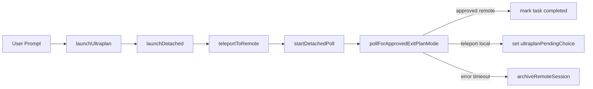

# ULTRAPLAN 深度分析

> **Source Commit**: `4b9d30f`
> **分析日期**: 2026-04-04
> **复杂度等级**: A-Tier
> **涉及文件数**: ~26
> **相关 Feature Flags**: `tengu_ultraplan_model`, `tengu_plan_mode_interview_phase`

## 1. 概述

ULTRAPLAN 是一个“本地触发、远程规划、双端收敛”的增强计划流：用户在本地触发 `/ultraplan` 后，CLI 先发起远程会话，再把首轮提示与 `plan` 权限模式一并注入会话初始事件，之后本地仅做 detached poll，等待远端 `ExitPlanMode` 结果回传。该路径并不是把本地 Plan Mode 逻辑简单搬到云端，而是显式分成 Launch（本地）→ Teleport（API）→ Poll（本地）→ ExitPlanModeV2（远端工具结果）的四段流水。（`src/commands/ultraplan.tsx:launchUltraplan (L234)`；`src/utils/teleport.tsx:teleportToRemote (L730)`；`src/utils/ultraplan/ccrSession.ts:pollForApprovedExitPlanMode (L198)`；`src/tools/ExitPlanModeTool/ExitPlanModeV2Tool.ts:mapToolResultToToolResultBlockParam (L419)`）

ULTRAPLAN 命令是按构建期开关注册到命令表，且命令本体在 ant 构建中启用；因此它在架构上天然属于“受限发布 + 远程编排”能力，而非默认 CLI 核心路径。（`src/commands.ts` 中 `feature('ULTRAPLAN')` 条件导入 (L104)；`src/commands/ultraplan.tsx` 默认导出 `isEnabled` (L466)）

## 2. 核心文件与职责矩阵

| 文件 | 关键函数/位置 | 在 ULTRAPLAN 闭环中的职责 |
|---|---|---|
| `src/commands/ultraplan.tsx` | `launchUltraplan` / `launchDetached` / `startDetachedPoll` | 命令入口、会话创建、异步轮询协调、失败通知与清理 |
| `src/utils/teleport.tsx` | `teleportToRemote` / `pollRemoteSessionEvents` / `archiveRemoteSession` | 创建 CCR 会话、分页拉取事件、归档会话 |
| `src/utils/ultraplan/ccrSession.ts` | `ExitPlanModeScanner` / `pollForApprovedExitPlanMode` | 从 SDK 事件流提取 plan-ready/approved/teleport 语义 |
| `src/tools/ExitPlanModeTool/ExitPlanModeV2Tool.ts` | `call` / `mapToolResultToToolResultBlockParam` | 生成“Approved Plan”文本协议并回填执行阶段提示 |
| `src/utils/processUserInput/processUserInput.ts` | keyword 分流分支 | 非 slash 输入中自动识别 `ultraplan` 关键词并改写路由 |
| `src/utils/ultraplan/keyword.ts` | `findKeywordTriggerPositions` / `replaceUltraplanKeyword` | 关键字触发过滤（排除路径、引号、slash command） |
| `src/tasks/pillLabel.ts` | `getPillLabel` | Diamond 状态标签（running/needs_input/ready） |
| `src/state/onChangeAppState.ts` | `onChangeAppState` | ULTRAPLAN 元数据同步到远端 external metadata |

上表里的职责边界在源码中是明确分层的：命令层不直接解析事件语义，语义解析集中在 `ccrSession.ts`；传输层不关心 ULTRAPLAN 业务状态，只返回标准化 `SDKMessage[]` 与 session metadata。（`src/commands/ultraplan.tsx:startDetachedPoll (L74)`；`src/utils/ultraplan/ccrSession.ts:ExitPlanModeScanner (L80)`；`src/utils/teleport.tsx:pollRemoteSessionEvents (L633)`）

## 3. 入口与前置门槛（Launch）

`launchUltraplan` 做了三件关键前置：

1. **并发防重入**：若已有 `ultraplanSessionUrl` 或 `ultraplanLaunching`，直接返回 already-active 文案，不再重复启动远程会话。（`src/commands/ultraplan.tsx:launchUltraplan (L260)`）
2. **空输入处理**：裸 `/ultraplan` 返回 usage 文本与 Terms 链接，不触发远端创建。（`src/commands/ultraplan.tsx:launchUltraplan (L270)`）
3. **同步占位标记**：先写 `ultraplanLaunching=true` 再异步 `launchDetached`，避免用户在 teleport 窗口期二次触发。（`src/commands/ultraplan.tsx:launchUltraplan (L278)`）

对于“自然语言触发”路径，系统在输入处理阶段拦截关键词，把首个可触发 `ultraplan` 改写为 `plan` 并路由到 `/ultraplan ...`，同时规避路径名、命令名、问句等误触发场景。（`src/utils/processUserInput/processUserInput.ts` keyword 分支 (L455)；`src/utils/ultraplan/keyword.ts:findKeywordTriggerPositions (L46)`；`src/utils/ultraplan/keyword.ts:replaceUltraplanKeyword (L120)`）

### 架构时序图（中文标题，英文节点）



## 4. Teleport 会话创建与模型覆盖

ULTRAPLAN 的 model 不是固定常量，而是启动时动态读取 `tengu_ultraplan_model`，默认回落到 `opus46.firstParty`。这意味着同一二进制下，服务端可按用户/环境切换 ULTRAPLAN 的远端主模型。（`src/commands/ultraplan.tsx:getUltraplanModel (L32)`）

`launchDetached` 调用 `teleportToRemote` 时显式传入 `permissionMode: 'plan'` 与 `ultraplan: true`，并将 prompt 作为 initial user event 放进 session 创建请求。（`src/commands/ultraplan.tsx:launchDetached (L330)`；`src/utils/teleport.tsx:teleportToRemote (L730)`）

在 `teleportToRemote` 内部，`permission_mode` 并非直接放在 payload 顶层，而是注入为 `control_request` 事件 `set_permission_mode`；这样能保证容器连接后第一轮就处于 plan 权限模式，避免 readiness race。（`src/utils/teleport.tsx:teleportToRemote (L1117)`）

```ts
// src/utils/teleport.tsx:teleportToRemote (L1126)
if (options.permissionMode) {
  events.push({
    type: 'event',
    data: {
      type: 'control_request',
      request_id: `set-mode-${randomUUID()}`,
      request: {
        subtype: 'set_permission_mode',
        mode: options.permissionMode,
        ultraplan: options.ultraplan,
      },
    },
  })
}
```

## 5. Poll 引擎：ExitPlanMode 扫描器

ULTRAPLAN 的关键不是“轮询到会话结束”，而是“轮询到 ExitPlanMode 决议”。`ExitPlanModeScanner` 维护 `exitPlanCalls/results/rejectedIds`，并用优先级 `approved > terminated > rejected > pending > unchanged` 规避多事件同批次冲突。（`src/utils/ultraplan/ccrSession.ts:ExitPlanModeScanner (L80)`）

`pollForApprovedExitPlanMode` 每 3 秒抓取事件，带连续失败上限（5 次），并接受 `shouldStop` 回调与 UI phase 回调，实现“可取消 + 可观测”的 detached poll。（`src/utils/ultraplan/ccrSession.ts:pollForApprovedExitPlanMode (L198)`）

```ts
// src/utils/ultraplan/ccrSession.ts:pollForApprovedExitPlanMode (L210)
while (Date.now() < deadline) {
  if (shouldStop?.()) throw new UltraplanPollError('poll stopped by caller', 'stopped', scanner.rejectCount)
  const resp = await pollRemoteSessionEvents(sessionId, cursor)
  const result = scanner.ingest(resp.newEvents)
  if (result.kind === 'approved') return { plan: result.plan, rejectCount: scanner.rejectCount, executionTarget: 'remote' }
  if (result.kind === 'teleport') return { plan: result.plan, rejectCount: scanner.rejectCount, executionTarget: 'local' }
  await sleep(POLL_INTERVAL_MS)
}
```

这套扫描逻辑特别处理了一个现实问题：`result(success)` 在 CCR 中会在每个 turn 后出现，不能直接当“任务完成”信号，因此 ULTRAPLAN 专门跳过通用 remote poll 的 result-complete 逻辑，改由 ExitPlanMode 扫描器负责收敛。（`src/utils/ultraplan/ccrSession.ts` 注释与逻辑 (L120, L190)；`src/tasks/RemoteAgentTask/RemoteAgentTask.tsx:startRemoteSessionPolling (L606)`）

## 6. ExitPlanModeV2 协议与计划提取

ULTRAPLAN 依赖 ExitPlanModeV2 的 tool_result 文本协议：

- 远端正常通过时，tool_result 包含 `## Approved Plan:` 或 `## Approved Plan (edited by user):`，本地扫描器据此抽取最终计划文本。（`src/tools/ExitPlanModeTool/ExitPlanModeV2Tool.ts:mapToolResultToToolResultBlockParam (L474)`；`src/utils/ultraplan/ccrSession.ts:extractApprovedPlan (L333)`）
- 用户在 Web 侧选择“teleport back to terminal”时，反馈文本走 deny 分支并附带 sentinel `__ULTRAPLAN_TELEPORT_LOCAL__`，本地识别为 `executionTarget: 'local'`，进入本地继续执行分支。（`src/utils/ultraplan/ccrSession.ts:ULTRAPLAN_TELEPORT_SENTINEL (L48)`；`src/utils/ultraplan/ccrSession.ts:extractTeleportPlan (L321)`）

这使 ULTRAPLAN 形成“同一个 ExitPlanMode、两条批准出口”的协议化闭环，而不是依赖 UI 私有状态同步。（`src/utils/ultraplan/ccrSession.ts:ScanResult (L50)`）

## 7. 30 分钟超时与失败收敛

ULTRAPLAN 明确把规划上限设为 30 分钟（`30 * 60 * 1000`），并把超时失败细分成 `timeout_pending` 与 `timeout_no_plan` 两种语义，前者表示已进入 plan approval 循环但迟迟未批准，后者表示甚至未到 ExitPlanMode 阶段。（`src/commands/ultraplan.tsx:ULTRAPLAN_TIMEOUT_MS (L24)`；`src/utils/ultraplan/ccrSession.ts:PollFailReason (L26)`；`src/utils/ultraplan/ccrSession.ts:pollForApprovedExitPlanMode (L299)`）

失败路径的收敛动作是“通知 + 归档 + 清 URL + 标记 failed”，防止远端会话继续空跑 30 分钟并阻塞后续重试。（`src/commands/ultraplan.tsx:startDetachedPoll (L139)`；`src/utils/teleport.tsx:archiveRemoteSession (L1200)`）

同时，`stopUltraplan` 使用 `RemoteAgentTask.kill` 触发归档，并清理 `ultraplanSessionUrl/ultraplanPendingChoice/ultraplanLaunching`，确保用户主动停止后不会被旧状态反复拉起。（`src/commands/ultraplan.tsx:stopUltraplan (L203)`；`src/tasks/RemoteAgentTask/RemoteAgentTask.tsx:RemoteAgentTask.kill (L811)`）

## 8. Diamond UI 与状态可视化

ULTRAPLAN 的 Diamond 不是单独组件，而是通过任务 pill 标签渲染策略表达状态：

- `◇ ultraplan`：运行中
- `◇ ultraplan needs your input`：远端等待用户输入
- `◆ ultraplan ready`：plan_ready（等待审批）

该映射由 `getPillLabel` 根据 `ultraplanPhase` 生成，并与 CTA 显示逻辑 `pillNeedsCta` 配套。（`src/tasks/pillLabel.ts:getPillLabel (L10)`；`src/tasks/pillLabel.ts:pillNeedsCta (L74)`）

`DIAMOND_OPEN/DIAMOND_FILLED` 字符语义在常量文件内定义为 running 与 completed/failed 指示符，因此 ULTRAPLAN 的“30 分钟进度可见性”本质是阶段态可视化，而非逐秒倒计时条。（`src/constants/figures.ts` 常量定义 (L26)）

## 9. Plan Mode V1 vs V2（ULTRAPLAN 视角）

在当前快照中，ULTRAPLAN 路径显式绑定的是 `ExitPlanModeV2` 数据协议，而不是旧版 exit 行为：

1. Scanner 常量引用 `EXIT_PLAN_MODE_V2_TOOL_NAME`，且仅解析 V2 `Approved Plan` 标记。（`src/utils/ultraplan/ccrSession.ts` imports 与 `extractApprovedPlan` (L12, L333)）
2. V2 支持 `planWasEdited` 语义，允许 CCR Web UI 编辑后带标签回传，这正是 ULTRAPLAN 本地抽取“最终计划”的输入来源。（`src/tools/ExitPlanModeTool/ExitPlanModeV2Tool.ts:outputSchema (L125)`；`src/tools/ExitPlanModeTool/ExitPlanModeV2Tool.ts:mapToolResultToToolResultBlockParam (L477)`）
3. EnterPlanMode 在 interview phase 开启时会切换提示策略，说明 Plan Mode 语义在 V2 时代已包含“分阶段引导”能力，而非单一文本提醒。（`src/tools/EnterPlanModeTool/EnterPlanModeTool.ts:mapToolResultToToolResultBlockParam (L103)`；`src/utils/planModeV2.ts:isPlanModeInterviewPhaseEnabled (L50)`）

关于“V1 的完整行为差异”在 ULTRAPLAN 代码路径内未直接实现完整并行分支，因此本文不对 V1 运行细节做额外推断。（N/A）

## 10. 状态机与数据面

ULTRAPLAN 在本地 `AppState` 的核心字段是 `ultraplanLaunching / ultraplanSessionUrl / ultraplanPendingChoice / ultraplanLaunchPending / isUltraplanMode`，这组字段把“发起中、会话进行中、等待用户选择、启动确认弹层、远端模式标记”拆开存储，避免单字段过载。（`src/state/AppStateStore.ts` 字段定义注释 (L428)）

状态同步方面，`onChangeAppState` 在 permission mode 变化时会把 `is_ultraplan_mode` 同步到 external metadata，且仅在“首次进入 plan + isUltraplanMode 由 false→true”时上报 true，退出时按 merge-patch 语义发 null 清理。（`src/state/onChangeAppState.ts:onChangeAppState (L43)`）

ULTRAPLAN 运行态与通用 remote task poll 并存：task poll 负责 task shell 生命周期，ULTRAPLAN 专有 poll 负责批准语义；源码里有明确 TODO 准备后续合并两套机制，说明当前是“语义优先的双轮询”结构。（`src/commands/ultraplan.tsx:launchDetached (L364)`；`src/tasks/RemoteAgentTask/RemoteAgentTask.tsx:startRemoteSessionPolling (L606)`）

## 11. 安全与中断恢复

ULTRAPLAN 的安全收敛点主要在三处：

1. **预检失败立即中止**：`checkRemoteAgentEligibility` 不通过时不创建远端会话，避免把失败转移到云端。（`src/commands/ultraplan.tsx:launchDetached (L315)`）
2. **会话归档是幂等兜底**：`archiveRemoteSession` 把 409 视为成功，减少重复清理时的异常噪音。（`src/utils/teleport.tsx:archiveRemoteSession (L1200)`）
3. **网络抖动容忍**：poll 层对 transient error 采用连续失败阈值而非一次失败即终止，提升 30 分钟长轮询稳定性。（`src/utils/ultraplan/ccrSession.ts:MAX_CONSECUTIVE_FAILURES (L24)`；`src/utils/ultraplan/ccrSession.ts:pollForApprovedExitPlanMode (L229)`）

这三点组合后，ULTRAPLAN 对“短抖动、用户中止、迟到结果”都有对应防护分支，降低 orphan session 与误通知概率。（`src/commands/ultraplan.tsx:startDetachedPoll (L143)`）

## 12. Feature Flag 门控（引用）

ULTRAPLAN 所涉门控分层与统一约束请直接参考：[`../infra/20-feature-flag-arch.md`](../infra/20-feature-flag-arch.md)。

在本功能最直接可见的 flag 仅包括：

- `tengu_ultraplan_model`（远端模型覆盖）
- `tengu_plan_mode_interview_phase`（Plan Mode interview phase）

对应读取位置分别在命令层 model 选择与 Plan Mode V2 能力判定处。（`src/commands/ultraplan.tsx:getUltraplanModel (L32)`；`src/utils/planModeV2.ts:isPlanModeInterviewPhaseEnabled (L50)`）

## 13. 已知边界与 N/A

- **N/A：独立“Diamond 倒计时组件”**。代码中可见的是基于 diamond glyph 的状态标记与 phase 切换，未发现 ULTRAPLAN 专有“分钟级倒计时条”组件实现。（`src/tasks/pillLabel.ts:getPillLabel (L10)`；`src/constants/figures.ts` (L26)）
- **N/A：ULTRAPLAN 内部直接实现 UltraplanChoiceDialog/UltraplanLaunchDialog**。当前可证据范围是 `REPL` 挂载并消费这两个 dialog 的状态，不在本次可读文件中展开其内部逻辑。（`src/screens/REPL.tsx` 挂载点 (L4850)）
- **N/A：V1 并行执行路径细节**。ULTRAPLAN 现路径以 V2 协议为核心；对 V1 的“完整运行时行为”不做超出证据推演。（`src/utils/ultraplan/ccrSession.ts:extractApprovedPlan (L333)`）

## 14. 技术亮点（≤3）

1. **协议驱动的双出口批准模型**：同一 ExitPlanMode 结果可选择“远端继续执行”或“teleport 回本地继续执行”，且都通过 tool_result 文本协议解析，不依赖 UI 私有状态。（`src/utils/ultraplan/ccrSession.ts:ScanResult (L50)`；`src/tools/ExitPlanModeTool/ExitPlanModeV2Tool.ts:mapToolResultToToolResultBlockParam (L419)`）
2. **控制请求前置，避免模式竞争**：`set_permission_mode` 被注入 CreateSession 初始事件，确保远端容器首轮就进入 plan 权限模式。（`src/utils/teleport.tsx:teleportToRemote (L1119)`）
3. **语义轮询与任务轮询分离**：ULTRAPLAN 用专有 scanner 处理 plan approval 语义，规避“每 turn 都有 success result”导致的误完成，稳定性明显高于通用 done-on-result 策略。（`src/utils/ultraplan/ccrSession.ts:ExitPlanModeScanner (L80)`；`src/tasks/RemoteAgentTask/RemoteAgentTask.tsx:startRemoteSessionPolling (L606)`）
