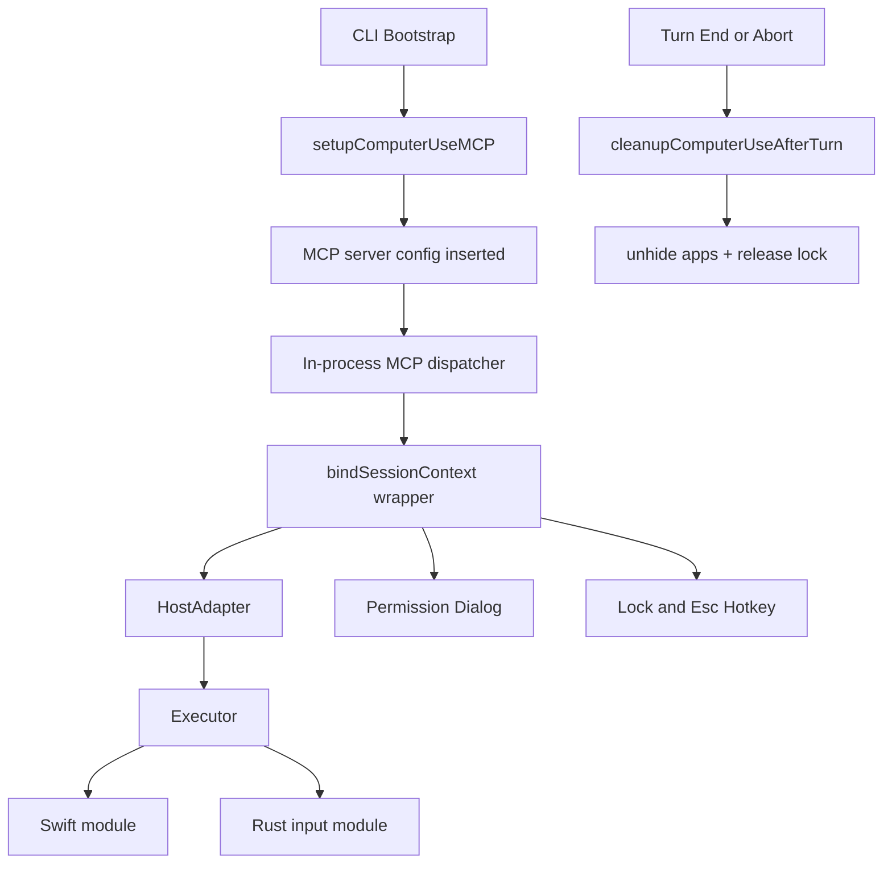

# CHICAGO_MCP 深度分析

> **Source Commit**: `4b9d30f`
> **分析日期**: 2026-04-04
> **复杂度等级**: A-Tier
> **涉及文件数**: ~26
> **相关 Feature Flags**: `tengu_malort_pedway`

## 概述

CHICAGO_MCP 是 Claude Code 在本地终端中接入 Computer Use 能力的实现层：模型并不直接操作操作系统，而是通过 MCP 工具面（`mcp__computer-use__*`）调用本地执行器，由执行器再下沉到 Rust/Swift 原生模块完成截图、鼠标、键盘与应用管理动作。（src/utils/computerUse/setup.ts:setupComputerUseMCP (L23), src/utils/computerUse/executor.ts:createCliExecutor (L259)）

这套能力在设计上是“会话级受控自动化”，而不是“永久后台控制”：每个 turn 结束会清理隐藏应用与锁状态，中断路径也会走同样的清理逻辑，避免控制残留到下一轮。（src/utils/computerUse/cleanup.ts:cleanupComputerUseAfterTurn (L30), src/query/stopHooks.ts:executeStopHooks (L164), src/query.ts:query (L1033)）

从代码边界看，CHICAGO_MCP 只覆盖 macOS 路径：Swift 加载器和执行器工厂都带有 Darwin 限制，非 macOS 直接抛错退出该能力链路。（src/utils/computerUse/swiftLoader.ts:requireComputerUseSwift (L15), src/utils/computerUse/executor.ts:createCliExecutor (L263), src/utils/computerUse/common.ts:CLI_CU_CAPABILITIES (L54)）

## 架构图

下面的图展示 CHICAGO_MCP 的“进程内 MCP + 本地执行器 + 回合清理”主链路。



该架构里，`setupComputerUseMCP` 先注入动态 MCP 配置与 allowlist 工具名；随后 wrapper 的 `.call()` 覆盖将 MCP 调用绑定到会话上下文，并走 host adapter + executor 执行真实系统动作。（src/utils/computerUse/setup.ts:setupComputerUseMCP (L23), src/utils/computerUse/wrapper.tsx:getComputerUseMCPToolOverrides (L248), src/utils/computerUse/wrapper.tsx:getOrBind (L230)）

## 核心文件清单

| 文件路径 | 角色 | 关键职责 |
|---|---|---|
| `src/utils/computerUse/setup.ts` | 接入层 | 生成动态 MCP 配置、导出可直通工具名 |
| `src/utils/computerUse/mcpServer.ts` | Server 层 | 构造 Computer Use MCP Server、重写 ListTools |
| `src/utils/computerUse/wrapper.tsx` | 调度层 | 覆盖 `.call()`，桥接 ToolUseContext 与会话绑定 |
| `src/utils/computerUse/hostAdapter.ts` | 适配层 | 注入 executor、TCC 检查、sub-gates |
| `src/utils/computerUse/executor.ts` | 执行层 | 截图/鼠标/键盘/应用管理 API 落地 |
| `src/utils/computerUse/swiftLoader.ts` | Native 加载 | 按平台加载 `@ant/computer-use-swift` |
| `src/utils/computerUse/inputLoader.ts` | Native 加载 | 按能力加载 `@ant/computer-use-input` |
| `src/utils/computerUse/escHotkey.ts` | 安全中断 | 注册/注销全局 Escape CGEventTap |
| `src/utils/computerUse/drainRunLoop.ts` | 运行时桥接 | 在 libuv 下泵送 CFRunLoop 保障主队列任务完成 |
| `src/utils/computerUse/computerUseLock.ts` | 并发控制 | 文件锁互斥、僵尸锁恢复、进程退出清理 |
| `src/utils/computerUse/cleanup.ts` | 回合收尾 | 自动 unhide + 释放锁 + 退出通知 |
| `src/components/permissions/ComputerUseApproval/ComputerUseApproval.tsx` | 交互权限 | TCC 面板与应用授权面板 |

以上文件构成了 CHICAGO_MCP 的最小闭环：配置接入、请求调度、原生执行、用户授权、互斥控制、回合清理。（src/utils/computerUse/setup.ts:setupComputerUseMCP (L23), src/utils/computerUse/wrapper.tsx:buildSessionContext (L59), src/utils/computerUse/cleanup.ts:cleanupComputerUseAfterTurn (L30)）

## 启动与初始化流程

1. CLI 仅在 macOS 且交互会话下尝试初始化 Computer Use，并在运行时 gate 通过后把 `computer-use` 服务器配置写入 `dynamicMcpConfig`，同时把相关工具名加入 `allowedTools`。（src/main.tsx:main (L1608), src/main.tsx:main (L1614), src/utils/computerUse/setup.ts:setupComputerUseMCP (L23)）
2. `setupComputerUseMCP` 生成 `type: 'stdio'` 的 MCP 配置，但注释明确写了该命令参数并非真的用于 spawn，真实路径由客户端按保留名拦截并走进程内 server。（src/utils/computerUse/setup.ts:setupComputerUseMCP (L32), src/utils/computerUse/setup.ts:setupComputerUseMCP (L45)）
3. 当以 `--computer-use-mcp` 启动子入口时，会走 `runComputerUseMcpServer`：启用配置、初始化 analytics sink、绑定 stdio transport、监听 stdin 结束后优雅退出。（src/entrypoints/cli.tsx:main (L86), src/utils/computerUse/mcpServer.ts:runComputerUseMcpServer (L85), src/utils/computerUse/mcpServer.ts:runComputerUseMcpServer (L100)）

```ts
// src/utils/computerUse/setup.ts
export function setupComputerUseMCP() {
  const allowedTools = buildComputerUseTools(
    CLI_CU_CAPABILITIES,
    getChicagoCoordinateMode(),
  ).map(t => buildMcpToolName(COMPUTER_USE_MCP_SERVER_NAME, t.name))

  return {
    mcpConfig: {
      [COMPUTER_USE_MCP_SERVER_NAME]: {
        type: 'stdio',
        command: process.execPath,
        args,
        scope: 'dynamic',
      },
    },
    allowedTools,
  }
}
```

## 运行时行为

运行时核心是 `wrapper.tsx` 的覆盖调用：首次工具调用时构建绑定并缓存 dispatcher，后续调用复用同一绑定，同时通过 `currentToolUseContext` 刷新每次调用的 abort/UI/notification 上下文。（src/utils/computerUse/wrapper.tsx:getOrBind (L230), src/utils/computerUse/wrapper.tsx:tuc (L51), src/utils/computerUse/wrapper.tsx:getComputerUseMCPToolOverrides (L248)）

`createComputerUseMcpServerForCli` 里会尝试在 1 秒内枚举应用，把结果用于 `request_access` 描述增强；若超时则软失败，不阻塞 server 启动。（src/utils/computerUse/mcpServer.ts:tryGetInstalledAppNames (L25), src/utils/computerUse/mcpServer.ts:createComputerUseMcpServerForCli (L60)）

回合退出策略覆盖了自然结束和两类中断：正常 stop hook、流式中断、tool 执行中断都触发 cleanup，保证 hidden apps 与 lock 不泄漏。（src/query/stopHooks.ts:executeStopHooks (L164), src/query.ts:query (L1033), src/query.ts:query (L1489), src/utils/computerUse/cleanup.ts:cleanupComputerUseAfterTurn (L30)）

## Feature Flag 门控

CHICAGO_MCP 的门控分层与统一术语说明，遵循基础架构文档，不在本篇重复展开机制细节：

- 参见：[`../infra/20-feature-flag-arch.md`](../infra/20-feature-flag-arch.md)

本篇仅聚焦 CHICAGO_MCP 在代码中的实现结果与行为边界。

## 关键代码片段

### Rust/Swift Native 模块加载

Swift 侧由 `requireComputerUseSwift()` 统一加载并缓存，且显式要求 Darwin；Rust 输入模块由 `requireComputerUseInput()` 懒加载并在 `isSupported` 分支做能力校验。（src/utils/computerUse/swiftLoader.ts:requireComputerUseSwift (L15), src/utils/computerUse/inputLoader.ts:requireComputerUseInput (L22)）

执行器工厂 `createCliExecutor()` 在创建时即加载 Swift（截图/应用/TCC都依赖），而输入模块保持按需加载，避免 screenshot-only 路径拉起 enigo `.node`。（src/utils/computerUse/executor.ts:createCliExecutor (L259), src/utils/computerUse/executor.ts:createCliExecutor (L269), src/utils/computerUse/executor.ts:createCliExecutor (L270)）

在 Node/bun 的 libuv 运行时，主队列不会像 Electron 那样天然被持续排空，因此 `drainRunLoop()` 用 refcount + 1ms interval 去调用 `_drainMainRunLoop()`，避免 `@MainActor` 方法与 key/keys 卡死。（src/utils/computerUse/drainRunLoop.ts:drainRunLoop (L61), src/utils/computerUse/drainRunLoop.ts:retain (L24), src/utils/computerUse/drainRunLoop.ts:drainTick (L20), src/utils/computerUse/swiftLoader.ts:requireComputerUseSwift (L10), src/utils/computerUse/inputLoader.ts:requireComputerUseInput (L16)）

### CGEventTap Escape 热键中断

`registerEscHotkey()` 通过 Swift hotkey 接口注册全局 Escape；注释明确其底层是 CGEventTap，并说明注册期间 Escape 会被系统级消费用于“立即中止”。（src/utils/computerUse/escHotkey.ts:registerEscHotkey (L25)）

该热键生命周期与 CU 锁绑定：fresh acquire 时注册，turn 结束 cleanup 时注销，且通过 `retainPump/releasePump` 保持对应 RunLoop source 可被处理。（src/utils/computerUse/wrapper.tsx:buildSessionContext (L207), src/utils/computerUse/cleanup.ts:cleanupComputerUseAfterTurn (L73), src/utils/computerUse/escHotkey.ts:unregisterEscHotkey (L40), src/utils/computerUse/escHotkey.ts:registerEscHotkey (L34)）

为避免模型自己发 `escape` 触发误中断，执行器在发送 bare Escape 前调用 `notifyExpectedEscape()`，在 tap 侧打“预期事件”孔洞。（src/utils/computerUse/executor.ts:key (L455), src/utils/computerUse/executor.ts:holdKey (L475), src/utils/computerUse/escHotkey.ts:notifyExpectedEscape (L51)）

```ts
// src/utils/computerUse/escHotkey.ts
export function registerEscHotkey(onEscape: () => void): boolean {
  if (registered) return true
  const cu = requireComputerUseSwift()
  if (!cu.hotkey.registerEscape(onEscape)) return false
  retainPump()
  registered = true
  return true
}
```

### TCC 权限检查流程

Host adapter 在 `ensureOsPermissions()` 里同步检查 Accessibility 与 Screen Recording；二者都为真才返回 `{granted: true}`，否则返回缺失项用于上层 UI 渲染。（src/utils/computerUse/hostAdapter.ts:getComputerUseHostAdapter (L47)）

权限弹窗组件 `ComputerUseApproval` 根据 `request.tccState` 在 TCC 面板与应用授权面板间分流：若缺少系统权限，直接展示 TCC 面板，不进入 app allowlist 逻辑。（src/components/permissions/ComputerUseApproval/ComputerUseApproval.tsx:ComputerUseApproval (L30), src/components/permissions/ComputerUseApproval/ComputerUseApproval.tsx:ComputerUseTccPanel (L51)）

TCC 面板可直接 `open x-apple.systempreferences:` 跳转到对应隐私项，并提供 retry，形成“检查 → 跳设置 → 重试”闭环。（src/components/permissions/ComputerUseApproval/ComputerUseApproval.tsx:ComputerUseTccPanel (L106), src/components/permissions/ComputerUseApproval/ComputerUseApproval.tsx:ComputerUseTccPanel (L122)）

### 截图/鼠标/键盘控制 API

截图链路包括 `screenshot()` 与 `zoom()`：先读取显示器几何并计算 API 目标尺寸，再调用 Swift capture 接口；整个调用包在 `drainRunLoop()` 中以保证主队列工作完成。（src/utils/computerUse/executor.ts:screenshot (L399), src/utils/computerUse/executor.ts:zoom (L420), src/utils/computerUse/executor.ts:computeTargetDims (L60), src/utils/computerUse/executor.ts:resolvePrepareCapture (L368)）

鼠标链路覆盖 move/click/drag/scroll：`moveAndSettle()` 固定 50ms settle；drag 使用 `animatedMove()`（可被 sub-gate 关闭）；click 支持带 modifier 的按压包裹，确保异常时释放修饰键。（src/utils/computerUse/executor.ts:moveAndSettle (L113), src/utils/computerUse/executor.ts:animatedMove (L217), src/utils/computerUse/executor.ts:click (L538), src/utils/computerUse/executor.ts:withModifiers (L150), src/utils/computerUse/executor.ts:drag (L579), src/utils/computerUse/executor.ts:scroll (L600)）

键盘链路覆盖 `key/holdKey/type`：组合键通过 `keys(parts)`，长按通过 press/sleep/release，文本输入支持 clipboard paste 回退策略并在 finally 恢复用户剪贴板。（src/utils/computerUse/executor.ts:key (L455), src/utils/computerUse/executor.ts:holdKey (L475), src/utils/computerUse/executor.ts:type (L509), src/utils/computerUse/executor.ts:typeViaClipboard (L180), src/utils/computerUse/executor.ts:releasePressed (L131)）

```ts
// src/utils/computerUse/executor.ts
async screenshot(opts: { allowedBundleIds: string[]; displayId?: number }) {
  const d = cu.display.getSize(opts.displayId)
  const [targetW, targetH] = computeTargetDims(d.width, d.height, d.scaleFactor)
  return drainRunLoop(() =>
    cu.screenshot.captureExcluding(
      withoutTerminal(opts.allowedBundleIds),
      SCREENSHOT_JPEG_QUALITY,
      targetW,
      targetH,
      opts.displayId,
    ),
  )
}
```

## 状态管理

CHICAGO_MCP 的会话态集中在 `AppState.computerUseMcpState`：包括允许应用、grant flags、截图尺寸元数据、本回合隐藏应用集合、目标显示器与 pin 状态。（src/state/AppStateStore.ts:AppState (L259)）

`buildSessionContext()` 通过 getter/setter 把这些状态桥接给 `bindSessionContext`：例如 `onAllowedAppsChanged` 持久化授权、`onScreenshotCaptured` 只存 dims 不存图像、`onDisplayPinned` 管理 display pin 语义。（src/utils/computerUse/wrapper.tsx:buildSessionContext (L59), src/utils/computerUse/wrapper.tsx:buildSessionContext (L86), src/utils/computerUse/wrapper.tsx:buildSessionContext (L165), src/utils/computerUse/wrapper.tsx:buildSessionContext (L137)）

这种设计把“重对象（截图 base64）”留在 dispatcher 闭包，把“跨回合必要元信息”写入 AppState，降低了状态同步与恢复复杂度。（src/utils/computerUse/wrapper.tsx:getOrBind (L230), src/state/AppStateStore.ts:AppState (L272)）

## 安全与权限模型

CHICAGO_MCP 的并发边界依赖文件锁：`tryAcquireComputerUseLock()` 用 `writeFile(..., flag:'wx')` 原子抢占，遇到 stale pid 会恢复，遇到 live owner 返回 blocked。（src/utils/computerUse/computerUseLock.ts:tryAcquireComputerUseLock (L148), src/utils/computerUse/computerUseLock.ts:tryCreateExclusive (L79), src/utils/computerUse/computerUseLock.ts:isProcessRunning (L65)）

`checkCuLock/acquireCuLock` 被注入到会话上下文，request_access 等 defer-acquire 工具先检查不抢锁；真正需要执行系统操作时才抢锁并注册 ESC 热键与 enter 通知。（src/utils/computerUse/wrapper.tsx:buildSessionContext (L181), src/utils/computerUse/wrapper.tsx:buildSessionContext (L207), src/utils/computerUse/computerUseLock.ts:checkComputerUseLock (L110)）

turn-end cleanup 先 unhide 再释放锁，并在成功释放后发送 exit 通知，保证用户可见的“进入/退出控制”状态一致。（src/utils/computerUse/cleanup.ts:cleanupComputerUseAfterTurn (L38), src/utils/computerUse/cleanup.ts:cleanupComputerUseAfterTurn (L80)）

## 错误处理与恢复

CHICAGO_MCP 的恢复策略不是单点重试，而是“多出口统一收尾”：自然 stop、流式中断、tool 执行中断都会进入同一个 cleanup，优先处理应用恢复与锁释放。（src/query/stopHooks.ts:executeStopHooks (L164), src/query.ts:query (L1033), src/query.ts:query (L1489), src/utils/computerUse/cleanup.ts:cleanupComputerUseAfterTurn (L30)）

锁文件有 stale PID 回收逻辑：读取 owner 后做 `process.kill(pid, 0)` 存活探测，失活则自动 unlink 并重试原子创建，避免旧会话崩溃后长期阻塞新会话。（src/utils/computerUse/computerUseLock.ts:isProcessRunning (L65), src/utils/computerUse/computerUseLock.ts:checkComputerUseLock (L110), src/utils/computerUse/computerUseLock.ts:tryAcquireComputerUseLock (L184)）

`cleanupComputerUseAfterTurn` 对 unhide 操作设置 5s 超时 race，避免用户中断路径被慢 Swift 调用卡死；同时把 hotkey 注销放在释放锁前，确保泵引用尽早下降。（src/utils/computerUse/cleanup.ts:cleanupComputerUseAfterTurn (L15), src/utils/computerUse/cleanup.ts:cleanupComputerUseAfterTurn (L47), src/utils/computerUse/cleanup.ts:cleanupComputerUseAfterTurn (L68)）

## UI/UX

`getComputerUseMCPRenderingOverrides()` 为 `mcp__computer-use__*` 定义了面向用户的动作摘要：例如 click 显示坐标、type 显示截断文本、non-verbose 时显示单行结果摘要。（src/utils/computerUse/toolRendering.tsx:getComputerUseMCPRenderingOverrides (L43)）

权限 UX 分两层：
- **TCC Panel**：处理系统权限缺失。
- **App Allowlist Panel**：处理会话期可控应用与附加 flags 授权。

两层都通过同一个 `ComputerUseApproval` 分发器进入，降低了模型侧“为何失败”的解释负担。（src/components/permissions/ComputerUseApproval/ComputerUseApproval.tsx:ComputerUseApproval (L30), src/components/permissions/ComputerUseApproval/ComputerUseApproval.tsx:ComputerUseAppListPanel (L208)）

## 与其他功能交互

与 MCP 配置系统：`computer-use` 被定义为保留名称，用户不能手工新增同名 server；且其在内置策略中默认禁用，需显式 enable。（src/services/mcp/config.ts:addMcpConfig (L625), src/services/mcp/config.ts:isMcpServerDisabled (L1528)）

与 analytics 元数据：当 CHICAGO_MCP 特性存在时，`computer-use` 被纳入“固定保留名内置 MCP”集合，以便工具细节日志判定。（src/services/analytics/metadata.ts:mcpToolDetailsForAnalytics (L145), src/services/analytics/metadata.ts:BUILTIN_MCP_SERVER_NAMES (L129)）

与 query 生命周期：自然结束与中断结束都挂接 cleanup，保证 CHICAGO_MCP 在主线程回合语义内闭合，不泄漏到子 agent 生命周期。（src/query/stopHooks.ts:executeStopHooks (L164), src/query.ts:query (L1033), src/query.ts:query (L1489)）

## 限制与已知问题

1. **平台硬限制（非 N/A）**：Swift 与 executor 都是 darwin 限制，意味着当前实现并未提供 Linux/Windows fallback 执行器。（src/utils/computerUse/swiftLoader.ts:requireComputerUseSwift (L16), src/utils/computerUse/executor.ts:createCliExecutor (L263)）
2. **像素校验裁剪为 N/A（能力降级）**：`cropRawPatch` 在 CLI host adapter 中固定返回 `null`，注释说明因同步接口契约与现有图像处理库异步模型不匹配，故走“跳过验证”回退。（src/utils/computerUse/hostAdapter.ts:getComputerUseHostAdapter (L60), src/utils/computerUse/hostAdapter.ts:getComputerUseHostAdapter (L66)）
3. **ESC 热键依赖可选系统授权**：若 `registerEscape` 失败（常见是无 Accessibility），CU 仍可运行但失去全局 Esc 立即中止能力。（src/utils/computerUse/escHotkey.ts:registerEscHotkey (L28), src/utils/computerUse/escHotkey.ts:registerEscHotkey (L31)）

### macOS 限定原因分析

根因不是单点 API，而是三层耦合：

- **原生模块耦合**：`@ant/computer-use-swift` 和 `@ant/computer-use-input` 都是面向 macOS 的本地绑定入口。（src/utils/computerUse/swiftLoader.ts:requireComputerUseSwift (L15), src/utils/computerUse/inputLoader.ts:requireComputerUseInput (L25)）
- **系统能力耦合**：TCC（Accessibility/Screen Recording）、CGEventTap Escape、NSWorkspace/显示器/截图相关能力都在当前适配器里以 macOS API 语义暴露。（src/utils/computerUse/hostAdapter.ts:getComputerUseHostAdapter (L47), src/utils/computerUse/escHotkey.ts:registerEscHotkey (L25), src/utils/computerUse/executor.ts:createCliExecutor (L302)）
- **能力声明耦合**：CLI capabilities 固定 `platform: 'darwin'`，工具构建与调用路径因此默认按 darwin 行为编排。（src/utils/computerUse/common.ts:CLI_CU_CAPABILITIES (L54), src/utils/computerUse/setup.ts:setupComputerUseMCP (L27)）

因此，跨平台化不是“改一处开关”，而是要重建 host adapter + executor + 权限模型的等价实现。

## 技术亮点

1. **进程内 MCP + 会话绑定分层清晰**：server 负责工具面暴露，真正调用落在 wrapper 的 `.call()` 覆盖与 `bindSessionContext`，把协议面与执行面拆开，降低了调用耦合。（src/utils/computerUse/mcpServer.ts:createComputerUseMcpServerForCli (L60), src/utils/computerUse/wrapper.tsx:getComputerUseMCPToolOverrides (L248)）
2. **RunLoop 泵送解决 libuv/主队列鸿沟**：`drainRunLoop` 用共享泵 + 超时保护支撑 `@MainActor` 与输入主队列调用，属于 Node/bun 场景下很关键的稳定性补丁。（src/utils/computerUse/drainRunLoop.ts:drainRunLoop (L61), src/utils/computerUse/drainRunLoop.ts:timeoutReject (L44)）
3. **中断可达与清理闭环**：ESC 热键、文件锁、turn-end cleanup 三者组合，保证“可立刻停、可恢复、可退出通知”的操作边界。（src/utils/computerUse/escHotkey.ts:registerEscHotkey (L25), src/utils/computerUse/computerUseLock.ts:tryAcquireComputerUseLock (L148), src/utils/computerUse/cleanup.ts:cleanupComputerUseAfterTurn (L30)）
