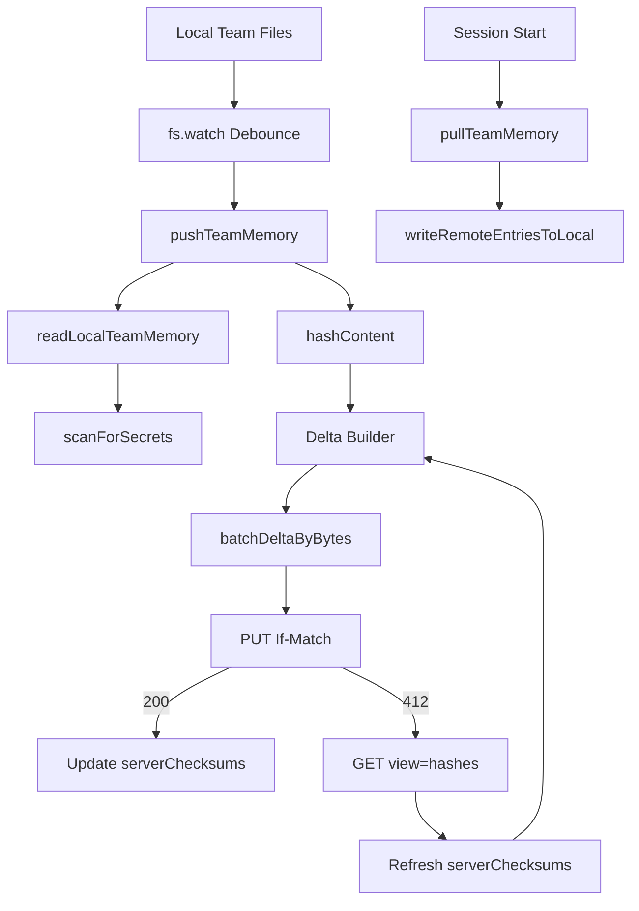

# TEAMMEM 深度分析

> **Source Commit**: `4b9d30f`
> **分析日期**: 2026-04-04
> **复杂度等级**: A-Tier
> **涉及文件数**: ~25
> **相关 Feature Flags**: `tengu_herring_clock`, `tengu_passport_quail`

## 概述

TEAMMEM 是一个“以仓库为作用域的共享记忆同步层”，它把本地 `memory/team/` 目录中的 Markdown 条目与服务端 repo 维度存储进行双向对齐，核心目标不是“强一致数据库复制”，而是“低成本增量同步 + 可恢复冲突处理 + 不泄露敏感信息”的工程折中。入口语义在模块头注释中已经写得很清楚：pull 以服务端为准覆盖本地、push 只上传 hash 差异键、删除不传播（下次 pull 会回补）。(src/services/teamMemorySync/index.ts:pullTeamMemory (L770-L867), src/services/teamMemorySync/index.ts:pushTeamMemory (L889-L1146), src/services/teamMemorySync/index.ts:syncTeamMemory (L1153-L1191))

这套机制由 watcher 常驻驱动：会话启动时先 pull，再挂载目录监听，后续本地文件变化通过 debounce 汇聚为 push。其设计重点不是“每次变化立即写远端”，而是避免噪声、降低冲突面、并在失败场景下保持可重试与可抑制。 (src/services/teamMemorySync/watcher.ts:startTeamMemoryWatcher (L252-L305), src/services/teamMemorySync/watcher.ts:schedulePush (L132-L145), src/services/teamMemorySync/watcher.ts:executePush (L84-L127))

## 架构图

下图展示 TEAMMEM 在当前快照中的最小闭环：本地写入、监听触发、delta 计算、ETag 条件写、冲突探测、哈希探针刷新、再计算上传，以及 secret guard 的前置阻断。



图中每个节点都可在实现里找到直接对应函数：`pushTeamMemory`、`readLocalTeamMemory`、`scanForSecrets`、`hashContent`、`batchDeltaByBytes`、`uploadTeamMemory`、`fetchTeamMemoryHashes`、`pullTeamMemory`、`writeRemoteEntriesToLocal`。 (src/services/teamMemorySync/index.ts:pushTeamMemory (L889-L1146), src/services/teamMemorySync/index.ts:readLocalTeamMemory (L567-L673), src/services/teamMemorySync/secretScanner.ts:scanForSecrets (L277-L295), src/services/teamMemorySync/index.ts:hashContent (L134-L136), src/services/teamMemorySync/index.ts:batchDeltaByBytes (L426-L460), src/services/teamMemorySync/index.ts:uploadTeamMemory (L462-L553), src/services/teamMemorySync/index.ts:fetchTeamMemoryHashes (L315-L385), src/services/teamMemorySync/index.ts:pullTeamMemory (L770-L867), src/services/teamMemorySync/index.ts:writeRemoteEntriesToLocal (L689-L755))

## 核心文件清单

| 文件路径 | 角色 | 关键职责 |
|---|---|---|
| `src/services/teamMemorySync/index.ts` | 同步核心 | pull/push、delta、ETag、冲突重试、批次上传、本地读写 |
| `src/services/teamMemorySync/watcher.ts` | 变更驱动 | 启动 pull、`fs.watch` 监听、防抖 push、失败抑制 |
| `src/services/teamMemorySync/secretScanner.ts` | 敏感信息识别 | gitleaks 规则子集、匹配/标签/脱敏 |
| `src/services/teamMemorySync/teamMemSecretGuard.ts` | 写入前守卫 | FileWrite/FileEdit 进入 TEAMMEM 路径时先拒绝秘密内容 |
| `src/memdir/teamMemPaths.ts` | 路径边界 | 团队目录定位、开关判定、路径穿越与符号链接防护 |
| `src/utils/sessionFileAccessHooks.ts` | 钩子联动 | team memory 编辑写入后触发 `notifyTeamMemoryWrite` |
| `src/services/extractMemories/extractMemories.ts` | 子 agent 提取 | `tengu_passport_quail` 门控、自动提取时可写团队记忆 |
| `src/services/extractMemories/prompts.ts` | 提示词契约 | 组合模式下明示 private/team 双目录与 `MEMORY.md` 索引规则 |
| `src/memdir/memdir.ts` | Prompt 组装 | auto+team 组合提示词、目录存在性保证与范围说明 |
| `src/utils/claudemd.ts` | 注入读取层 | 将 TeamMem entrypoint 作为共享记忆注入上下文 |

以上文件之间不是平铺关系，而是“写入入口防护（Tool）→ 监听与同步（Service）→ 提示词和上下文装载（memdir/utils）”的分层链路。 (src/tools/FileWriteTool/FileWriteTool.ts:validateInput (L153-L222), src/tools/FileEditTool/FileEditTool.ts:validateInput (L137-L362), src/services/teamMemorySync/watcher.ts:startTeamMemoryWatcher (L252-L305), src/memdir/memdir.ts:loadMemoryPrompt (L419-L507), src/utils/claudemd.ts:getMemoryFiles (L790-L1074))

## 启动与初始化流程

TEAMMEM 的初始化由 `setup()` 异步触发：当构建期开关允许且不是 bare 模式，系统动态导入 watcher 并启动。 (src/setup.ts:setup (L330-L370))

启动后 watcher 会先做四层前置检查：构建门控、team memory enabled、OAuth 可用、仓库是否存在 github.com remote；任一失败直接返回，不进入监听环节。 (src/services/teamMemorySync/watcher.ts:startTeamMemoryWatcher (L252-L266), src/services/teamMemorySync/index.ts:isTeamMemorySyncAvailable (L762-L764), src/services/teamMemorySync/index.ts:isUsingOAuth (L151-L161))

通过检查后才创建 `SyncState`，先执行 initial pull，再无条件启动目录级递归监听，避免“新仓库无远端内容时没有监听器导致首写长时间不触发同步”的死区。 (src/services/teamMemorySync/watcher.ts:startTeamMemoryWatcher (L268-L297), src/services/teamMemorySync/index.ts:createSyncState (L121-L127))

```ts
// src/services/teamMemorySync/watcher.ts:startTeamMemoryWatcher (L252-L297)
syncState = createSyncState()
const pullResult = await pullTeamMemory(syncState)
await startFileWatcher(getTeamMemPath())
```

## 运行时行为

运行时主循环是“事件驱动 + debounce 聚合”：任意团队记忆文件变化都会触发 `schedulePush()`，2 秒窗口内合并为一次 push，避免连续写产生请求风暴。 (src/services/teamMemorySync/watcher.ts:DEBOUNCE_MS (L35), src/services/teamMemorySync/watcher.ts:schedulePush (L132-L145))

当 push 进行中又发生新变更，watcher 不并发开第二个上传，而是重置防抖等待当前完成后再发，减少 ETag 竞争。 (src/services/teamMemorySync/watcher.ts:schedulePush (L138-L144), src/services/teamMemorySync/watcher.ts:executePush (L84-L127))

此外，PostToolUse 钩子对 TeamMem 的 Edit/Write 会显式调用 `notifyTeamMemoryWrite()`，它与文件监听形成双保险：即使平台事件合并或启动竞态导致 `fs.watch` 漏报，也能补触发一次计划上传。 (src/utils/sessionFileAccessHooks.ts:handleSessionFileAccess (L188-L207), src/services/teamMemorySync/watcher.ts:notifyTeamMemoryWrite (L314-L319))

## Feature Flag 门控

本节不重复门控机制细节，统一参考基础设施文档：[`../infra/20-feature-flag-arch.md`](../infra/20-feature-flag-arch.md)。

## 关键代码片段

### 1) SHA-256 差异同步（按 key 计算 delta）

```ts
// src/services/teamMemorySync/index.ts:pushTeamMemory (L966-L971)
const delta: Record<string, string> = {}
for (const [key, localHash] of localHashes) {
  if (state.serverChecksums.get(key) !== localHash) {
    delta[key] = entries[key]!
  }
}
```

这段代码定义了 TEAMMEM 的带宽与冲突基础：上传集不是“本地全量”，而是“local hash 与 serverChecksums 不一致的键集合”。 (src/services/teamMemorySync/index.ts:pushTeamMemory (L947-L974), src/services/teamMemorySync/index.ts:hashContent (L134-L136))

### 2) ETag 条件写与 412 冲突路径

```ts
// src/services/teamMemorySync/index.ts:uploadTeamMemory (L480-L500)
if (ifMatchChecksum) {
  headers['If-Match'] = `"${ifMatchChecksum.replace(/"/g, '')}"`
}
if (response.status === 412) {
  return { success: false, conflict: true, error: 'ETag mismatch' }
}
```

这里将“并发写冲突”编码为 HTTP 语义：客户端以 `If-Match` 乐观锁提交，服务端返回 412 代表条件不成立，随后客户端进入哈希探针与重算 delta。 (src/services/teamMemorySync/index.ts:uploadTeamMemory (L462-L500), src/services/teamMemorySync/index.ts:fetchTeamMemoryHashes (L315-L385), src/services/teamMemorySync/index.ts:pushTeamMemory (L1086-L1137))

### 3) Secret Guard 在工具入口先拦截

```ts
// src/tools/FileWriteTool/FileWriteTool.ts:validateInput (L156-L160)
const secretError = checkTeamMemSecrets(fullFilePath, content)
if (secretError) {
  return { result: false, message: secretError, errorCode: 0 }
}
```

同样逻辑也在 FileEditTool 中执行，意味着模型尝试写入 team memory 时先过本地 secret guard，而不是等到同步阶段才发现。 (src/tools/FileEditTool/FileEditTool.ts:validateInput (L143-L147), src/services/teamMemorySync/teamMemSecretGuard.ts:checkTeamMemSecrets (L15-L44))

## 状态管理

同步状态是显式对象而非模块单例：`lastKnownChecksum`、`serverChecksums`、`serverMaxEntries` 全部挂在 `SyncState`，由 watcher 创建并在 pull/push 之间传递。这样做直接减少测试污染与会话串扰。 (src/services/teamMemorySync/index.ts:SyncState (L100-L119), src/services/teamMemorySync/index.ts:createSyncState (L121-L127), src/services/teamMemorySync/watcher.ts:startTeamMemoryWatcher (L268-L269))

`lastKnownChecksum` 负责请求级条件缓存（`If-None-Match` / `If-Match`）；`serverChecksums` 负责键级差异判定；`serverMaxEntries` 负责在收到结构化 413 后学习服务端上限并影响后续本地截断。三者覆盖了“网络协商、内容比较、容量约束”三个维度。 (src/services/teamMemorySync/index.ts:fetchTeamMemoryOnce (L206-L254), src/services/teamMemorySync/index.ts:pushTeamMemory (L1047-L1057), src/services/teamMemorySync/index.ts:readLocalTeamMemory (L637-L671))

## 安全与权限模型

TEAMMEM 的安全并不是单点，而是三层：

1. **路径边界层**：`validateTeamMemWritePath`/`validateTeamMemKey` 先做字符串级 containment，再做最深存在祖先 realpath 校验，覆盖 `..`、URL 编码、Unicode 归一化、dangling symlink、symlink loop 等绕过向量。 (src/memdir/teamMemPaths.ts:validateTeamMemWritePath (L228-L256), src/memdir/teamMemPaths.ts:validateTeamMemKey (L265-L284), src/memdir/teamMemPaths.ts:realpathDeepestExisting (L109-L171))
2. **写入入口层**：FileWrite/FileEdit 在 validateInput 阶段调用 `checkTeamMemSecrets`，若目标路径属于 team memory 且命中规则直接拒绝写。 (src/tools/FileWriteTool/FileWriteTool.ts:validateInput (L153-L160), src/tools/FileEditTool/FileEditTool.ts:validateInput (L137-L147), src/services/teamMemorySync/teamMemSecretGuard.ts:checkTeamMemSecrets (L27-L41))
3. **同步上传层**：即使入口未拦到，`readLocalTeamMemory` 仍会在构建上传 payload 前对每个文件 `scanForSecrets`，命中后跳过该文件并打警告及事件。 (src/services/teamMemorySync/index.ts:readLocalTeamMemory (L596-L615), src/services/teamMemorySync/index.ts:pushTeamMemory (L924-L945), src/services/teamMemorySync/secretScanner.ts:scanForSecrets (L277-L295))

`secretScanner` 使用的是 gitleaks 高置信规则子集，并且只返回规则标签，不回传 secret value；分析与日志都尽量避免二次泄露。 (src/services/teamMemorySync/secretScanner.ts:SECRET_RULES (L48-L224), src/services/teamMemorySync/secretScanner.ts:scanForSecrets (L271-L295), src/services/teamMemorySync/index.ts:pushTeamMemory (L936-L943))

## 与其他功能交互

与 TEAMMEM 最强耦合的是 Extract Memories 子 agent：当 `feature('TEAMMEM')` 且团队记忆开启时，提取提示词从 auto-only 切到 combined 版本，允许在 private/team 双目录里落盘，并显式要求敏感信息不得进入共享目录。 (src/services/extractMemories/extractMemories.ts:runExtraction (L362-L414), src/services/extractMemories/prompts.ts:buildExtractCombinedPrompt (L101-L154))

Extract Memories 本身受 `tengu_passport_quail` 门控，并带有 closure-scoped 并发控制（`inProgress` + `pendingContext` trailing run），因此它与 TEAMMEM 的交互是“按 eligible turn 的异步提取写入”，不是每轮强制写。 (src/services/extractMemories/extractMemories.ts:initExtractMemories (L296-L327), src/services/extractMemories/extractMemories.ts:executeExtractMemoriesImpl (L536-L567), src/services/extractMemories/extractMemories.ts:runExtraction (L506-L521))

系统提示词层面，`loadMemoryPrompt()` 在 auto+team 条件下返回 combined memory prompt；上下文注入层 `getMemoryFiles()` 会把 TeamMem entrypoint 作为 `TeamMem` 类型载入。这说明 TEAMMEM 不只是“同步存储”，也是“模型可读上下文”的一部分。 (src/memdir/memdir.ts:loadMemoryPrompt (L448-L472), src/utils/claudemd.ts:getMemoryFiles (L994-L1007), src/utils/claudemd.ts:getClaudeMds (L1173-L1183))

## 错误处理与恢复

网络侧：fetch/push 都对 auth、timeout、network、unknown 做类型化返回，并带有限次重试（`MAX_RETRIES`、`MAX_CONFLICT_RETRIES`）与延迟退避。 (src/services/teamMemorySync/index.ts:fetchTeamMemory (L387-L410), src/services/teamMemorySync/index.ts:fetchTeamMemoryOnce (L266-L305), src/services/teamMemorySync/index.ts:pushTeamMemory (L956-L1146))

冲突侧：412 不做盲重传，而是先 `GET ?view=hashes` 刷新远端每键校验值，再重算 delta；若探针失败直接返回失败，等待后续编辑事件再次触发。这降低了“大 payload 反复拉取”的代价。 (src/services/teamMemorySync/index.ts:fetchTeamMemoryHashes (L308-L385), src/services/teamMemorySync/index.ts:pushTeamMemory (L1114-L1137))

监听侧：对于“重复失败且无需重试”的场景，watcher 会进入 suppression，避免无限重试风暴；当检测到 unlink（恢复动作）可自动解除 suppression。 (src/services/teamMemorySync/watcher.ts:isPermanentFailure (L61-L73), src/services/teamMemorySync/watcher.ts:executePush (L103-L117), src/services/teamMemorySync/watcher.ts:startFileWatcher (L188-L203))

容量侧：遇到结构化 413 时客户端学习 `max_entries` 并缓存到 `state.serverMaxEntries`，下次读取本地条目时按确定顺序截断，减少随机子集导致的伪增量抖动。 (src/services/teamMemorySync/index.ts:uploadTeamMemory (L529-L551), src/services/teamMemorySync/index.ts:pushTeamMemory (L1053-L1057), src/services/teamMemorySync/index.ts:readLocalTeamMemory (L645-L670))

## UI/UX（N/A）

N/A：TEAMMEM 在本快照主要表现为后台同步与提示词/上下文注入逻辑，未见独立交互界面或专属前端组件；可观测反馈主要来自日志与系统消息事件，而非单独 UI 面板。 (src/services/teamMemorySync/watcher.ts:executePush (L95-L102), src/services/extractMemories/extractMemories.ts:runExtraction (L490-L496), src/components/messages/SystemTextMessage.tsx (L606))

## 限制与已知问题

1. **删除不传播是明确语义**：本地删文件不会删除远端键，下一次 pull 会回补；这避免误删扩散，但也意味着“团队记忆清理”需要额外机制，不是删本地文件即可。 (src/services/teamMemorySync/index.ts:Team Memory Sync Service 注释 (L18-L19), src/services/teamMemorySync/index.ts:pullTeamMemory (L824-L830))
2. **同键并发更新不做内容级 merge**：冲突重试是“刷新远端哈希后本地覆盖上传”，并未进行行级或语义级合并。 (src/services/teamMemorySync/index.ts:pushTeamMemory 注释 (L879-L887), src/services/teamMemorySync/index.ts:pushTeamMemory (L1086-L1137))
3. **大体积/大数量受网关与服务端双重约束**：客户端通过 `MAX_PUT_BODY_BYTES` 分批、`MAX_FILE_SIZE_BYTES` 预过滤，以及结构化 413 学习来缓解，但不是无限扩展。 (src/services/teamMemorySync/index.ts:MAX_FILE_SIZE_BYTES (L75), src/services/teamMemorySync/index.ts:MAX_PUT_BODY_BYTES (L89), src/services/teamMemorySync/index.ts:batchDeltaByBytes (L415-L460))
4. **平台监听语义差异需要补偿**：目录监听依赖 `fs.watch` 的平台实现差异，代码中用显式 `notifyTeamMemoryWrite` 和 debounce 进行一致性补偿。 (src/services/teamMemorySync/watcher.ts:startFileWatcher (L150-L166), src/services/teamMemorySync/watcher.ts:notifyTeamMemoryWrite (L307-L319))

## 技术亮点

1. **键级哈希增量 + 条件写冲突恢复**：`serverChecksums` 与 `If-Match` 联合，把“同步成本”压缩到差异键，同时保留并发写检测能力。 (src/services/teamMemorySync/index.ts:pushTeamMemory (L961-L1016), src/services/teamMemorySync/index.ts:uploadTeamMemory (L480-L500))
2. **Secret Guard 双闸门**：工具入口拦截 + 上传前再扫描，使“误写共享记忆”与“漏网文件上传”都被覆盖。 (src/services/teamMemorySync/teamMemSecretGuard.ts:checkTeamMemSecrets (L15-L44), src/tools/FileWriteTool/FileWriteTool.ts:validateInput (L156-L160), src/services/teamMemorySync/index.ts:readLocalTeamMemory (L596-L615))
3. **失败抑制与恢复动作解耦**：watcher 对永久失败执行 suppression，且仅在 unlink 恢复动作出现时解锁，防止后台无限重试刷屏。 (src/services/teamMemorySync/watcher.ts:isPermanentFailure (L61-L73), src/services/teamMemorySync/watcher.ts:executePush (L103-L117), src/services/teamMemorySync/watcher.ts:startFileWatcher (L188-L203))
