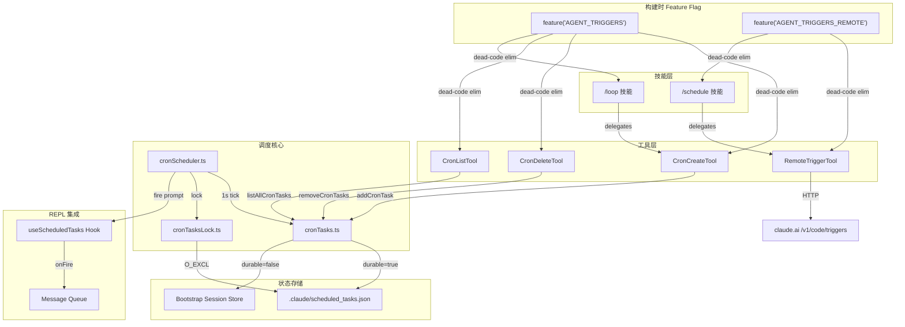

# AGENT_TRIGGERS — 定时任务与远程触发器

> Source Commit: 4b9d30f
> 分析日期: 2026-04-04
> Tier: B

---

## 1. 功能概述

AGENT_TRIGGERS 是 Claude Code 的**定时调度与远程触发器**子系统，提供三类核心能力：

1. **本地 Cron 调度** — 通过 `CronCreate`/`CronDelete`/`CronList` 三个工具，在 REPL 会话中按 cron 表达式定时执行 prompt（支持一次性和循环两种模式）。
2. **远程触发器** — 通过 `RemoteTrigger` 工具调用 claude.ai CCR API，在 Anthropic 云端创建/管理/运行远程定时 Agent。
3. **SleepTool** — 让 Agent 主动等待指定时长（与 PROACTIVE/KAIROS 联动），避免占用 shell 进程。

该功能由 `feature('AGENT_TRIGGERS')` 和 `feature('AGENT_TRIGGERS_REMOTE')` 两个独立构建时标志控制，配合 GrowthBook 运行时门控 (`tengu_kairos_cron`/`tengu_surreal_dali`) 实现精细化灰度发布。

---

## 2. 架构总览（含 Mermaid 图）



核心数据流：CronCreateTool 写入任务 → cronScheduler 1 秒轮询 → 到期时通过 useScheduledTasks 将 prompt 注入 REPL 消息队列。远程触发器走独立的 HTTP API 路径。

---

## 3. 核心文件清单

| 文件 | 职责 |
|------|------|
| `src/tools/ScheduleCronTool/CronCreateTool.ts` | 创建定时任务工具 |
| `src/tools/ScheduleCronTool/CronDeleteTool.ts` | 删除定时任务工具 |
| `src/tools/ScheduleCronTool/CronListTool.ts` | 列出定时任务工具 |
| `src/tools/ScheduleCronTool/prompt.ts` | Cron 工具的 prompt 和门控函数 |
| `src/tools/ScheduleCronTool/UI.tsx` | Cron 工具的 Ink UI 渲染 |
| `src/tools/RemoteTriggerTool/RemoteTriggerTool.ts` | 远程触发器 CRUD + run 工具 |
| `src/tools/RemoteTriggerTool/prompt.ts` | 远程触发器 prompt 常量 |
| `src/tools/RemoteTriggerTool/UI.tsx` | 远程触发器 UI 渲染 |
| `src/tools/SleepTool/prompt.ts` | Sleep 工具 prompt |
| `src/utils/cronScheduler.ts` | 非 React 调度核心（timer + chokidar） |
| `src/utils/cronTasks.ts` | 任务 CRUD、文件读写、抖动算法 |
| `src/utils/cronTasksLock.ts` | 多会话调度锁 (O_EXCL) |
| `src/hooks/useScheduledTasks.ts` | REPL React 集成 Hook |
| `src/skills/bundled/loop.ts` | `/loop` 快捷调度技能 |
| `src/skills/bundled/scheduleRemoteAgents.ts` | `/schedule` 远程 Agent 技能 |
| `src/bootstrap/state.ts` | 会话内存中的 cron 任务存储 |
| `src/tools.ts` | 工具注册入口 |
| `src/skills/bundled/index.ts` | 技能注册入口 |

---

## 4. 启动与初始化流程

1. **构建时**：`feature('AGENT_TRIGGERS')` 决定 cron 工具和 `/loop` 技能是否被打包；`feature('AGENT_TRIGGERS_REMOTE')` 决定 RemoteTriggerTool 和 `/schedule` 技能是否被打包。未启用的代码被 Bun 的 dead-code elimination 完全剥离。`src/tools.ts:cronTools (L29-35)`

2. **工具注册**：`src/tools.ts` 通过 `feature('AGENT_TRIGGERS')` 条件导入 CronCreateTool / CronDeleteTool / CronListTool。`src/tools.ts:cronTools (L29-35)`

3. **技能注册**：`src/skills/bundled/index.ts` 中 `feature('AGENT_TRIGGERS')` 触发 `registerLoopSkill()`，`feature('AGENT_TRIGGERS_REMOTE')` 触发 `registerScheduleRemoteAgentsSkill()`。`src/skills/bundled/index.ts:registerLoopSkill (L47-54)`

4. **运行时门控**：`isKairosCronEnabled()` 在 Tool 的 `isEnabled()` 中被调用（惰性，post-init），组合 build-time flag 与 GrowthBook 的 `tengu_kairos_cron` 开关。`src/tools/ScheduleCronTool/prompt.ts:isKairosCronEnabled (L36-45)`

5. **调度器启动**：REPL 挂载 `useScheduledTasks` Hook → 创建 `createCronScheduler` 实例 → `scheduler.start()` 检查 `getScheduledTasksEnabled()` 或 `hasCronTasksSync()` → 若有任务则 `enable()` → 获取锁 + 启动 chokidar + 启动 1 秒 check timer。`src/utils/cronScheduler.ts:start (L463-498)`

---

## 5. 运行时行为

**Cron 调度循环**：`cronScheduler.check()` 每 1 秒执行一次。对每个任务：
- 首次见到时从 `lastFiredAt ?? createdAt` 计算 `nextFireAt`，加入 jitter 防止雷群效应
- 当 `now >= nextFireAt` 且 REPL 空闲（`!isLoading()`）时触发
- 循环任务：从 `now` 重新计算下次触发时间 + jitter，写回 `lastFiredAt`
- 一次性任务：触发后删除（会话内存同步删除，文件异步删除 + chokidar reload）

`src/utils/cronScheduler.ts:check (L230-394)`

**任务双存储**：
- `durable: true` → 写入 `.claude/scheduled_tasks.json`，跨会话持久化
- `durable: false`（默认） → 仅存在于 `bootstrap/state.ts` 的会话内存中

`src/utils/cronTasks.ts:addCronTask (L194-219)`

**远程触发器**：RemoteTriggerTool 通过 OAuth bearer token 调用 `{BASE_API_URL}/v1/code/triggers`，支持 list/get/create/update/run 五种 action，响应为原始 JSON。

`src/tools/RemoteTriggerTool/RemoteTriggerTool.ts:call (L78-151)`

---

## 6. Feature Flag 门控

本功能涉及多层 flag，详细机制参见 `docs/features/infra/20-feature-flag-arch.md`。

| Flag | 类型 | 作用 |
|------|------|------|
| `AGENT_TRIGGERS` | 构建时 (Bun) | 控制 CronCreate/Delete/List + `/loop` 技能的代码包含 |
| `AGENT_TRIGGERS_REMOTE` | 构建时 (Bun) | 控制 RemoteTriggerTool + `/schedule` 技能的代码包含 |
| `tengu_kairos_cron` | 运行时 (GrowthBook) | 全局开关，default=true，5 分钟刷新，可中途关闭已运行的调度器 |
| `tengu_kairos_cron_durable` | 运行时 (GrowthBook) | 持久化 cron 任务的子开关 |
| `tengu_surreal_dali` | 运行时 (GrowthBook) | RemoteTriggerTool + `/schedule` 技能的运行时启用 |
| `CLAUDE_CODE_DISABLE_CRON` | 环境变量 | 本地覆盖，优先于 GrowthBook |

`isKairosCronEnabled()` 的逻辑：build-time `AGENT_TRIGGERS` → 非 `CLAUDE_CODE_DISABLE_CRON` → GrowthBook `tengu_kairos_cron` (default true, 5 min refresh)。

`src/tools/ScheduleCronTool/prompt.ts:isKairosCronEnabled (L36-45)`

---

## 7. 关键代码片段

**片段 1：Cron 任务创建入口**

```typescript
// src/tools/ScheduleCronTool/CronCreateTool.ts:call (L117-141)
async call({ cron, prompt, recurring = true, durable = false }) {
    const effectiveDurable = durable && isDurableCronEnabled()
    const id = await addCronTask(
      cron, prompt, recurring, effectiveDurable,
      getTeammateContext()?.agentId,
    )
    setScheduledTasksEnabled(true)
    return {
      data: { id, humanSchedule: cronToHuman(cron), recurring,
              durable: effectiveDurable },
    }
  },
```

**片段 2：调度器抖动算法（防雷群）**

```typescript
// src/utils/cronTasks.ts:jitteredNextCronRunMs (L381-398)
export function jitteredNextCronRunMs(
  cron: string, fromMs: number, taskId: string,
  cfg: CronJitterConfig = DEFAULT_CRON_JITTER_CONFIG,
): number | null {
  const t1 = nextCronRunMs(cron, fromMs)
  if (t1 === null) return null
  const t2 = nextCronRunMs(cron, t1)
  if (t2 === null) return t1
  const jitter = Math.min(
    jitterFrac(taskId) * cfg.recurringFrac * (t2 - t1),
    cfg.recurringCapMs,
  )
  return t1 + jitter
}
```

**片段 3：多会话调度锁获取**

```typescript
// src/utils/cronTasksLock.ts:tryAcquireSchedulerLock (L111-173)
export async function tryAcquireSchedulerLock(
  opts?: SchedulerLockOptions,
): Promise<boolean> {
  const sessionId = opts?.lockIdentity ?? getSessionId()
  const lock = { sessionId, pid: process.pid, acquiredAt: Date.now() }
  if (await tryCreateExclusive(lock, dir)) {
    registerLockCleanup(opts)
    return true
  }
  const existing = await readLock(dir)
  if (existing?.sessionId === sessionId) return true // idempotent
  if (existing && isProcessRunning(existing.pid)) return false
  // Stale — recover
  await unlink(getLockPath(dir)).catch(() => {})
  return tryCreateExclusive(lock, dir)
}
```

**片段 4：RemoteTriggerTool 的 HTTP 分发**

```typescript
// src/tools/RemoteTriggerTool/RemoteTriggerTool.ts:call (L100-133)
const { action, trigger_id, body } = input
switch (action) {
  case 'list':  method = 'GET';  url = base; break
  case 'get':   method = 'GET';  url = `${base}/${trigger_id}`; break
  case 'create': method = 'POST'; url = base; data = body; break
  case 'update': method = 'POST'; url = `${base}/${trigger_id}`;
                  data = body; break
  case 'run':   method = 'POST';
                  url = `${base}/${trigger_id}/run`; data = {}; break
}
```

**片段 5：`/loop` 技能解析与调度**

```typescript
// src/skills/bundled/loop.ts:buildPrompt (L25-71)
// 解析规则：
// 1. 前导 token 匹配 ^\d+[smhd]$ → interval + rest
// 2. 尾部 "every <N><unit>" → extract interval
// 3. 默认 10m
// 然后 CronCreate recurring:true + 立即执行一次
```

---

## 8. 状态管理

**双存储模型**：

| 存储层 | 接口 | 持久性 |
|--------|------|--------|
| 文件 `.claude/scheduled_tasks.json` | `readCronTasks()` / `writeCronTasks()` | 跨会话 |
| 会话内存 `STATE.sessionCronTasks` | `addSessionCronTask()` / `getSessionCronTasks()` | 仅当前进程 |

`listAllCronTasks()` 合并两者：文件任务的 `durable` 字段为 undefined（隐式 true），会话任务标记 `durable: false`。`src/utils/cronTasks.ts:listAllCronTasks (L288-296)`

**调度器全局标志**：`STATE.scheduledTasksEnabled` — 由 `CronCreateTool.call()` 或 `hasCronTasksSync()` 在启动时翻转。`useScheduledTasks` Hook 轮询此标志决定是否 `enable()` 调度器。

**锁状态**：`.claude/scheduled_tasks.lock` 文件包含 `{sessionId, pid, acquiredAt}`，通过 `O_EXCL` 原子创建。每 5 秒非 owner 会话 probe 一次锁，owner 进程退出后 stale lock 被恢复。`src/utils/cronTasksLock.ts:tryAcquireSchedulerLock (L111-173)`

**远程触发器**：无本地状态，每次操作直接 HTTP → claude.ai API，响应透传。

---

## 9. 安全与权限模型

1. **OAuth 令牌隔离**：RemoteTriggerTool 在进程内注入 Bearer token，从不暴露给 shell。prompt 中明确说明 "Auth is handled in-process — the token never reaches the shell"。`src/tools/RemoteTriggerTool/prompt.ts:PROMPT (L6-15)`

2. **策略门控**：RemoteTriggerTool 的 `isEnabled()` 要求 `isPolicyAllowed('allow_remote_sessions')` 通过。`src/tools/RemoteTriggerTool/RemoteTriggerTool.ts:isEnabled (L57-62)`

3. **GrowthBook 运行时门控**：`tengu_surreal_dali` (远程) 和 `tengu_kairos_cron` (本地) 作为 fleet 级别 kill switch。

4. **只读分类**：RemoteTriggerTool 对 `list`/`get` action 标记 `isReadOnly: true`。`src/tools/RemoteTriggerTool/RemoteTriggerTool.ts:isReadOnly (L66-68)`

5. **Teammate 隔离**：Teammate 只能删除自己创建的 cron 任务（通过 `agentId` 匹配）。`src/tools/ScheduleCronTool/CronDeleteTool.ts:validateInput (L71-79)`

6. **trigger_id 格式校验**：`/^[\w-]+$/` regex 限制 trigger_id 字符集。`src/tools/RemoteTriggerTool/RemoteTriggerTool.ts:inputSchema (L22-23)`

---

## 10. 与其他功能的交互

- **PROACTIVE/KAIROS**：SleepTool 在 `feature('PROACTIVE') || feature('KAIROS')` 下启用；cron 系统可独立于 KAIROS 运作（`AGENT_TRIGGERS` 无 KAIROS 依赖），但 assistant mode 的内建任务（catch-up/morning-checkin/dream）通过 `permanent: true` 标记永不过期。`src/tools/ScheduleCronTool/prompt.ts:isKairosCronEnabled 注释 (L16-18)`
- **Teammate 系统**：调度器通过 `onFireTask` 回调检查 `task.agentId`，将触发 prompt 路由到对应 teammate 的 `pendingUserMessages` 队列。`src/hooks/useScheduledTasks.ts:onFireTask (L91-109)`
- **MCP Connectors**：`/schedule` 技能自动检测已连接的 claude.ai MCP connector 并注入远程触发器的 `mcp_connections` 配置。`src/skills/bundled/scheduleRemoteAgents.ts:getConnectedClaudeAIConnectors (L65-87)`

---

## 11. 错误处理与恢复

1. **cron 表达式校验**：`CronCreateTool.validateInput()` 检查表达式合法性和是否有下次触发时间（一年内）。`src/tools/ScheduleCronTool/CronCreateTool.ts:validateInput (L82-115)`

2. **任务上限**：`MAX_JOBS = 50`，超出返回 errorCode 3。`src/tools/ScheduleCronTool/CronCreateTool.ts:validateInput (L97-104)`

3. **文件损坏容错**：`readCronTasks()` 对 malformed JSON 返回空数组；逐条跳过无效任务（id/cron/prompt/createdAt 类型校验 + cron 表达式重校验），仅 debug 级别日志。`src/utils/cronTasks.ts:readCronTasks (L91-140)`

4. **调度锁恢复**：owner 进程崩溃后，passive 会话通过 PID liveness 检测接管锁。`src/utils/cronTasksLock.ts:tryAcquireSchedulerLock (L149-172)`

5. **错过任务检测**：启动时 `findMissedTasks()` 发现 one-shot 任务已过期 → 通过 `AskUserQuestion` 询问是否执行（不自动执行）。`src/utils/cronScheduler.ts:load (L179-228)`

6. **循环任务自动过期**：`recurringMaxAgeMs` 默认 7 天，过期任务最后触发一次后删除。`src/utils/cronScheduler.ts:isRecurringTaskAged (L53-60)`

7. **RemoteTriggerTool**：`validateStatus: () => true` 接受所有 HTTP 状态码，透传给 Agent 处理。20 秒超时。`src/tools/RemoteTriggerTool/RemoteTriggerTool.ts:call (L135-143)`

---

## 12. UI/UX

**CronCreateTool**：渲染 "Scheduled **{id}** ({humanSchedule})"，用 `<Text bold>` 高亮 job ID。`src/tools/ScheduleCronTool/UI.tsx:renderCreateResultMessage (L17-24)`

**CronDeleteTool**：渲染 "Cancelled **{id}**"。`src/tools/ScheduleCronTool/UI.tsx:renderDeleteResultMessage (L33-38)`

**CronListTool**：空列表显示 dimColor 的 "No scheduled jobs"；有任务时逐行 "{id} {humanSchedule}"。`src/tools/ScheduleCronTool/UI.tsx:renderListResultMessage (L46-57)`

**RemoteTriggerTool**：显示 "HTTP {status} ({lines} lines)"。`src/tools/RemoteTriggerTool/UI.tsx:renderToolResultMessage (L9-16)`

**调度器触发消息**：`useScheduledTasks` 在触发时插入 "Running scheduled task (Apr 4 3:15pm)" 格式的系统消息到 REPL。`src/hooks/useScheduledTasks.ts:formatCronFireTime (L129-139)`

---

## 13. 限制与已知问题

1. **最小粒度 1 分钟**：Cron 表达式为标准 5-field 格式，不支持秒级调度。`/loop` 的秒数参数会向上取整到分钟。

2. **循环任务 7 天自动过期**：`recurringMaxAgeMs = 7 * 24 * 60 * 60 * 1000`，非 `permanent` 任务到期后最后触发一次即删除。这是有意设计，防止长期 session 中内存泄漏累积。`src/utils/cronTasks.ts:DEFAULT_CRON_JITTER_CONFIG (L348-355)`

3. **远程触发器不支持删除**：RemoteTriggerTool 只有 list/get/create/update/run，删除需用户访问 `https://claude.ai/code/scheduled`。`src/skills/bundled/scheduleRemoteAgents.ts:buildPrompt (L319)`

4. **Teammate 不支持 durable cron**：Teammate 创建的任务强制 session-only，因为 teammate 不会跨会话持久化。`src/tools/ScheduleCronTool/CronCreateTool.ts:validateInput (L106-114)`

5. **远程触发器最短间隔 1 小时**：由 API 侧强制，本地无校验。`src/skills/bundled/scheduleRemoteAgents.ts:buildPrompt (L251)`

---

## 14. 技术亮点

1. **确定性抖动防雷群**：`jitteredNextCronRunMs()` 用 taskId 的前 8 hex 字符转 u32 分数作为稳定的 per-task jitter seed。循环任务正向延迟（interval 的 10%，最大 15 分钟），一次性任务反向提前（仅在 :00/:30 分钟触发，最大 90 秒）。这让同一 cron 表达式的不同用户均匀分散到时间窗口内，避免 inference API 尖峰。`src/utils/cronTasks.ts:jitteredNextCronRunMs (L381-398)` + `oneShotJitteredNextCronRunMs (L421-445)`

2. **O_EXCL 原子锁 + PID liveness probe**：多个 Claude 会话共享同一 cwd 时，`cronTasksLock.ts` 用文件系统原子操作保证只有一个 session 驱动调度器。Stale 锁通过 `isProcessRunning(pid)` 检测并恢复，非 owner 每 5 秒 probe 一次。模式与 `computerUseLock.ts` 一致。`src/utils/cronTasksLock.ts:tryAcquireSchedulerLock (L111-173)`

3. **运行时 kill switch 热更新**：`isKairosCronEnabled()` 使用 5 分钟 TTL 的 GrowthBook 缓存刷新，调度器 `check()` 每个 tick 轮询 `isKilled`。ops 可以通过远程 push `tengu_kairos_cron=false` 在不重启客户端的情况下停止所有已运行的调度器。`src/utils/cronScheduler.ts:check (L231)` + `src/tools/ScheduleCronTool/prompt.ts:isKairosCronEnabled (L36-45)`
