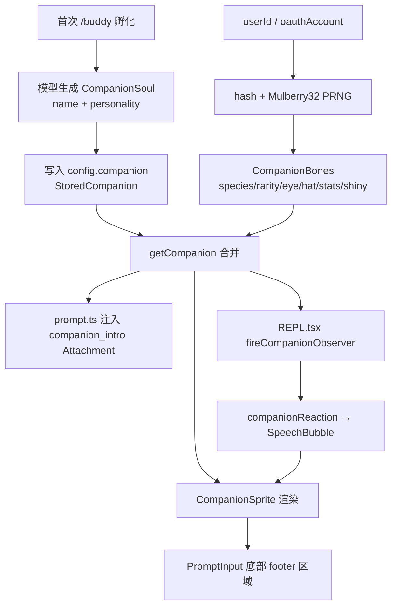

# BUDDY 伴侣精灵深度分析

> **Source Commit**: `4b9d30f`
> **分析日期**: 2026-04-04
> **Tier**: B
> **涉及文件数**: ~10
> **相关 Feature Flags**: `BUDDY`

## 1. 功能概述

BUDDY 是 Claude Code 的虚拟伴侣精灵系统——一个基于用户 ID 确定性生成的 ASCII 角色，会在终端输入框旁边显示，并在 AI 回复后产生独立的"旁白反应"。它本质上是一个彩蛋功能（初始发布窗口为 2026 年 4 月 1-7 日），但命令 `/buddy` 之后永久可用。伴侣包含两部分数据：**骨骼（Bones）**——由 `hash(userId)` 确定性派生的物种、稀有度、眼睛、帽子、属性等；**灵魂（Soul）**——模型生成的名字和性格，仅在首次孵化时写入 config 永久存储。（`src/buddy/companion.ts:roll (L107)`, `src/buddy/types.ts:CompanionBones (L101)`, `src/buddy/types.ts:CompanionSoul (L111)`）

## 2. 架构总览（含 Mermaid 图）



系统流程：用户 ID 经 `mulberry32` 种子确定性生成骨骼属性，首次孵化时由 LLM 生成灵魂数据持久化到 config。运行时 `getCompanion()` 始终从 userId 重新推导骨骼，再合并持久化灵魂，保证用户无法通过修改 config 伪造稀有度。REPL 每轮对话结束后触发 `fireCompanionObserver`，将伴侣反应写入 `AppState.companionReaction`，由 `CompanionSprite` 渲染气泡。（`src/buddy/companion.ts:getCompanion (L127)`, `src/screens/REPL.tsx:fireCompanionObserver (L2805)`）

## 3. 核心文件清单

| 文件 | 关键职责 |
|---|---|
| `src/buddy/types.ts` | Rarity/Species/Eye/Hat/StatName 类型定义，权重与颜色映射 |
| `src/buddy/companion.ts` | Mulberry32 PRNG、hash、roll 生成、getCompanion 合并逻辑 |
| `src/buddy/sprites.ts` | 18 物种 × 3 帧 ASCII 精灵定义、renderSprite/renderFace |
| `src/buddy/CompanionSprite.tsx` | 主 UI 组件：idle 动画、SpeechBubble、pet 心跳、窄屏适配 |
| `src/buddy/useBuddyNotification.tsx` | 启动彩虹提示、teaser 窗口判定、`/buddy` 触发位置检测 |
| `src/buddy/prompt.ts` | companion_intro Attachment 注入与去重 |
| `src/utils/config.ts` | `companion` / `companionMuted` 配置字段定义 |
| `src/state/AppStateStore.ts` | `companionReaction` / `companionPetAt` 状态字段 |
| `src/commands.ts` | `/buddy` 命令条件注册 |
| `src/screens/REPL.tsx` | 伴侣 Observer 触发、滚动清除反应、布局集成 |

## 4. 启动与初始化流程

1. **编译期**：`feature('BUDDY')` 在 `bun:bundle` 编译期决定是否打包 buddy 分支。为 false 时所有 buddy 代码被死码消除。（`src/commands.ts:feature('BUDDY') (L118)`）
2. **命令注册**：`commands.ts` 中 `const buddy = feature('BUDDY') ? require('./commands/buddy/index.js') : null`，结果展开进命令数组。（`src/commands.ts:buddy (L118-L322)`）
3. **启动通知**：`useBuddyNotification` hook 在 `PromptInput` 中挂载，检查 `feature('BUDDY')` 且用户尚未孵化伴侣 且处于 teaser 窗口（2026-04-01 ~ 04-07），则推送 15 秒彩虹 `/buddy` 提示。（`src/buddy/useBuddyNotification.tsx:useBuddyNotification (L43)`, `src/buddy/useBuddyNotification.tsx:isBuddyTeaserWindow (L12)`）
4. **已孵化路径**：若 `config.companion` 存在，`getCompanion()` 立即合并骨骼与灵魂，`CompanionSprite` 在 REPL 布局中直接渲染。（`src/buddy/companion.ts:getCompanion (L127)`）

## 5. 运行时行为

**Idle 动画**：`CompanionSprite` 每 500ms tick 一次，按 `IDLE_SEQUENCE` 在 frame 0（静止）、frame 1-2（fidget）、-1（blink）间循环，产生轻量级呼吸感动画。（`src/buddy/CompanionSprite.tsx:IDLE_SEQUENCE (L23)`, `src/buddy/CompanionSprite.tsx:TICK_MS (L16)`）

**反应气泡**：每轮 AI 回复后 REPL 调用 `fireCompanionObserver`，将消息传给 observer 生成短文本反应，写入 `AppState.companionReaction`。气泡显示 20 tick（~10s），最后 6 tick 渐隐。用户滚动时立即清除。（`src/screens/REPL.tsx:fireCompanionObserver (L2805)`, `src/buddy/CompanionSprite.tsx:BUBBLE_SHOW (L17)`, `src/buddy/CompanionSprite.tsx:FADE_WINDOW (L18)`, `src/screens/REPL.tsx:companionReaction清除 (L1302)`）

**Pet 交互**：`/buddy pet` 设置 `companionPetAt` 时间戳，`CompanionSprite` 在 2.5s 内渲染上浮心形动画（5 帧）。（`src/buddy/CompanionSprite.tsx:PET_BURST_MS (L19)`, `src/buddy/CompanionSprite.tsx:PET_HEARTS (L27)`）

**窄屏适配**：终端宽度 < 100 列时折叠为单行 `renderFace` + 名字；quip 超 24 字符截断加省略号。（`src/buddy/CompanionSprite.tsx:MIN_COLS_FOR_FULL_SPRITE (L152)`, `src/buddy/CompanionSprite.tsx:NARROW_QUIP_CAP (L157)`）

**全屏模式**：气泡由 `CompanionFloatingBubble` 独立渲染在 `FullscreenLayout` 的 `bottomFloat` slot 中，避免 `overflowY:hidden` 裁剪。（`src/buddy/CompanionSprite.tsx:CompanionFloatingBubble (L296)`, `src/components/FullscreenLayout.tsx:bottomFloat (L42)`）

## 6. Feature Flag 门控

本功能使用 `BUDDY` feature flag，遵循统一的三层门控机制。不在本文重复机制细节，完整架构请参考：`../infra/20-feature-flag-arch.md`。

具体门控点：
- `src/commands.ts` (L118)：命令注册条件
- `src/buddy/useBuddyNotification.tsx` (L53)：通知 hook 提前返回
- `src/buddy/useBuddyNotification.tsx` (L83)：触发位置检测提前返回空数组
- `src/buddy/prompt.ts` (L18)：companion_intro attachment 注入
- `src/buddy/CompanionSprite.tsx` (L168, L215)：宽度计算和渲染提前返回
- `src/buddy/CompanionSprite.tsx` (L340)：浮动气泡渲染
- `src/screens/REPL.tsx` (L2804, L4565, L4590-4591, L4995)：Observer 触发与布局渲染

另有时间窗口门控：`isBuddyTeaserWindow()` 限制彩虹提示仅在 2026-04-01 ~ 04-07 显示，`isBuddyLive()` 在 2026 年 4 月后永久返回 true。内部构建（`"external" === 'ant'`）始终绕过时间检查。（`src/buddy/useBuddyNotification.tsx:isBuddyTeaserWindow (L12)`, `src/buddy/useBuddyNotification.tsx:isBuddyLive (L17)`）

## 7. 关键代码片段

### 7.1 Mulberry32 种子 PRNG

```typescript
// src/buddy/companion.ts (L16-L25)
function mulberry32(seed: number): () => number {
  let a = seed >>> 0
  return function () {
    a |= 0
    a = (a + 0x6d2b79f5) | 0
    let t = Math.imul(a ^ (a >>> 15), 1 | a)
    t = (t + Math.imul(t ^ (t >>> 7), 61 | t)) ^ t
    return ((t ^ (t >>> 14)) >>> 0) / 4294967296
  }
}
```

### 7.2 稀有度加权随机

```typescript
// src/buddy/companion.ts (L43-L51)
function rollRarity(rng: () => number): Rarity {
  const total = Object.values(RARITY_WEIGHTS).reduce((a, b) => a + b, 0)
  let roll = rng() * total
  for (const rarity of RARITIES) {
    roll -= RARITY_WEIGHTS[rarity]
    if (roll < 0) return rarity
  }
  return 'common'
}
```

### 7.3 骨骼从不持久化——getCompanion 防伪造

```typescript
// src/buddy/companion.ts (L127-L133)
export function getCompanion(): Companion | undefined {
  const stored = getGlobalConfig().companion
  if (!stored) return undefined
  const { bones } = roll(companionUserId())
  return { ...stored, ...bones }
}
```

### 7.4 精灵渲染与帽子覆盖

```typescript
// src/buddy/sprites.ts (L454-L469)
export function renderSprite(
  bones: CompanionBones, frame = 0
): string[] {
  const frames = BODIES[bones.species]
  const body = frames[frame % frames.length]!.map(
    line => line.replaceAll('{E}', bones.eye)
  )
  const lines = [...body]
  if (bones.hat !== 'none' && !lines[0]!.trim()) {
    lines[0] = HAT_LINES[bones.hat]
  }
  if (!lines[0]!.trim()
    && frames.every(f => !f[0]!.trim())) lines.shift()
  return lines
}
```

### 7.5 反应气泡渐隐

```typescript
// src/buddy/CompanionSprite.tsx (L220-L223)
const bubbleAge = reaction
  ? tick - lastSpokeTick.current : 0
const fading = reaction !== undefined
  && bubbleAge >= BUBBLE_SHOW - FADE_WINDOW
```

### 7.6 物种名称防 grep 编码

```typescript
// src/buddy/types.ts (L14-L18)
const c = String.fromCharCode
export const duck = c(0x64,0x75,0x63,0x6b) as 'duck'
export const goose = c(0x67,0x6f,0x6f,0x73,0x65) as 'goose'
export const blob = c(0x62,0x6c,0x6f,0x62) as 'blob'
```

## 8. 状态管理

| 存储位置 | 字段 | 说明 |
|---|---|---|
| `config` (磁盘) | `companion: StoredCompanion` | 灵魂数据（name, personality, hatchedAt）持久化 |
| `config` (磁盘) | `companionMuted: boolean` | 静音开关，隐藏精灵和气泡 |
| `AppState` (内存) | `companionReaction: string` | 当前轮次旁白文本，10s 后自动清除 |
| `AppState` (内存) | `companionPetAt: number` | `/buddy pet` 时间戳，驱动心跳动画 |
| `AppState` (内存) | `footerSelection: 'companion'` | 底栏焦点选中状态 |

关键设计：骨骼数据**从不持久化**。每次 `getCompanion()` 都从 `hash(userId + SALT)` 重新派生骨骼，再合并持久化灵魂。这保证：(1) 用户无法通过编辑 config 伪造稀有度；(2) 物种重命名或数组调整不破坏已有伴侣。（`src/buddy/companion.ts:getCompanion (L127)`, `src/buddy/companion.ts:SALT (L84)`）

Roll 结果有单条缓存（`rollCache`），因为同一 userId 会被多个热路径重复调用（500ms sprite tick、按键、每轮 observer）。（`src/buddy/companion.ts:rollCache (L106)`）

## 9. 安全与权限模型

- **无额外权限需求**：BUDDY 功能完全在客户端运行，不发起网络请求（除 observer 可能调用 API 生成反应文本）。
- **防伪造设计**：骨骼每次读取重新派生，存储的 `companion` 字段只保存灵魂数据，编辑 config 无法改变物种或稀有度。（`src/buddy/companion.ts:getCompanion (L127)`）
- **userId 来源**：优先使用 `oauthAccount.accountUuid`，回退到 `config.userID`，最终降级到 `'anon'`。（`src/buddy/companion.ts:companionUserId (L119)`）
- **静音控制**：`companionMuted` 配置项在所有渲染入口检查，可完全关闭精灵显示。（`src/buddy/CompanionSprite.tsx:companionMuted检查 (L170, L217, L344)`）

## 10. 与其他功能的交互

- **Prompt 系统**：`getCompanionIntroAttachment` 在 attachment 管线中注入 `companion_intro` 类型，通过 `src/utils/messages.ts` 转换为系统提示文本，让 LLM 知晓伴侣存在并保持 one-line 风格回复。（`src/buddy/prompt.ts:getCompanionIntroAttachment (L15)`, `src/utils/messages.ts:companion_intro处理 (L4232)`）
- **PromptInput 集成**：底栏 footer 导航包含 `'companion'` 选项，选中后按回车等同执行 `/buddy`；输入框中 `/buddy` 文本高亮为彩虹色。（`src/components/PromptInput/PromptInput.tsx:companion footer (L1788)`, `src/components/PromptInput/PromptInput.tsx:buddyTriggers (L525)`）
- **FullscreenLayout**：全屏模式下气泡通过 `bottomFloat` slot 独立渲染，避免与 ScrollBox 的 `overflowY:hidden` 冲突。（`src/screens/REPL.tsx:CompanionFloatingBubble (L4565)`）

## 11. 错误处理与恢复

- **无伴侣降级**：所有入口（渲染、宽度计算、prompt 注入）均首先检查 `getCompanion()` 返回值和 `companionMuted`，未孵化或已静音时返回 null/0/空数组，不影响正常工作流。（`src/buddy/CompanionSprite.tsx:CompanionSprite (L216-L217)`, `src/buddy/CompanionSprite.tsx:companionReservedColumns (L168-L171)`）
- **反应超时清除**：`companionReaction` 在 `BUBBLE_SHOW * TICK_MS`（10s）后由 `setTimeout` 自动置 undefined，带 cleanup 清除计时器，不会泄漏。（`src/buddy/CompanionSprite.tsx:useEffect (L205-L214)`）
- **物种 encoding 容错**：所有物种名通过 `String.fromCharCode` 运行时构造，避免构建管线的排除字符串检查误报（某个物种名与模型代号冲突）。（`src/buddy/types.ts:SPECIES编码 (L14-L28)`）

## 12. UI/UX

**精灵形态**：18 种物种（duck, goose, blob, cat, dragon, octopus, owl, penguin, turtle, snail, ghost, axolotl, capybara, cactus, robot, rabbit, mushroom, chonk），每种 3 帧 5 行 12 列 ASCII 艺术。帽子（crown, tophat, propeller, halo, wizard, beanie, tinyduck）叠加在 line 0。稀有度用星级和主题色区分：common=★ inactive, legendary=★★★★★ warning。（`src/buddy/sprites.ts:BODIES (L26)`, `src/buddy/sprites.ts:HAT_LINES (L443)`, `src/buddy/types.ts:RARITY_STARS (L134)`, `src/buddy/types.ts:RARITY_COLORS (L142)`）

**气泡**：圆角边框 Ink `Box`，最大 30 字宽自动换行，渐隐时 border 变 inactive 色。尾巴方向区分内联模式（`right`，水平连接符 `─`）和浮动模式（`down`，反斜线 `╲`）。（`src/buddy/CompanionSprite.tsx:SpeechBubble (L43)`, `src/buddy/CompanionSprite.tsx:wrap (L28)`）

**Footer 集成**：在 PromptInput 底部 footer pill 列表中有 `companion` 条目，箭头键选中高亮为 inverse 显示，回车等同 `/buddy`。输入框中 `/buddy` 文本片段被检测并渲染为彩虹色。（`src/components/PromptInput/PromptInput.tsx:footerItems (L460)`, `src/components/PromptInput/PromptInput.tsx:buddyTriggers (L525)`）

**宽度自适应**：`companionReservedColumns` 计算精灵+气泡占用列宽，`PromptInput` 据此缩减文本输入列数以避免换行错位。窄屏（< 100 列）返回 0，精灵切换为 one-liner。（`src/buddy/CompanionSprite.tsx:companionReservedColumns (L167)`, `src/components/PromptInput/PromptInput.tsx:textInputColumns (L1991)`）

## 13. 限制与已知问题

1. **Observer 不在快照中**：`src/buddy/observer.ts` 被 `AppStateStore` 注释引用但不在当前源码快照中，`fireCompanionObserver` 的定义亦不可见。反应生成的完整逻辑无法从现有代码推断。
2. **`/buddy` 命令实现缺失**：`src/commands/buddy/index.js` 被 `commands.ts` 引用但目录不存在于快照中，孵化流程（LLM 生成灵魂）的具体实现不可分析。
3. **单条 roll 缓存**：`rollCache` 仅缓存最后一个 userId 的结果，多用户环境（理论上不存在于 CLI）下会频繁失效。
4. **shiny 概率极低**：`rng() < 0.01` 即 1% 概率，但目前 `shiny` 字段在渲染中无可见差异处理。
5. **内部构建绕过时间窗口**：`"external" === 'ant'` 条件使 Anthropic 内部构建始终启用 teaser，外部用户严格受日期限制。

## 14. 技术亮点

1. **骨骼/灵魂分离架构**：骨骼（物种、稀有度、属性）每次从 userId 重新确定性派生，灵魂（名字、性格）一次生成永久存储。这种设计既保证了伴侣的唯一性和不可伪造性（编辑 config 无法改变稀有度），又允许开发者安全修改物种列表而不破坏已有用户数据。（`src/buddy/companion.ts:getCompanion (L127)`, `src/buddy/types.ts:StoredCompanion (L124)`）

2. **物种名 fromCharCode 反检测**：所有 18 个物种名用 `String.fromCharCode(0x64,0x75,0x63,0x6b)` 而非字面量 `'duck'` 定义，因为构建管线的排除字符串检查会 grep 构建产物寻找模型代号——某个物种名恰好与代号冲突。这种编码策略让源码可读性通过 `as 'duck'` 类型断言保持，而构建产物中不出现明文。（`src/buddy/types.ts:SPECIES编码 (L14-L28)`）

3. **响应式宽度让位**：`companionReservedColumns` 让 `PromptInput` 感知伴侣精灵和气泡的占用宽度，在非全屏模式下精确扣减输入列数，避免文本换行错位。窄屏时返回 0 并切换为单行模式，全屏时气泡浮动渲染不占行内空间。这种分模式宽度协商在终端 UI 中是少见的精细实现。（`src/buddy/CompanionSprite.tsx:companionReservedColumns (L167)`, `src/components/PromptInput/PromptInput.tsx:textInputColumns (L1991)`）
