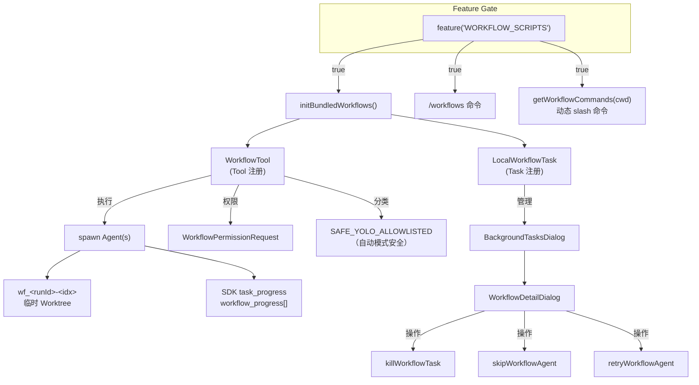

# WORKFLOW_SCRIPTS 深度分析

> **Source Commit**: `4b9d30f`
> **分析日期**: 2026-04-04
> **Tier**: B
> **涉及文件数**: ~10（集成点）+ 不可见实现模块
> **Feature Flag**: `tengu_workflow_scripts`（`WORKFLOW_SCRIPTS`）

---

## 1. 功能概述

WORKFLOW_SCRIPTS 是 Claude Code 的本地工作流脚本引擎，允许用户定义和执行可复用的多步骤自动化工作流。其核心理念是将重复性编码任务（如 spec 编写、代码审查、CI 修复）编排为脚本化流程，每个步骤由独立 Agent 执行，主线程负责编排与生命周期管理。

该功能通过 `feature('WORKFLOW_SCRIPTS')` 门控，仅在 Anthropic 内部 ant 构建中激活。外部 npm 发布版本中，实现文件（`src/tools/WorkflowTool/`、`src/tasks/LocalWorkflowTask/`、`src/commands/workflows/`）被 Bun 的死代码消除（DCE）完整剥离。本分析基于快照中可观测的集成接口、类型签名和运行时胶水代码推断整体架构。`src/tools.ts:WorkflowTool` (L129-L134), `src/tasks.ts:LocalWorkflowTask` (L9-L11)

## 2. 架构总览（含 Mermaid 图）



上图展示 WORKFLOW_SCRIPTS 的三层集成结构：Feature Gate 门控层、Tool/Task/Command 注册层、以及运行时的 Agent 编排与 UI 管理层。每个节点在快照集成代码中均有对应引用点。

## 3. 核心文件清单

| 文件路径 | 角色 | 关键职责 |
|---|---|---|
| `src/tools.ts` | Tool 注册 | 条件加载 `WorkflowTool`，初始化 `initBundledWorkflows()` |
| `src/tasks.ts` | Task 注册 | 条件加载 `LocalWorkflowTask`，纳入 `getAllTasks()` |
| `src/commands.ts` | 命令注册 | 加载 `/workflows` 命令和 `getWorkflowCommands(cwd)` 动态命令 |
| `src/constants/tools.ts` | 约束定义 | 将 `WORKFLOW_TOOL_NAME` 加入 `ALL_AGENT_DISALLOWED_TOOLS` |
| `src/utils/permissions/classifierDecision.ts` | 权限分类 | 将 Workflow 工具加入 `SAFE_YOLO_ALLOWLISTED_TOOLS` |
| `src/components/tasks/BackgroundTasksDialog.tsx` | UI 管理 | 条件加载 `WorkflowDetailDialog`，管理 kill/skip/retry |
| `src/components/permissions/PermissionRequest.tsx` | 权限 UI | 条件匹配 `WorkflowPermissionRequest` 组件 |
| `src/components/tasks/BackgroundTask.tsx` | 状态显示 | 渲染 `local_workflow` 类型的 pill 标签和进度 |
| `src/tasks/pillLabel.ts` | 标签文案 | `local_workflow` → "N background workflow(s)" |
| `src/tasks/types.ts` | 类型联合 | `LocalWorkflowTaskState` 纳入 `TaskState` 联合类型 |
| `src/utils/task/sdkProgress.ts` | SDK 事件 | 发射含 `workflowProgress` 的 `task_progress` 事件 |
| `src/utils/task/framework.ts` | 任务框架 | 发射 `task_started` 事件时附带 `workflow_name` 字段 |
| `src/Task.ts` | 基础类型 | 定义 `local_workflow` 任务类型和 `w` ID 前缀 |
| `src/utils/worktree.ts` | 工作树清理 | 定义 `wf_<runId>-<idx>` 短暂工作树模式的清扫规则 |

> **注意**：实际实现文件 `src/tools/WorkflowTool/WorkflowTool.js`、`src/tasks/LocalWorkflowTask/LocalWorkflowTask.js`、`src/commands/workflows/index.js`、`src/tools/WorkflowTool/bundled/index.js` 在快照中不存在（被 DCE 剥离），以上均为集成侧引用点。

## 4. 启动与初始化流程

WorkflowTool 的加载采用 IIFE（立即执行函数表达式）模式，在 `src/tools.ts` 模块求值时同步完成两步操作：

1. **调用 `initBundledWorkflows()`**：从 `src/tools/WorkflowTool/bundled/index.js` 导入并执行，注册内置工作流定义到某个全局注册表中。`src/tools.ts` (L131)
2. **返回 `WorkflowTool` 对象**：从 `src/tools/WorkflowTool/WorkflowTool.js` 导入 Tool 实例，加入 `getAllBaseTools()` 数组。`src/tools.ts` (L132-L133)

```typescript
const WorkflowTool = feature('WORKFLOW_SCRIPTS')
  ? (() => {
      require('./tools/WorkflowTool/bundled/index.js').initBundledWorkflows()
      return require('./tools/WorkflowTool/WorkflowTool.js').WorkflowTool
    })()
  : null
```

同时，`LocalWorkflowTask` 在 `src/tasks.ts` 中通过相同的 feature gate 加载，纳入 `getAllTasks()` 列表，使任务系统识别 `local_workflow` 类型。`src/tasks.ts:getAllTasks` (L22-L32)

命令侧，`/workflows` 和动态工作流命令分别在 `src/commands.ts` 的两个位置加载：静态命令 (L86-L90) 和 `getWorkflowCommands` 工厂函数 (L401-L405)。后者在 `loadAllCommands` 中与技能和插件命令并行加载。`src/commands.ts:loadAllCommands` (L449-L458)

## 5. 运行时行为

基于集成代码的类型签名和 UI 逻辑，可推断如下运行时行为模型：

**工作流执行**：当 LLM 调用 `WorkflowTool` 时，系统创建一个 `local_workflow` 类型的后台任务。该任务内部管理多个 Agent，每个 Agent 对应工作流脚本中的一个步骤。UI 层通过 `task.agentCount` 显示当前运行的 Agent 数量。`src/components/tasks/BackgroundTask.tsx` (L221-L233)

**工作树隔离**：每个工作流 Agent 在独立的 git worktree 中执行，slug 格式为 `wf_<runId>-<idx>`（其中 runId 为 `randomUUID().slice(0,12)` 的 8 hex + `-` + 3 hex，idx 为步骤序号）。这些是短暂工作树，进程退出后由 30 天清扫任务回收。`src/utils/worktree.ts` (L1024-L1035)

**进度汇报**：工作流通过 `emitTaskProgress` 发射带有 `workflowProgress` 数组的 SDK 事件。客户端（如 VS Code 扩展）通过 `${type}:${index}` 键进行 upsert 更新，并按 `phaseIndex` 分组重建阶段树。`src/utils/task/sdkProgress.ts:emitTaskProgress` (L10-L35), `src/utils/sdkEventQueue.ts` (L30-L33)

**结果持回**：`local_workflow` 类型任务与 `local_agent` 一样参与结果持回（hold-back）逻辑：当有运行中的后台工作流时，主 LLM 的最终响应会被暂缓，直到工作流完成。`src/cli/print.ts` (L2225-L2232)

## 6. Feature Flag 门控

WORKFLOW_SCRIPTS 使用构建期 `feature('WORKFLOW_SCRIPTS')` 门控，由 `bun:bundle` 在编译时求值。详细机制参见 [Feature Flag 三层架构](../infra/20-feature-flag-arch.md)。

该 flag 对应 `build_flags.yaml` 中的 `tengu_workflow_scripts` 键。在外部构建中值为 `false`，导致所有 `require()` 分支被 Bun DCE 完整剥离，包括：
- `src/tools/WorkflowTool/` 目录下所有模块
- `src/tasks/LocalWorkflowTask/` 目录下所有模块
- `src/commands/workflows/` 目录下所有模块
- `src/components/tasks/WorkflowDetailDialog.js`
- `src/tools/WorkflowTool/WorkflowPermissionRequest.js`

代码注释明确指出 DCE 的必要性："WORKFLOW_SCRIPTS is ant-only (build_flags.yaml). Static imports would leak ~1.3K lines into external builds."。`src/components/tasks/BackgroundTasksDialog.tsx` (L105-L107)

## 7. 关键代码片段

**片段 1：WorkflowTool 加载 IIFE**（`src/tools.ts` L129-L134）

```typescript
const WorkflowTool = feature('WORKFLOW_SCRIPTS')
  ? (() => {
      require('./tools/WorkflowTool/bundled/index.js').initBundledWorkflows()
      return require('./tools/WorkflowTool/WorkflowTool.js').WorkflowTool
    })()
  : null
```

**片段 2：Agent 递归防护**（`src/constants/tools.ts` L44-L46）

```typescript
// Prevent recursive workflow execution inside subagents.
...(feature('WORKFLOW_SCRIPTS') ? [WORKFLOW_TOOL_NAME] : []),
```

**片段 3：自动模式安全白名单**（`src/utils/permissions/classifierDecision.ts` L84-L85）

```typescript
// Workflow orchestration — subagents go through canUseTool individually
...(WORKFLOW_TOOL_NAME ? [WORKFLOW_TOOL_NAME] : []),
```

**片段 4：后台任务 UI 中的工作流操作**（`src/components/tasks/BackgroundTasksDialog.tsx` L389-L391）

```typescript
case 'local_workflow':
  if (!WorkflowDetailDialog) return null;
  return <WorkflowDetailDialog workflow={task_0} onDone={onDone}
    onKill={killWorkflowTask ? () => killWorkflowTask(task_0.id, setAppState) : undefined}
    onSkipAgent={skipWorkflowAgent ? agentId => skipWorkflowAgent(task_0.id, agentId, setAppState) : undefined}
    onRetryAgent={retryWorkflowAgent ? agentId => retryWorkflowAgent(task_0.id, agentId, setAppState) : undefined}
    onBack={goBackToList} />;
```

**片段 5：SDK 事件中的 workflow_name 传播**（`src/utils/task/framework.ts` L111-L114）

```typescript
workflow_name:
  'workflowName' in task
    ? (task.workflowName as string | undefined)
    : undefined,
```

**片段 6：短暂工作树清扫模式**（`src/utils/worktree.ts` L1032）

```typescript
/^wf_[0-9a-f]{8}-[0-9a-f]{3}-\d+$/,
```

## 8. 状态管理

工作流任务状态通过 `LocalWorkflowTaskState` 类型管理（类型定义在 `src/tasks/LocalWorkflowTask/LocalWorkflowTask.js` 中，被 DCE 剥离，但类型导入在 `src/tasks/types.ts` (L8) 和 `src/components/tasks/BackgroundTasksDialog.tsx` (L18) 中可见）。

从 UI 代码推断的状态字段包括：
- **`type`**: 固定为 `'local_workflow'`
- **`status`**: 复用 `TaskStatus`（pending/running/completed/failed/killed）。`src/Task.ts` (L15-L20)
- **`id`**: 以 `w` 为前缀的随机 ID。`src/Task.ts:TASK_ID_PREFIXES` (L84)
- **`workflowName`**: 工作流脚本的 `meta.name`（如 `'spec'`），用于 SDK 事件和 UI 标签。`src/entrypoints/sdk/coreSchemas.ts` (L1723-L1728)
- **`agentCount`**: 当前运行中的 Agent 数量，UI 据此显示 "N agent(s)"。`src/components/tasks/BackgroundTask.tsx` (L232-L233)
- **`summary`**: 工作流执行摘要，用于后台任务列表标签。`src/components/tasks/BackgroundTasksDialog.tsx` (L530)

状态变更通过 `setAppState` 注入到全局 `AppState.tasks` 字典中，与其他任务类型共享相同的生命周期管理。`src/Task.ts:SetAppState` (L36)

## 9. 安全与权限模型

WORKFLOW_SCRIPTS 的权限设计遵循"编排器安全、子 Agent 独立检查"的分层原则：

1. **WorkflowTool 本身加入 SAFE_YOLO_ALLOWLISTED_TOOLS**：在自动模式下无需分类器检查即可执行。理由是"subagents go through canUseTool individually"——工作流编排器只是调度，实际危险操作由子 Agent 各自经过权限检查。`src/utils/permissions/classifierDecision.ts` (L84-L85)

2. **WorkflowPermissionRequest 专用 UI**：WorkflowTool 有独立的权限确认组件，而非通用 Fallback。`src/components/permissions/PermissionRequest.tsx` (L71-L72)

3. **禁止递归调用**：WorkflowTool 被加入 `ALL_AGENT_DISALLOWED_TOOLS`，确保子 Agent 无法在工作流内再次触发工作流执行，防止无限递归。`src/constants/tools.ts` (L44-L46)

## 10. 与其他功能的交互

- **Worktree 系统**：工作流 Agent 使用 `wf_<runId>-<idx>` 格式的临时工作树进行隔离执行，与 AgentTool 和 BridgeMode 的临时工作树共享清扫基础设施。`src/utils/worktree.ts` (L1024-L1041)
- **后台任务系统**：`LocalWorkflowTask` 完整接入 TaskState 联合类型、BackgroundTasksDialog 和 pillLabel 系统，享有与 `local_agent`、`local_bash` 同等的管理界面。`src/tasks/types.ts` (L12-L29)
- **SDK 事件流**：工作流进度通过 `emitTaskProgress` 的 `workflow_progress` 字段向 SDK 消费者（VS Code 等）实时推送阶段进展，客户端按 phase 分组重建进度树。`src/utils/sdkEventQueue.ts` (L30-L33)

## 11. 错误处理与恢复

从 BackgroundTasksDialog 的 UI 回调推断，工作流支持三种错误恢复操作：

1. **Kill**（`killWorkflowTask`）：终止整个工作流任务，状态转为 `killed`。`src/components/tasks/BackgroundTasksDialog.tsx` (L276-L277)
2. **Skip Agent**（`skipWorkflowAgent`）：跳过当前出错或卡住的 Agent，继续执行后续步骤。`src/components/tasks/BackgroundTasksDialog.tsx` (L112)
3. **Retry Agent**（`retryWorkflowAgent`）：重新执行失败的 Agent 步骤。`src/components/tasks/BackgroundTasksDialog.tsx` (L113)

此外，临时工作树在主进程异常退出（Ctrl+C、ESC、崩溃）时会泄漏，由 `EPHEMERAL_WORKTREE_PATTERNS` 定义的 30 天清扫任务在后续会话启动时回收。`src/utils/worktree.ts` (L1043-L1049)

## 12. UI/UX

工作流在 UI 层面有完整的集成表面：

- **后台任务列表**：`local_workflow` 类型任务以 `task.summary ?? task.description` 作为标签显示。`src/components/tasks/BackgroundTasksDialog.tsx` (L530)
- **BackgroundTask pill**：运行中显示 "N agent(s)"，完成后显示 "done"。`src/components/tasks/BackgroundTask.tsx` (L221-L233)
- **Footer pill**：单个工作流显示 "1 background workflow"，多个显示 "N background workflows"。`src/tasks/pillLabel.ts` (L57-L58)
- **WorkflowDetailDialog**：专属详情对话框，提供 kill/skip/retry 操作按钮。`src/components/tasks/BackgroundTasksDialog.tsx` (L390-L391)
- **权限确认**：专用 `WorkflowPermissionRequest` 组件。`src/components/permissions/PermissionRequest.tsx` (L71-L72)
- **Slash 命令**：`/workflows` 静态命令 + `getWorkflowCommands(cwd)` 基于 cwd 的动态命令列表。`src/commands.ts` (L86-L90, L401-L405)

## 13. 限制与已知问题

1. **实现不可见**：核心实现文件（WorkflowTool、LocalWorkflowTask、bundled workflows、WorkflowDetailDialog、WorkflowPermissionRequest、workflows 命令）在外部快照中完全缺失，无法验证具体的脚本定义格式、Agent 编排策略和错误处理细节。
2. **仅限 ant 构建**：`build_flags.yaml` 硬编码为内部构建开启，外部用户无法通过任何运行时配置启用此功能。
3. **工作树泄漏**：与所有临时工作树一样，进程被强制终止时 `wf_*` 工作树会残留，依赖 30 天清扫机制回收。
4. **SDK 进度协议复杂度**：`workflow_progress` 的 upsert/groupByPhase 协议要求客户端实现特定的状态折叠算法，增加了 SDK 集成方的对接成本。

## 14. 技术亮点

1. **IIFE 初始化模式**：`WorkflowTool` 的加载使用 IIFE 将 `initBundledWorkflows()` 和 Tool 注册合并为单次同步操作，确保内置工作流在 Tool 注册前已完成注册，消除时序依赖。`src/tools.ts` (L130-L133)

2. **编排器-子 Agent 权限分离**：WorkflowTool 自身被标记为安全（SAFE_YOLO_ALLOWLISTED），但子 Agent 各自独立经过 `canUseTool` 检查。这种分层设计既避免了用户被频繁打断确认编排操作，又不降低实际执行时的安全保障。`src/utils/permissions/classifierDecision.ts` (L84-L85), `src/constants/tools.ts` (L44-L46)

3. **结构化临时工作树命名**：`wf_<runId>-<idx>` 的命名方案同时编码了工作流运行 ID 和步骤序号，使清扫逻辑可通过正则精确匹配而不误伤用户自建的 EnterWorktree 工作树。`src/utils/worktree.ts` (L1024-L1032)
