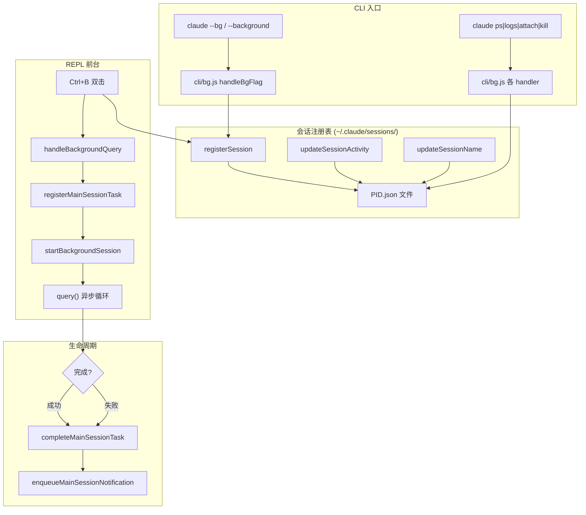

# BG_SESSIONS — 后台会话管理

> **Source Commit**: `4b9d30f`
> **分析日期**: 2026-04-04
> **Tier**: B
> **Feature Flag**: `BG_SESSIONS`（编译时 DCE，参见 [Feature Flag 三层架构](../infra/20-feature-flag-arch.md)）

---

## 1. 功能概述

BG_SESSIONS 为 Claude Code 提供**后台会话**能力——用户可以将正在运行的查询放入后台继续执行，或通过 `claude --bg` 直接在独立 tmux 会话中启动后台 REPL。该功能还为 `claude ps`、`claude logs`、`claude attach`、`claude kill` 等管理子命令提供基础设施，使用户可以在单终端内管理多个并行的 Claude 会话。

核心价值：
- **Ctrl+B 双击**：将当前前台查询移入后台，释放 REPL 继续交互
- **`claude --bg`**：在 tmux 中启动无头后台 REPL，退出时 detach 而非 kill
- **会话注册表**：PID 文件注册 + 活跃状态推送，支持 `claude ps` 列出所有存活会话
- **前台/后台切换**：foreground/background 任务消息同步与 UI 状态恢复

---

## 2. 架构总览（含 Mermaid 图）



---

## 3. 核心文件清单

| 文件 | 职责 |
|------|------|
| `src/tasks/LocalMainSessionTask.ts` | 后台主会话任务注册、完成、前台化、通知 |
| `src/hooks/useSessionBackgrounding.ts` | React Hook：Ctrl+B 前台/后台切换逻辑 |
| `src/components/SessionBackgroundHint.tsx` | UI 提示组件：双击 Ctrl+B 的视觉反馈 |
| `src/utils/concurrentSessions.ts` | PID 文件注册表：会话注册、状态更新、并发计数 |
| `src/entrypoints/cli.tsx` | CLI 入口快速路径：分发 ps/logs/attach/kill/--bg |
| `src/commands/exit/exit.tsx` | /exit 命令：bg 会话时 tmux detach 而非 kill |
| `src/screens/REPL.tsx` | REPL 主屏：集成 backgrounding hook 与 UI hint |
| `src/query.ts` | 查询引擎：条件加载 taskSummary 模块 |
| `src/utils/conversationRecovery.ts` | --continue 恢复：跳过活跃 bg/daemon 会话 |

---

## 4. 启动与初始化流程

**路径 A — `claude --bg` 启动**：
1. `cli.tsx` 检测 `args.includes('--bg')` 且 `feature('BG_SESSIONS')` 为 true — `src/entrypoints/cli.tsx:185`
2. 动态 `import('../cli/bg.js')` 加载 bg 模块
3. 调用 `bg.handleBgFlag(args)`，在 tmux 中启动独立 REPL 进程
4. 子进程通过 `CLAUDE_CODE_SESSION_KIND=bg` 环境变量标记自身 — `src/utils/concurrentSessions.ts:envSessionKind (L31-36)`
5. `registerSession()` 将 PID 文件写入 `~/.claude/sessions/` — `src/utils/concurrentSessions.ts:registerSession (L59-108)`

**路径 B — Ctrl+B 双击后台化**：
1. `SessionBackgroundHint` 监听 `task:background` 快捷键 — `src/components/SessionBackgroundHint.tsx:SessionBackgroundHint (L27)`
2. 双击确认后调用 `handleBackgroundSession` → `onBackgroundQuery` — `src/hooks/useSessionBackgrounding.ts:handleBackgroundSession (L41-64)`
3. REPL 中 `handleBackgroundQuery` abort 前台查询，调用 `startBackgroundSession` — `src/screens/REPL.tsx:handleBackgroundQuery (L2526-2573)`

---

## 5. 运行时行为

### 后台任务执行

`startBackgroundSession` 在 `runWithAgentContext` 隔离上下文中执行 `query()` 异步迭代器循环：

1. **消息收集**：每个 assistant/user/system 事件 push 到 `bgMessages` 数组 — `src/tasks/LocalMainSessionTask.ts:startBackgroundSession (L383-411)`
2. **转录持久化**：每条消息通过 `recordSidechainTranscript` 增量写入独立文件，确保 `/clear` 后 symlink 重指向不丢失数据 — `src/tasks/LocalMainSessionTask.ts:startBackgroundSession (L416-418)`
3. **进度追踪**：统计 token 数和工具调用数，维护最近 5 条活动记录 — `src/tasks/LocalMainSessionTask.ts:startBackgroundSession (L421-437)`
4. **状态同步**：通过 `setAppState` 更新 React 状态树中的任务 progress — `src/tasks/LocalMainSessionTask.ts:startBackgroundSession (L439-468)`
5. **完成通知**：`completeMainSessionTask` 设置终态并通过 XML 标签格式的通知入队 — `src/tasks/LocalMainSessionTask.ts:completeMainSessionTask (L168-218)`

### 前台化（foreground）

`foregroundMainSessionTask` 将后台任务标记为 `isBackgrounded: false`，同时将先前已前台化的任务恢复为后台状态，返回任务积累的消息列表供 UI 显示 — `src/tasks/LocalMainSessionTask.ts:foregroundMainSessionTask (L270-302)`

### 会话活跃状态推送

REPL 的 `useEffect` 在每次 `sessionStatus` 变化时调用 `updateSessionActivity`，写入 PID 文件的 `status`（busy/idle/waiting）和 `waitingFor` 字段，供 `claude ps` 实时展示 — `src/screens/REPL.tsx (L1160-1167)`

---

## 6. Feature Flag 门控

BG_SESSIONS 通过 `bun:bundle` 编译时特征标志控制。所有 `feature('BG_SESSIONS')` 调用在构建期静态求值；当标志关闭时，相关分支被 DCE 完全剥离。

门控点共 11 处，分布在 7 个文件中：

| 文件 | 门控内容 |
|------|----------|
| `src/entrypoints/cli.tsx` | CLI 快速路径（ps/logs/attach/kill/--bg） |
| `src/utils/concurrentSessions.ts` | 会话种类检测、PID 额外字段、活跃状态推送 |
| `src/query.ts` | taskSummary 模块条件加载、周期性摘要生成 |
| `src/screens/REPL.tsx` | 活跃状态推送、bg exit detach |
| `src/main.tsx` | agent CLI 参数传递到环境变量 |
| `src/commands/exit/exit.tsx` | bg 会话 tmux detach |
| `src/utils/conversationRecovery.ts` | --continue 跳过活跃 bg 会话 |

详细机制参见 [Feature Flag 三层架构](../infra/20-feature-flag-arch.md)。

---

## 7. 关键代码片段

### 片段 1：会话 PID 注册（含 BG_SESSIONS 扩展字段）

```typescript
// src/utils/concurrentSessions.ts:registerSession (L77-96)
await writeFile(
  pidFile,
  jsonStringify({
    pid: process.pid,
    sessionId: getSessionId(),
    cwd: getOriginalCwd(),
    startedAt: Date.now(),
    kind,
    entrypoint: process.env.CLAUDE_CODE_ENTRYPOINT,
    ...(feature('BG_SESSIONS')
      ? {
          name: process.env.CLAUDE_CODE_SESSION_NAME,
          logPath: process.env.CLAUDE_CODE_SESSION_LOG,
          agent: process.env.CLAUDE_CODE_AGENT,
        }
      : {}),
  }),
)
```

### 片段 2：bg 会话退出行为 — tmux detach

```typescript
// src/commands/exit/exit.tsx:call (L18-24)
if (feature('BG_SESSIONS') && isBgSession()) {
  onDone();
  spawnSync('tmux', ['detach-client'], { stdio: 'ignore' });
  return null;
}
```

### 片段 3：后台任务完成通知

```typescript
// src/tasks/LocalMainSessionTask.ts:enqueueMainSessionNotification (L255-262)
const message = `<${TASK_NOTIFICATION_TAG}>
<${TASK_ID_TAG}>${taskId}</${TASK_ID_TAG}>${toolUseIdLine}
<${OUTPUT_FILE_TAG}>${outputPath}</${OUTPUT_FILE_TAG}>
<${STATUS_TAG}>${status}</${STATUS_TAG}>
<${SUMMARY_TAG}>${summary}</${SUMMARY_TAG}>
</${TASK_NOTIFICATION_TAG}>`
enqueuePendingNotification({ value: message, mode: 'task-notification' })
```

### 片段 4：--continue 跳过活跃 bg 会话

```typescript
// src/utils/conversationRecovery.ts (L492-506)
if (feature('BG_SESSIONS')) {
  try {
    const { listAllLiveSessions } = await import('./udsClient.js')
    const live = await listAllLiveSessions()
    skip = new Set(
      live.flatMap(s =>
        s.kind && s.kind !== 'interactive' && s.sessionId
          ? [s.sessionId]
          : [],
      ),
    )
  } catch { /* UDS unavailable */ }
}
```

### 片段 5：任务 ID 生成 — 's' 前缀区分

```typescript
// src/tasks/LocalMainSessionTask.ts:generateMainSessionTaskId (L75-82)
function generateMainSessionTaskId(): string {
  const bytes = randomBytes(8)
  let id = 's'
  for (let i = 0; i < 8; i++) {
    id += TASK_ID_ALPHABET[bytes[i]! % TASK_ID_ALPHABET.length]
  }
  return id
}
```

---

## 8. 状态管理

### 任务状态（LocalMainSessionTaskState）

继承 `LocalAgentTaskState`，额外添加 `agentType: 'main-session'` 标记。关键字段：

| 字段 | 类型 | 说明 |
|------|------|------|
| `status` | `'running' \| 'completed' \| 'failed'` | 任务生命周期状态 |
| `isBackgrounded` | `boolean` | 是否处于后台（初始 true） |
| `messages` | `Message[]` | 任务积累的对话消息 |
| `progress` | `{ tokenCount, toolUseCount, recentActivities }` | 实时进度指标 |
| `notified` | `boolean` | 原子标志，防止重复通知 |

状态通过 `registerTask` / `updateTaskState` 写入全局 `AppState.tasks[taskId]`，由 `useSessionBackgrounding` hook 中的 `useEffect` 同步到前台 UI。

### PID 注册表

位于 `~/.claude/sessions/<pid>.json`，每个会话一个文件。BG_SESSIONS 启用时额外包含 `name`、`logPath`、`agent`、`status`、`waitingFor`、`updatedAt` 字段。进程退出时通过 `registerCleanup` 回调自动删除。`countConcurrentSessions` 遍历目录并通过 `isProcessRunning` 清理僵尸文件 — `src/utils/concurrentSessions.ts:countConcurrentSessions (L168-203)`。

---

## 9. 安全与权限模型

- **文件系统权限**：会话注册目录 `~/.claude/sessions/` 创建时设置 `mode: 0o700`（仅 owner 可读写），随后 `chmod` 加固 — `src/utils/concurrentSessions.ts:registerSession (L75-76)`
- **PID 文件严格匹配**：`countConcurrentSessions` 使用正则 `/^\d+\.json$/` 过滤文件名，防止误解析非 PID 文件（修复 #34210 中因 `parseInt` 宽松解析导致的数据丢失风险） — `src/utils/concurrentSessions.ts:countConcurrentSessions (L186)`
- **WSL 安全兜底**：在 WSL 环境下跳过僵尸 PID 文件清理，避免跨操作系统 PID 命名空间冲突导致误删 Windows 侧活跃会话文件 — `src/utils/concurrentSessions.ts:countConcurrentSessions (L194-200)`
- **abort 幂等性**：后台查询中断时通过 `notified` 原子标志确保通知只发送一次 — `src/tasks/LocalMainSessionTask.ts:startBackgroundSession (L391-399)`

---

## 10. 与其他功能的交互

- **DAEMON 守护进程**：会话种类 `SessionKind` 包含 `'daemon' | 'daemon-worker'`，共享 PID 注册表基础设施；`--continue` 同样跳过 daemon 会话以避免恢复到仍在运行的守护进程 — `src/utils/concurrentSessions.ts:SessionKind (L18)`。
- **UDS_INBOX**：PID 文件在 `feature('UDS_INBOX')` 启用时额外写入 `messagingSocketPath`，使 `claude attach` 可通过 Unix Domain Socket 连接后台会话 — `src/utils/concurrentSessions.ts:registerSession (L86-88)`。
- **Bridge Mode**：`updateSessionBridgeId` 在 PID 文件中记录远程控制会话 ID，供 peer 枚举去重——同一会话通过 UDS 和 Bridge 都可达时只显示一次 — `src/utils/concurrentSessions.ts:updateSessionBridgeId (L144-148)`。

---

## 11. 错误处理与恢复

| 场景 | 处理策略 | 引用 |
|------|----------|------|
| PID 文件写入失败 | `logForDebugging` 记录，`registerSession` 返回 false，不阻塞启动 | `concurrentSessions.ts:registerSession (L106)` |
| PID 文件更新失败 | `logForDebugging` 记录，静默忽略 | `concurrentSessions.ts:updatePidFile (L125)` |
| 后台查询被 abort | 检查 `notified` 标志，仅首次发送 SDK terminated 事件 | `LocalMainSessionTask.ts:startBackgroundSession (L387-400)` |
| 后台查询异常 | catch 块调用 `completeMainSessionTask(taskId, false, ...)` 标记失败 | `LocalMainSessionTask.ts:startBackgroundSession (L472-474)` |
| 转录写入失败 | `.catch()` 静默记录，不中断查询循环 | `LocalMainSessionTask.ts:startBackgroundSession (L360-361)` |
| UDS 不可用时 --continue | catch 空块，treat all sessions as continuable | `conversationRecovery.ts (L503-504)` |
| 进程退出清理 | `registerCleanup` 删除 PID 文件，ENOENT 静默忽略 | `concurrentSessions.ts:registerSession (L66-72)` |

---

## 12. UI/UX

- **Ctrl+B 双击提示**：`SessionBackgroundHint` 组件在首次按下 Ctrl+B 时显示提示文字，800ms 内再次按下才真正后台化。tmux 环境下快捷键自动适配为 `ctrl+b ctrl+b` — `src/components/SessionBackgroundHint.tsx:SessionBackgroundHint (L86-87)`
- **仅查询中可用**：`isLoading` 为 true 且无前台 shell/agent 任务时才激活会话后台功能 — `src/components/SessionBackgroundHint.tsx:SessionBackgroundHint (L73)`
- **消息同步**：`useSessionBackgrounding` hook 将前台化任务的 `messages` 实时同步到主视图，避免冗余渲染（按 length 变化检测） — `src/hooks/useSessionBackgrounding.ts (L93-97)`
- **完成通知**：后台任务完成后通过 XML 标签格式的 task-notification 入队到消息队列，用户在下次 REPL 交互时看到结果摘要
- **环境变量禁用**：`CLAUDE_CODE_DISABLE_BACKGROUND_TASKS` 环境变量可全局关闭后台任务功能 — `src/components/SessionBackgroundHint.tsx:SessionBackgroundHint (L40)`

---

## 13. 限制与已知问题

1. **`cli/bg.js` 不在源码快照中**：`--bg` 实际处理逻辑（`psHandler`、`logsHandler`、`attachHandler`、`killHandler`、`handleBgFlag`）位于动态导入的 `../cli/bg.js`，该模块在当前源码快照中不可见，无法分析其具体实现。
2. **`taskSummary.js` 不在源码快照中**：`query.ts` 条件加载的 `src/utils/taskSummary.js` 模块同样不可见，周期性摘要生成的具体策略（`shouldGenerateTaskSummary`、`maybeGenerateTaskSummary`）无法验证。
3. **tmux 硬依赖**：`--bg` 模式和 bg 会话退出依赖 `spawnSync('tmux', ...)` — 未安装 tmux 的环境下该功能不可用。
4. **WSL 并发计数保守**：WSL 环境下不清理僵尸 PID 文件，可能导致 `countConcurrentSessions` 计数偏高。

---

## 14. 技术亮点

1. **双前缀 Task ID 命名空间**：主会话后台任务使用 `'s'` 前缀（`generateMainSessionTaskId`），与子 agent 任务的 `'a'` 前缀形成命名空间隔离，使 `isMainSessionTask` 类型守卫可以在统一的 `tasks` 状态树中区分两种任务类型 — `src/tasks/LocalMainSessionTask.ts:generateMainSessionTaskId (L75-82)`。

2. **AsyncLocalStorage 上下文隔离**：`startBackgroundSession` 使用 `runWithAgentContext` 将后台查询包裹在独立的 `SubagentContext` 中，确保技能调用、转录写入等操作不会与前台 REPL 的 `AsyncLocalStorage` 上下文交叉污染——即使两者共享同一进程 — `src/tasks/LocalMainSessionTask.ts:startBackgroundSession (L367-376)`。

3. **PID 注册表防御性设计**：严格正则过滤（`/^\d+\.json$/`）+ WSL 跨平台 PID 感知 + 清理回调 + `chmod 0o700` 四重保护，在多平台、多进程并发环境下保持注册表一致性 — `src/utils/concurrentSessions.ts`。
