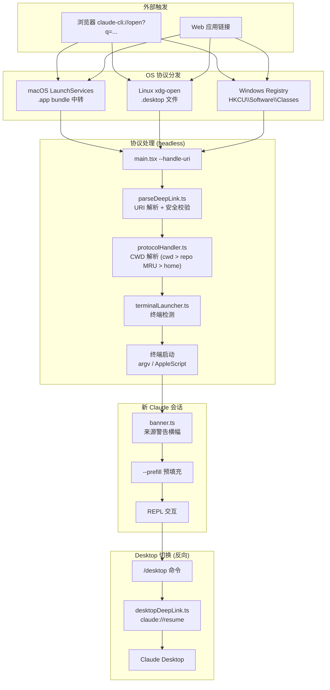

# LODESTONE — Deep Link 协议与跨平台会话导航

```
Source Commit: 4b9d30f
分析日期: 2026-04-04
Tier: B
```

## 1. 功能概述

LODESTONE 是 Claude Code 的 **自定义 URI 协议（`claude-cli://`）** 系统，实现从浏览器、外部应用或 Web 链接一键启动 Claude Code 终端会话。该功能涵盖：

- **`claude-cli://open` 协议**：从外部链接打开 Claude Code，支持 prefill prompt、指定 cwd、指定 GitHub 仓库
- **跨平台协议注册**：macOS（.app bundle + LaunchServices）、Linux（.desktop + xdg-mime）、Windows（注册表）
- **终端检测与启动**：自动识别用户偏好的终端模拟器并在其中启动新 Claude 实例
- **Desktop 会话切换**：通过 `claude://resume` 协议将 CLI 会话转移至 Claude Desktop 应用
- **安全横幅**：外部深链接打开的会话显示来源警告，防止 prompt 注入

LODESTONE 由构建时 feature flag `LODESTONE` 控制，并有运行时 GrowthBook flag `tengu_lodestone_enabled` 作为二级门控。

## 2. 架构总览（含 Mermaid 图）



系统包含两个方向的深链接流：**入站**（外部 → CLI）通过 `claude-cli://` 协议，**出站**（CLI → Desktop）通过 `claude://resume` 协议。入站流在无 TTY 的 headless 环境中解析 URI，然后启动终端；出站流则在已有的交互式会话中构建 Desktop 深链接。

## 3. 核心文件清单

| 文件 | 职责 | 行数 |
|------|------|------|
| `src/utils/deepLink/parseDeepLink.ts` | URI 解析、参数校验、安全净化 | 170 |
| `src/utils/deepLink/protocolHandler.ts` | 入站协议处理入口，CWD 解析 | 136 |
| `src/utils/deepLink/registerProtocol.ts` | 跨平台协议注册与自修复检测 | 348 |
| `src/utils/deepLink/terminalLauncher.ts` | 终端检测与跨平台启动 | 557 |
| `src/utils/deepLink/terminalPreference.ts` | 终端偏好捕获与持久化 | 54 |
| `src/utils/deepLink/banner.ts` | 深链接来源警告横幅生成 | 123 |
| `src/utils/desktopDeepLink.ts` | CLI→Desktop 反向深链接 | 236 |
| `src/components/DesktopHandoff.tsx` | Desktop 切换 UI 组件 | 193 |
| `src/commands/desktop/index.ts` | `/desktop` 命令注册 | 26 |
| `src/utils/backgroundHousekeeping.ts` | 后台自动注册协议 | 94 |
| `src/main.tsx` | CLI 入口，`--handle-uri` 处理 | L644-676, L3774-3796 |

## 4. 启动与初始化流程

LODESTONE 的初始化分为三条路径：

**路径 A — 正常交互式启动（注册 + 偏好捕获）：**

1. `main.tsx` 进入正常启动流程
2. `backgroundHousekeeping.ts:startBackgroundHousekeeping` (L39-41) 在 `feature('LODESTONE') && getIsInteractive()` 条件下调用 `ensureDeepLinkProtocolRegistered()`
3. `registerProtocol.ts:ensureDeepLinkProtocolRegistered` (L298) 检查用户设置 `disableDeepLinkRegistration`，检查 GrowthBook flag `tengu_lodestone_enabled`，然后验证已有注册是否 current
4. `interactiveHelpers.tsx` (L176-178) 在信任对话框之后调用 `updateDeepLinkTerminalPreference()` 将当前 `TERM_PROGRAM` 持久化到 `~/.claude.json` 的 `deepLinkTerminal` 字段

**路径 B — `--handle-uri` 协议处理（headless）：**

1. `main.tsx` (L647-660) 检测 `--handle-uri` 参数，提前退出正常初始化
2. 仅加载 `config.ts:enableConfigs()` 和 `protocolHandler.ts:handleDeepLinkUri()`
3. 解析 URI → 解析 CWD → 检测终端 → 在终端中启动新 Claude 实例
4. 立即 `process.exit(exitCode)`

**路径 C — macOS URL Scheme Launch：**

1. `main.tsx` (L666-676) 检测 `__CFBundleIdentifier === 'com.anthropic.claude-code-url-handler'`
2. 通过 `url-handler-napi` NAPI 模块从 Apple Event 读取 URL
3. 委托给 `handleDeepLinkUri()` 处理

## 5. 运行时行为

### 入站深链接处理

当用户点击 `claude-cli://open?q=fix+tests&repo=owner/repo` 链接时：

1. OS 调用已注册的协议处理器（即 `claude --handle-uri <url>`）
2. `parseDeepLink` 解析 URI：校验协议头、提取 `q`/`cwd`/`repo` 参数、执行安全净化
3. `protocolHandler.resolveCwd` 按优先级解析工作目录：显式 `cwd` > `repo` 的 MRU 本地克隆路径 > `$HOME`
4. 如果是 repo 解析，通过 `readLastFetchTime` 读取 `.git/FETCH_HEAD` mtime 判断仓库新鲜度
5. `terminalLauncher.launchInTerminal` 检测并启动终端，传递 `--deep-link-origin --prefill <query>` 等参数
6. 新启动的 Claude 实例在 `main.tsx` (L3781-3796) 中检测 `options.deepLinkOrigin`，构建并显示安全警告横幅

### Desktop 反向切换

`/desktop` 命令触发 `DesktopHandoff` 组件：检查 Desktop 安装状态 → 版本兼容性（≥1.1.2396）→ flush 会话存储 → 构建 `claude://resume?session={id}&cwd={cwd}` → 通过 `open`/`xdg-open`/`cmd start` 打开 → 成功后 graceful shutdown CLI。

## 6. Feature Flag 门控

LODESTONE 采用双层门控（详见 `docs/features/infra/20-feature-flag-arch.md`）：

- **构建时 flag**: `feature('LODESTONE')` — 控制所有 LODESTONE 代码的 tree-shaking。未激活时整个 `deepLink/` 模块不进入 bundle
- **运行时 flag**: `getFeatureValue_CACHED_MAY_BE_STALE('tengu_lodestone_enabled', false)` — 仅在 `registerProtocol.ts:ensureDeepLinkProtocolRegistered` (L302) 中使用，控制是否自动注册协议处理器

构建时 flag 出现在 6 处：`main.tsx` (L647, L3781)、`backgroundHousekeeping.ts` (L10, L39)、`interactiveHelpers.tsx` (L176)、`settings/types.ts` (L808)。

## 7. 关键代码片段

### 片段 1：URI 解析与安全校验

```typescript
// src/utils/deepLink/parseDeepLink.ts:parseDeepLink (L84-153)
export function parseDeepLink(uri: string): DeepLinkAction {
  const normalized = uri.startsWith(`${DEEP_LINK_PROTOCOL}://`)
    ? uri
    : uri.startsWith(`${DEEP_LINK_PROTOCOL}:`)
      ? uri.replace(`${DEEP_LINK_PROTOCOL}:`, `${DEEP_LINK_PROTOCOL}://`)
      : null
  if (!normalized) {
    throw new Error(`Invalid deep link: expected ${DEEP_LINK_PROTOCOL}:// ...`)
  }
  const url = new URL(normalized)
  if (url.hostname !== 'open') {
    throw new Error(`Unknown deep link action: "${url.hostname}"`)
  }
  // 校验 cwd 绝对路径、控制字符、长度限制
  // 校验 repo slug 格式 (owner/repo)
  // 净化 query Unicode 隐藏字符
  return { query, cwd, repo }
}
```

### 片段 2：跨平台终端检测（macOS）

```typescript
// src/utils/deepLink/terminalLauncher.ts:detectMacosTerminal (L64-121)
async function detectMacosTerminal(): Promise<TerminalInfo> {
  // 1. 从 ~/.claude.json deepLinkTerminal 读取持久化偏好
  const stored = getGlobalConfig().deepLinkTerminal
  if (stored) {
    const match = MACOS_TERMINALS.find(t => t.app === stored)
    if (match) return { name: match.name, command: match.app }
  }
  // 2. TERM_PROGRAM 环境变量
  // 3. mdfind (Spotlight) 查找已安装终端
  // 4. 直接检查 /Applications/*.app
  // 5. 回退: Terminal.app (macOS 始终可用)
  return { name: 'Terminal.app', command: 'Terminal' }
}
```

### 片段 3：协议注册自修复检测

```typescript
// src/utils/deepLink/registerProtocol.ts:isProtocolHandlerCurrent (L263-289)
export async function isProtocolHandlerCurrent(
  claudePath: string,
): Promise<boolean> {
  switch (process.platform) {
    case 'darwin': {
      const target = await fs.readlink(MACOS_SYMLINK_PATH)
      return target === claudePath
    }
    case 'linux': {
      const content = await fs.readFile(linuxDesktopPath(), 'utf8')
      return content.includes(linuxExecLine(claudePath))
    }
    case 'win32': {
      const { stdout, code } = await execFileNoThrow('reg', ['query', ...])
      return code === 0 && stdout.includes(windowsCommandValue(claudePath))
    }
  }
}
```

### 片段 4：CWD 解析优先级

```typescript
// src/utils/deepLink/protocolHandler.ts:resolveCwd (L117-136)
async function resolveCwd(action: {
  cwd?: string; repo?: string
}): Promise<{ cwd: string; resolvedRepo?: string }> {
  if (action.cwd) return { cwd: action.cwd }
  if (action.repo) {
    const known = getKnownPathsForRepo(action.repo)
    const existing = await filterExistingPaths(known)
    if (existing[0]) return { cwd: existing[0], resolvedRepo: action.repo }
  }
  return { cwd: homedir() }
}
```

### 片段 5：Desktop 深链接构建

```typescript
// src/utils/desktopDeepLink.ts:buildDesktopDeepLink (L35-41)
function buildDesktopDeepLink(sessionId: string): string {
  const protocol = isDevMode() ? 'claude-dev' : 'claude'
  const url = new URL(`${protocol}://resume`)
  url.searchParams.set('session', sessionId)
  url.searchParams.set('cwd', getCwd())
  return url.toString()
}
```

## 8. 状态管理

LODESTONE 的状态分散在多个存储层：

| 状态 | 存储位置 | 说明 |
|------|----------|------|
| `deepLinkTerminal` | `~/.claude.json` (全局配置) | 用户偏好终端，由 `terminalPreference.ts:updateDeepLinkTerminalPreference` (L38) 在交互式会话中捕获 |
| `githubRepoPaths` | `~/.claude.json` (全局配置) | 仓库路径 MRU 映射，由 `githubRepoPathMapping.ts` 维护 |
| `.deep-link-register-failed` | `~/.claude/` | 注册失败标记文件，24 小时退避 — `registerProtocol.ts` (L315-326) |
| 协议注册产物 | OS 级别 | macOS: `~/Applications/Claude Code URL Handler.app`；Linux: `~/.local/share/applications/claude-code-url-handler.desktop`；Windows: `HKCU\Software\Classes\claude-cli` |

不存在全局 React 状态或 Redux store。所有状态要么是文件系统持久化，要么通过 CLI 参数传递。`DesktopHandoff` 组件使用局部 `useState` 管理切换流程的 `checking → flushing → opening → success/error` 状态机：`DesktopHandoff.tsx` (L32-34)。

## 9. 安全与权限模型

LODESTONE 的安全设计是整个功能最精密的部分：

**输入净化（parseDeepLink.ts）：**
- ASCII 控制字符检测：`containsControlChars` (L36-44) 拒绝 0x00-0x1F 和 0x7F，防止 shell 命令分隔符注入
- Unicode 净化：`partiallySanitizeUnicode` 去除隐藏 Unicode 字符（ASCII 走私 / 隐藏 prompt 注入）
- 长度上限：query ≤ 5000 字符（受 Windows cmd.exe 8191 字符限制约束），cwd ≤ 4096（PATH_MAX）
- Repo slug 格式验证：`/^[\w.-]+\/[\w.-]+$/` 正则，防止路径遍历
- cwd 必须为绝对路径

**终端启动安全（terminalLauncher.ts）：**
- 纯 argv 路径（Ghostty/Alacritty/Kitty/WezTerm/Windows Terminal）：用户输入作为独立 argv 元素传递，无 shell 解释
- Shell 字符串路径（iTerm/Terminal.app/PowerShell/cmd.exe）：使用 `shellQuote`/`psQuote`/`cmdQuote` 进行严格转义
- cmd.exe 特殊处理：`cmdQuote` (L553-556) 剥离 `"` 字符（不可安全表示），转义 `%` 为 `%%`

**来源警告横幅（banner.ts）：**
- 长 prompt 检测（>1000 字符）：切换为 "scroll to review the entire prompt" 警告
- 仓库新鲜度提示：FETCH_HEAD > 7 天显示 "CLAUDE.md may be stale"

## 10. 与其他功能的交互

- **GitHub Repo Path Mapping**：`protocolHandler.ts:resolveCwd` (L124-129) 使用 `githubRepoPathMapping.ts` 的 MRU 映射将 `?repo=owner/name` 解析为本地克隆路径
- **Plugin Telemetry**：`pluginTelemetry.ts` (L108) 将 `'deep-link'` 作为 `InstallSource` 类型之一，表明插件可通过深链接安装
- **Desktop Upsell**：`DesktopUpsellStartup.tsx` 使用 `DesktopHandoff` 组件引导用户从 CLI 切换到 Desktop 应用

## 11. 错误处理与恢复

**协议注册失败恢复（registerProtocol.ts）：**
- `EACCES`/`ENOSPC` 错误写入 `.deep-link-register-failed` 标记文件，24 小时退避（`FAILURE_BACKOFF_MS`），避免每次启动重试：`registerProtocol.ts:ensureDeepLinkProtocolRegistered` (L311-346)
- 注册产物检查（`isProtocolHandlerCurrent`）直接读取 OS 产物而非缓存标志，确保跨机器自修复

**终端启动失败回退（terminalLauncher.ts）：**
- macOS: 任何终端启动失败都回退到 Terminal.app：`launchMacosTerminal` (L348-356)
- `spawnDetached` (L476-499) 捕获 ENOENT/EACCES，返回 false 而非 crash

**深链接解析失败：**
- `protocolHandler.ts:handleDeepLinkUri` (L36-47) catch 解析错误输出到 stderr 并返回退出码 1
- repo 未找到本地克隆时回退到 `$HOME` 而非报错：`resolveCwd` (L131-134)

**Desktop 切换失败：**
- `desktopDeepLink.ts:getDesktopInstallStatus` (L137-161) 版本检测失败时 assume ready
- `DesktopHandoff.tsx` 提供 not-installed 和 version-too-old 的下载提示

## 12. UI/UX

**深链接来源横幅**：以 `warning` 类型系统消息显示在会话顶部。内容包括工作目录、repo 来源（含 fetch 新鲜度）、prefill 提示。由 `banner.ts:buildDeepLinkBanner` (L54-75) 生成。

**`/desktop` 命令**：
- 注册名 `desktop`，别名 `app`，仅在 macOS 和 Windows x64 上可见：`commands/desktop/index.ts:isSupportedPlatform` (L3-11)
- `DesktopHandoff` 组件展示进度流（Checking → Saving → Opening → Success），使用 `LoadingState` 组件
- 未安装或版本过旧时提示 y/n 下载确认

**Desktop Upsell 弹窗**：`DesktopUpsellStartup.tsx` 在满足条件时（受 `tengu_desktop_upsell` 远程配置控制，最多显示 3 次）推荐用户使用 Desktop 应用。

## 13. 限制与已知问题

1. **Linux 终端检测无记忆**：`terminalPreference.ts:updateDeepLinkTerminalPreference` (L41) 明确跳过非 macOS 平台，Linux 每次都走静态优先级列表或 `$TERMINAL` 环境变量检测
2. **cmd.exe 引用不完整**：`cmdQuote` (L553-556) 无法安全表示 `"` 字符（直接剥离），含双引号的 query 在 cmd.exe 回退路径下会丢失内容
3. **macOS Apple Event 超时**：`handleUrlSchemeLaunch` (L96) 通过 NAPI `waitForUrlEvent(5000)` 等待 URL，5 秒超时后返回 null
4. **repo 解析依赖先有交互式会话**：`githubRepoPaths` MRU 只在用户手动使用过对应仓库后才有数据，首次通过深链接访问未曾使用的仓库会回退到 `$HOME`
5. **设置 `disableDeepLinkRegistration` 仅禁用自动注册**：用户仍可手动调用 `registerProtocolHandler()`

## 14. 技术亮点

1. **纯 argv vs Shell 字符串的双轨安全模型**：`terminalLauncher.ts` 为每个终端分类标注了 "PURE ARGV PATH" 和 "SHELL-STRING PATH" (L198-212)。支持纯 argv 的终端（Ghostty、Alacritty 等）完全绕过 shell 解释，用户输入作为独立 argv 元素传递；仅在 AppleScript / cmd.exe 等无 argv 接口的路径上使用 shell 转义，并在注释中明确标注 "correctness of that escaping is load-bearing"
2. **OS 产物级协议自修复**：`isProtocolHandlerCurrent` (L263-289) 直接读取 OS 注册产物（symlink target / .desktop 内容 / 注册表值）而非维护缓存标志。安装路径变更、产物被删除时下次启动自动重新注册，避免了 "config 在机器间同步但 OS 状态无法同步" 的问题
3. **Headless Trampoline 架构**：协议处理器以 headless 进程运行（无 TTY），仅负责 URI 解析和终端启动，然后立即退出。预计算 FETCH_HEAD 新鲜度等数据传入新实例，使新实例的启动路径保持 await-free：`protocolHandler.ts:handleDeepLinkUri` (L56-58)
