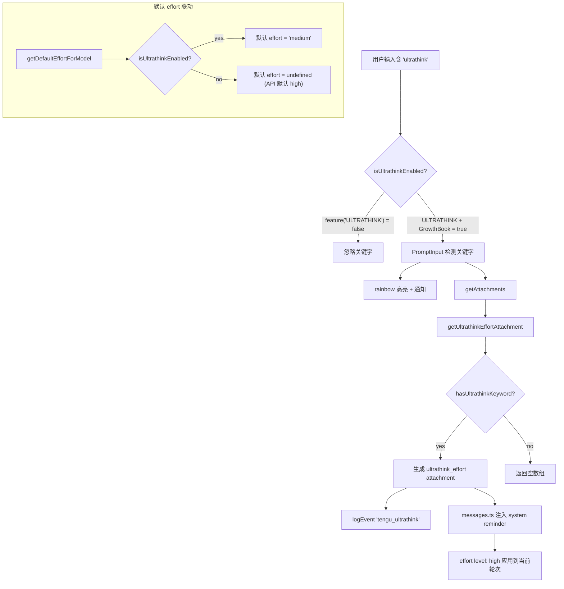

# ULTRATHINK — 关键字触发高推理努力

```
Source Commit: 4b9d30f
分析日期: 2026-04-04
Tier: B
```

## 1. 功能概述

ULTRATHINK 是一个通过用户在输入文本中嵌入 `ultrathink` 关键字来临时提升 Claude 推理努力等级（effort level）的功能。当用户在 prompt 中包含该关键字时，系统自动将当前轮次的 effort 从默认值（通常为 `medium`）提升至 `high`，从而获得更深度的推理能力。

该功能的核心设计理念是：在 Opus 4.6 等高端模型上默认使用 `medium` effort 以平衡速度和 rate limit 消耗，但允许用户通过自然语言中的魔术关键字按需激活高推理模式，无需手动切换 `/effort high`。

功能受 `ULTRATHINK` 构建时 feature flag 和 `tengu_turtle_carbon` GrowthBook 运行时 flag 双重门控。

## 2. 架构总览（含 Mermaid 图）



整体架构分为三层：
1. **UI 层**：PromptInput 实时检测关键字并提供 rainbow 高亮和通知
2. **Attachment 层**：在消息发送前生成 `ultrathink_effort` attachment，注入 system reminder
3. **Effort 默认值层**：当 ULTRATHINK 启用时，模型默认 effort 降为 `medium`，使关键字触发的 `high` 有实际提升效果

## 3. 核心文件清单

| 文件 | 职责 |
|------|------|
| `src/utils/thinking.ts` | ULTRATHINK 核心逻辑：feature gate、关键字检测、位置查找、rainbow 颜色 |
| `src/utils/effort.ts` | effort 系统：默认值计算中集成 ULTRATHINK 联动 |
| `src/utils/attachments.ts` | attachment 生成：`getUltrathinkEffortAttachment` 函数 |
| `src/utils/messages.ts` | attachment 转消息：将 `ultrathink_effort` 转为 system reminder |
| `src/components/PromptInput/PromptInput.tsx` | UI 层：rainbow 高亮和即时通知 |
| `src/utils/theme.ts` | Theme 类型：定义 rainbow 颜色系列 |
| `src/components/messages/nullRenderingAttachments.ts` | 标记 `ultrathink_effort` 为不可见 attachment |

## 4. 启动与初始化流程

ULTRATHINK 无独立的启动/初始化流程。其可用性在首次调用时惰性求值：

1. **构建时**：`feature('ULTRATHINK')` 通过 Bun 的 `bun:bundle` 在编译时决定是否包含代码路径。若 flag 为 `false`，相关代码被 dead-code elimination 移除
2. **运行时**：`isUltrathinkEnabled()` 每次被调用时检查 GrowthBook 的 `tengu_turtle_carbon` feature flag 缓存值（`getFeatureValue_CACHED_MAY_BE_STALE`），默认值为 `true`
3. **PromptInput 挂载时**：组件通过 `useMemo` 调用 `findThinkingTriggerPositions` 实时扫描输入文本

`isUltrathinkEnabled()`: `src/utils/thinking.ts:isUltrathinkEnabled (L19-24)`

## 5. 运行时行为

### 5.1 关键字检测

当用户在输入框中键入文本，`PromptInput` 组件实时检测 `ultrathink` 关键字：

- `findThinkingTriggerPositions` 使用正则 `/\bultrathink\b/gi` 匹配所有出现位置: `src/utils/thinking.ts:findThinkingTriggerPositions (L36-58)`
- `hasUltrathinkKeyword` 使用 `/\bultrathink\b/i` 进行布尔检测: `src/utils/thinking.ts:hasUltrathinkKeyword (L29-31)`

匹配是大小写不敏感的，要求完整单词边界（`\b`）。

### 5.2 Attachment 生成

消息发送时，`getAttachments` 调用 `getUltrathinkEffortAttachment`: `src/utils/attachments.ts:getUltrathinkEffortAttachment (L1446-1452)`

该函数在三个条件全部满足时生成 attachment：
1. `isUltrathinkEnabled()` 返回 `true`
2. `input` 非空
3. `hasUltrathinkKeyword(input)` 为 `true`

生成的 attachment 类型为 `{ type: 'ultrathink_effort', level: 'high' }`，同时触发 `logEvent('tengu_ultrathink', {})`。

### 5.3 System Reminder 注入

`messages.ts` 将 `ultrathink_effort` attachment 转化为系统消息: `src/utils/messages.ts (L4170-4177)`

注入内容：`"The user has requested reasoning effort level: high. Apply this to the current turn."`

### 5.4 默认 Effort 联动

当 ULTRATHINK 启用时，`getDefaultEffortForModel` 将模型默认 effort 设为 `medium`: `src/utils/effort.ts:getDefaultEffortForModel (L321-324)`

这确保关键字触发的 `high` 对比 `medium` 默认值有实质提升，而非等于已有默认值。

## 6. Feature Flag 门控

ULTRATHINK 采用双层门控机制，详见 [Feature Flag 架构](../infra/20-feature-flag-arch.md)。

| 层级 | 标识 | 类型 | 说明 |
|------|------|------|------|
| 构建时 | `ULTRATHINK` | `bun:bundle` feature | 控制代码是否包含在外部构建中 |
| 运行时 | `tengu_turtle_carbon` | GrowthBook | 控制功能是否对用户启用，默认 `true` |

## 7. 关键代码片段

### 片段 1：双层门控检查

```typescript
// src/utils/thinking.ts L19-24
export function isUltrathinkEnabled(): boolean {
  if (!feature('ULTRATHINK')) {
    return false
  }
  return getFeatureValue_CACHED_MAY_BE_STALE('tengu_turtle_carbon', true)
}
```

### 片段 2：关键字匹配与位置提取

```typescript
// src/utils/thinking.ts L29-31, L45
export function hasUltrathinkKeyword(text: string): boolean {
  return /\bultrathink\b/i.test(text)
}
// ...
const matches = text.matchAll(/\bultrathink\b/gi)
```

### 片段 3：Effort attachment 生成

```typescript
// src/utils/attachments.ts L1446-1452
function getUltrathinkEffortAttachment(input: string | null): Attachment[] {
  if (!isUltrathinkEnabled() || !input || !hasUltrathinkKeyword(input)) {
    return []
  }
  logEvent('tengu_ultrathink', {})
  return [{ type: 'ultrathink_effort', level: 'high' }]
}
```

### 片段 4：Rainbow 高亮渲染

```typescript
// src/components/PromptInput/PromptInput.tsx L685-698
// Rainbow highlighting for ultrathink keyword (per-character cycling colors)
if (isUltrathinkEnabled()) {
  for (const trigger of thinkTriggers) {
    for (let i = trigger.start; i < trigger.end; i++) {
      highlights.push({
        start: i,
        end: i + 1,
        color: getRainbowColor(i - trigger.start),
        shimmerColor: getRainbowColor(i - trigger.start, true),
        priority: 10
      });
    }
  }
}
```

### 片段 5：默认 effort 降级逻辑

```typescript
// src/utils/effort.ts L321-324
// When ultrathink feature is on, default effort to medium
// (ultrathink bumps to high)
if (isUltrathinkEnabled() && modelSupportsEffort(model)) {
  return 'medium'
}
```

### 片段 6：System reminder 注入

```typescript
// src/utils/messages.ts L4170-4177
case 'ultrathink_effort': {
  return wrapMessagesInSystemReminder([
    createUserMessage({
      content: `The user has requested reasoning effort level: ${attachment.level}. Apply this to the current turn.`,
      isMeta: true,
    }),
  ])
}
```

## 8. 状态管理

ULTRATHINK 不引入独立的持久化状态。其行为完全是每轮次（per-turn）的：

| 状态项 | 存储位置 | 生命周期 |
|--------|---------|---------|
| 关键字检测结果 | `PromptInput` 的 `useMemo` | 输入文本变化时重算 |
| `ultrathink_effort` attachment | 消息 attachment 数组 | 单次请求 |
| 通知状态 | Notification 系统 | 5 秒超时后自动移除 |

该功能不修改 AppState 中的 `effortValue`，而是通过 attachment 侧信道仅影响当前轮次。全局 effort 设置仍由 `/effort` 命令控制。

## 9. 安全与权限模型

ULTRATHINK 无特殊安全或权限需求：

- 不涉及文件系统访问或工具执行
- 不修改任何权限设置
- 关键字检测仅在用户输入文本中进行（非来自外部源）
- 通过 `logEvent` 记录使用情况用于分析（`tengu_ultrathink` 事件），不包含敏感数据

## 10. 与其他功能的交互

- **Effort 系统**：ULTRATHINK 与 `/effort` 命令互补——前者提供临时按需 high effort，后者提供持久化 effort 设置。当 ULTRATHINK 启用时，`getDefaultEffortForModel` 返回 `medium` 而非 `undefined`（即 API 默认 `high`），两者形成协同: `src/utils/effort.ts:getDefaultEffortForModel (L321-324)`
- **Opus 默认 effort 策略**：Opus 4.6 对 Pro/Max/Team 订阅用户也默认 `medium` effort（`getOpusDefaultEffortConfig`），ULTRATHINK 的默认值降级逻辑与该策略方向一致但独立判断: `src/utils/effort.ts:getDefaultEffortForModel (L307-319)`
- **ULTRAPLAN / ULTRAREVIEW**：共享同一套 rainbow 高亮 UI 模式（`getRainbowColor`），在 `PromptInput.tsx` 中并列处理，但逻辑完全独立: `src/components/PromptInput/PromptInput.tsx (L700-726)`

## 11. 错误处理与恢复

ULTRATHINK 的实现极为简洁，几乎无错误路径：

- **GrowthBook 不可用**：`getFeatureValue_CACHED_MAY_BE_STALE` 在缓存未就绪时返回默认值 `true`，功能仍然可用
- **正则匹配无副作用**：`findThinkingTriggerPositions` 每次调用创建新的 `/g` 正则字面量，避免了 `lastIndex` 状态泄露问题（代码注释明确指出）: `src/utils/thinking.ts:findThinkingTriggerPositions (L42-44)`
- **Attachment 生成失败**：即使 `getUltrathinkEffortAttachment` 返回空数组（gate 未通过），消息仍能正常发送，只是不会提升 effort

## 12. UI/UX

### Rainbow 高亮

当用户输入 `ultrathink` 关键字时，每个字符独立获得 7 色 rainbow 循环高亮（红→橙→黄→绿→蓝→靛→紫），并附带 shimmer 变体用于动画效果: `src/utils/thinking.ts:getRainbowColor (L80-86)`

Rainbow 颜色定义在 Theme 类型中：`rainbow_red` ~ `rainbow_violet`（含 `_shimmer` 变体）: `src/utils/theme.ts (L75-88)`

### 即时通知

当检测到关键字且功能启用时，触发 `addNotification` 显示 `"Effort set to high for this turn"`，优先级为 `immediate`，5 秒后自动消失: `src/components/PromptInput/PromptInput.tsx (L747-758)`

### 不可见 Attachment

`ultrathink_effort` 被注册在 `nullRenderingAttachments.ts` 的 `NULL_RENDERING_TYPES` 中，不在消息列表中渲染可见元素，不消耗 200 条消息的渲染预算: `src/components/messages/nullRenderingAttachments.ts (L37)`

## 13. 限制与已知问题

1. **仅 per-turn 生效**：关键字只影响包含它的那一轮对话，不会持久化。用户需在每次需要高 effort 时重新输入
2. **硬编码 effort 为 `high`**：attachment 固定为 `level: 'high'`，无法通过关键字触发 `max` effort
3. **与全局 effort 设置独立**：若用户通过 `/effort high` 已设置 high effort，再输入 ultrathink 关键字无额外效果（两者都是 `high`）
4. **Attachment 侧信道**：effort 提升通过 system reminder 注入而非直接修改 API 的 `effort` 参数，实际效果依赖模型对该 reminder 的遵循程度
5. **不支持 SDK/非交互模式**：关键字检测发生在 `PromptInput` 和 `getAttachments` 中，SDK 的 `--print` 模式是否触发取决于 `getAttachments` 的调用路径

## 14. 技术亮点

1. **双层 Feature Gate 的优雅设计**：构建时 `bun:bundle` feature flag 实现 dead-code elimination（外部构建完全不含 ULTRATHINK 代码），运行时 GrowthBook flag 控制渐进式灰度发布。两层解耦使得代码体积和功能发布独立管理: `src/utils/thinking.ts:isUltrathinkEnabled (L19-24)`

2. **正则 lastIndex 泄露的防御性编程**：`findThinkingTriggerPositions` 在每次调用时创建全新的 `/g` 正则字面量，而非复用模块级实例。代码注释详细解释了 `String.prototype.matchAll` 会从源正则拷贝 `lastIndex`，如果 `hasUltrathinkKeyword` 的 `.test()` 修改了共享正则的 `lastIndex`，后续的 `matchAll` 会产生错误结果: `src/utils/thinking.ts:findThinkingTriggerPositions (L42-45)`

3. **默认值联动的巧妙策略**：ULTRATHINK 不直接修改 effort 系统，而是通过在启用时将模型默认 effort 从 `undefined`（API 默认 `high`）降为 `medium`，使得关键字触发的 `high` 相对于基线有实际意义。这种间接联动避免了对 effort 管道的侵入式修改: `src/utils/effort.ts:getDefaultEffortForModel (L321-324)`
