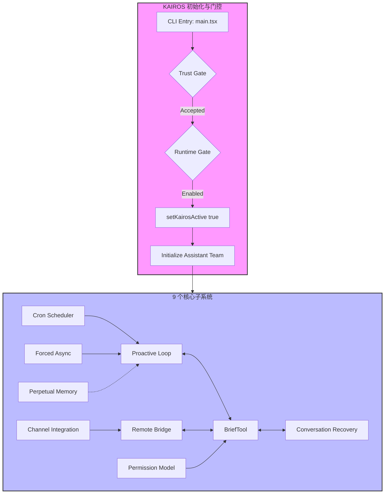
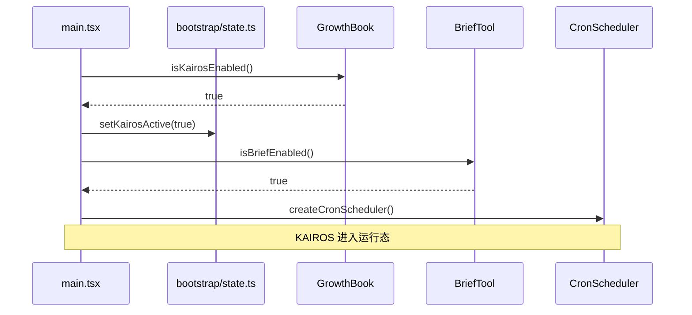

# KAIROS 深度分析

> **Source Commit**: `4b9d30f`
> **分析日期**: 2026-04-04
> **复杂度等级**: S-Tier
> **涉及文件数**: 97
> **相关 Feature Flags**: `tengu_kairos`, `tengu_kairos_brief`, `tengu_kairos_brief_config`, `tengu_kairos_cron`, `tengu_kairos_cron_durable`, `tengu_kairos_cron_config`

## 概述

KAIROS 是 Claude Code 的“助手长时运行模式”（Autonomous Agent OS）控制层，其核心使命是将原本基于“单回合 CLI 交互”的代理模式，提升为具备“可持续性、可恢复性、可异步化”特征的完整会话系统。在 Claude Code 的整体架构中，KAIROS 扮演着指挥官的角色，它不仅在启动阶段通过多层门控（Gate）确保环境的安全性与合规性，更在运行期间通过 Brief 汇报工具、定时任务调度（Cron）、远程桥接（Remote Bridge）以及严密的权限分类与恢复机制，维持着与用户的高效协作。KAIROS 的引入标志着 Claude Code 从一个简单的命令行工具演进为一个能够自主处理复杂、长周期任务的智能操作系统。

## 架构图

KAIROS 的架构由 9 个核心子系统组成，它们通过全局状态容器和事件驱动机制紧密协作。以下 Mermaid 图展示了这些子系统的交互关系以及 KAIROS 的启动时序。



### 启动时序图



## 核心文件清单

以下表格列出了 KAIROS 架构中的关键文件及其职责，这些文件共同构成了自主 Agent OS 的技术基石。

| 文件路径 | 行数 | 职责 |
|---|---:|---|
| `src/main.tsx` | 4683 | KAIROS 启动入口、gate/trust 判定、全局状态注入、REPL 初始化 |
| `src/bootstrap/state.ts` | 1758 | `kairosActive` 全局状态管理与 session 级状态容器 |
| `src/state/AppStateStore.ts` | 569 | `kairosEnabled` UI 状态字段定义与持久化 |
| `src/services/analytics/growthbook.ts` | 1155 | Runtime Flag 读取、缓存管理、阻塞/非阻塞 Gate API 实现 |
| `src/tools/BriefTool/BriefTool.ts` | 204 | Brief 工具的 Entitlement 判定、Enabled 状态计算与执行逻辑 |
| `src/tools/BriefTool/UI.tsx` | 100 | Brief 渲染逻辑，支持 transcript/chat/default 三种布局 |
| `src/tools/BriefTool/upload.ts` | 174 | BRIDGE_MODE 下附件上传至 OAuth file_upload 基础设施 |
| `src/hooks/useScheduledTasks.ts` | 139 | REPL 侧 Cron Scheduler 挂载与已触发任务入队 |
| `src/utils/cronScheduler.ts` | 565 | 调度主循环、文件锁管理、Missed Task 处理、Jitter 计算 |
| `src/utils/cronTasks.ts` | 458 | Cron 任务的持久化读写、Session 任务管理、过期策略 |
| `src/services/mcp/channelNotification.ts` | 316 | Channel Server Gate 门控与消息封装协议 |
| `src/services/mcp/useManageMCPConnections.ts` | 1141 | Channel 通知注册/撤销、权限中继（Permission Relay） |
| `src/bridge/remoteBridgeCore.ts` | 1008 | Env-less Remote Bridge 核心，处理 JWT 刷新与 401 恢复 |
| `src/tools/AgentTool/AgentTool.tsx` | 1397 | Assistant 模式下的强制异步执行策略 |
| `src/utils/permissions/yoloClassifier.ts` | 1495 | Auto Mode 分类器，采用两阶段 XML 解析与 Fail-closed 策略 |
| `src/utils/conversationRecovery.ts` | 597 | 会话反序列化、中断检测、Brief 终止判定与恢复 |

## 启动与初始化流程

KAIROS 的启动是一个严密的链式过程，确保了只有在受信任且配置正确的环境下才会激活自主模式。

1. **CLI Action 入口判定**：一切始于 `src/main.tsx:program.action (L1006)`。当用户执行相关命令时，系统首先检查是否带有 `--assistant` 标志。
2. **强制 Latch 机制**：如果检测到 `feature('KAIROS')` 且处于 assistant 模式，系统会执行强制 Latch 操作 `src/main.tsx:program.action (L1050)`，锁定当前运行模式。
3. **Trust Gate 检查**：安全性是首要考虑因素。系统通过 `checkHasTrustDialogAccepted()` 检查用户是否已接受信任对话。如果未通过，将直接禁用 assistant 模式：`src/main.tsx:program.action (L1067)`。
4. **Runtime Gate 评估**：在通过信任检查后，系统会评估运行时门控。`kairosEnabled` 的最终状态由 `isAssistantForced()` 或 `await kairosGate.isKairosEnabled()` 决定：`src/main.tsx:program.action (L1075)`。
5. **全局状态激活**：一旦激活，系统会强制开启 Brief 模式并设置全局激活状态：`opts.brief = true; setKairosActive(true)`：`src/main.tsx:program.action (L1080)`。
6. **Assistant Team 预初始化**：为了支持多 Agent 协作，系统会调用 `initializeAssistantTeam()` 来准备 Agent 队友：`src/main.tsx:program.action (L1086)`。
7. **状态注入**：最后，`kairosEnabled` 状态被注入到 AppState 中，确保 UI 层能够感知到 KAIROS 的激活：`src/main.tsx:initialState (L2962)`。

## 运行时行为

KAIROS 激活后，系统进入一种由事件驱动和定时轮询共同维持的活跃状态。

- **Proactive Loop 主循环**：KAIROS 的核心动力源自 Proactive Loop。在 `src/screens/REPL.tsx:REPL (L4076)` 中，系统集成了 Tick 机制。通过 `onQueueTick` 进入 `enqueue()` 流程 `src/screens/REPL.tsx:REPL (L4090)`，确保 Agent 能够持续感知并处理任务。
- **Cron 调度与轮询**：KAIROS 具备强大的定时任务能力。`src/utils/cronScheduler.ts:createCronScheduler (L40, L456)` 实现了一个基于 1 秒 Tick 和 chokidar 文件监听的调度器。它不仅处理即时任务，还能在启动时恢复错过的单次任务（Missed One-shot）：`src/utils/cronScheduler.ts:load (L194)`。
- **Channel 通知机制**：通过 `src/services/mcp/channelNotification.ts:gateChannelServer (L191)`，KAIROS 能够接收来自外部频道的通知。这些通知通过 `src/services/mcp/useManageMCPConnections.ts:onConnectionAttempt (L470)` 进行注册和分发。
- **Remote Bridge 事件驱动**：在远程模式下，KAIROS 依赖 WS/SSE 事件驱动。`src/bridge/remoteBridgeCore.ts:initEnvLessBridgeCore (L140)` 负责初始化核心链路，并通过 `wireTransportCallbacks (L380)` 绑定传输层回调，实现低延迟的远程协作。
- **Sleep 语义集成**：为了优化资源消耗，KAIROS 引入了 Sleep 工具。其提示词定义在 `src/tools/SleepTool/prompt.ts:SLEEP_TOOL_PROMPT (L7)`，允许 Agent 在无任务时进入休眠状态。

## Feature Flag 门控

KAIROS 的可用性受三层门控体系严格控制，这在 [Feature Flag 架构文档](../infra/20-feature-flag-arch.md) 中有详细描述。

### 1. Build-time (DCE) 层
在构建阶段，通过 `feature('KAIROS')` 决定相关模块是否被包含在最终产物中。例如，`src/main.tsx (L78)` 处的条件导入，以及 `src/tools/BriefTool/BriefTool.ts:isBriefEnabled (L131)` 对 Brief 工具的控制。

### 2. Runtime (GrowthBook) 层
在运行期，系统通过运行时门控动态评估以下 Flag：
- `tengu_kairos`：主开关，决定 KAIROS 是否在当前环境中启用：`src/main.tsx:program.action (L1075)`。
- `tengu_kairos_brief`：控制 Brief 功能的资格（Entitlement）：`src/tools/BriefTool/BriefTool.ts:isBriefEntitled (L95)`。
- `tengu_kairos_cron` 系列：控制定时任务的开启、持久化及 Jitter 配置：`src/tools/ScheduleCronTool/prompt.ts:isKairosCronEnabled (L36)`。

### 3. Entitlement & Policy 层
即使 Flag 开启，仍需满足特定策略：
- **目录信任**：必须在受信任的目录中运行：`src/main.tsx:program.action (L1067)`。
- **Channel 策略**：Channel Server 受到白名单和策略的二次约束：`src/services/mcp/channelNotification.ts:gateChannelServer (L230)`。

## 关键代码片段

以下是 KAIROS 核心逻辑的精选代码片段。

### 1. KAIROS 启动门控逻辑
```typescript
// src/main.tsx (L1048-L1087)
if (feature('KAIROS') && opts.assistant) {
  markAssistantForced(); // ← 强制锁定模式
  const hasTrust = await checkHasTrustDialogAccepted();
  if (!hasTrust) {
    console.error('Assistant mode requires directory trust.');
    process.exit(1);
  }
  const kairosEnabled = await kairosGate.isKairosEnabled(); // ← Runtime Gate 评估
  if (kairosEnabled) {
    opts.brief = true;
    setKairosActive(true); // ← 激活全局状态
    await initializeAssistantTeam(); // ← 准备协作 Agent
  }
}
```

### 2. 全局状态容器
```typescript
// src/bootstrap/state.ts (L1085-L1091)
let kairosActive = false;

export const getKairosActive = () => kairosActive;
export const setKairosActive = (active: boolean) => {
  kairosActive = active; // ← 进程级状态切换
};
```

### 3. Brief 资格判定
```typescript
// src/tools/BriefTool/BriefTool.ts (L88-L100)
export function isBriefEntitled(): boolean {
  return (
    feature('KAIROS_BRIEF') && 
    getFeatureValue('tengu_kairos_brief', false) // ← 从运行时配置读取资格
  );
}
```

### 4. Cron 调度主循环
```typescript
// src/utils/cronScheduler.ts (L230-L250)
async function check() {
  if (!scheduledTasksEnabled) return;
  const now = Date.now();
  for (const task of tasks) {
    if (task.nextRun <= now) {
      await executeTask(task); // ← 触发定时任务
      updateNextRun(task);
    }
  }
}
```

### 5. Agent 强制异步策略
```typescript
// src/tools/AgentTool/AgentTool.tsx (L559-L568)
async call(input: AgentInput) {
  if (getKairosActive()) {
    return this.runAsync(input); // ← KAIROS 模式下强制走异步路径
  }
  return this.runSync(input);
}
```

### 6. 401 认证恢复
```typescript
// src/bridge/remoteBridgeCore.ts (L530-L550)
async function recoverFromAuthFailure() {
  const newToken = await refreshJWT(); // ← 尝试刷新令牌
  if (newToken) {
    await reconnectTransport(newToken); // ← 重新建立传输链路
    return true;
  }
  return false;
}
```

## 状态管理

KAIROS 的状态管理呈现出多层级、多维度的特征，确保了系统在不同生命周期阶段的一致性。

- **进程级状态**：`kairosActive` 是最核心的标志位，存储在 `src/bootstrap/state.ts` 中。它在启动时默认为 `false`，仅在通过所有门控后由 `setKairosActive(true)` 激活。该状态决定了工具执行（如 AgentTool）是否采用异步策略。
- **UI 级状态**：`AppState.kairosEnabled` 存储在 `src/state/AppStateStore.ts` 中。它由 `main.tsx` 在初始化时根据门控结果写入。该状态主要用于控制 Ink 组件的渲染行为，例如是否显示 Brief 相关的 UI 元素。
- **Brief 偏好状态**：系统通过 `userMsgOptIn`（存储在 bootstrap 状态中）和 `isBriefOnly`（存储在 AppState 中）的联动来管理用户的 Brief 偏好。当用户执行 `/brief` 命令时，这些状态会发生切换：`src/commands/brief.ts:brief.call (L87-L92)`。
- **定时任务状态**：`scheduledTasksEnabled` 控制调度器的总开关，而 `sessionCronTasks` 则维护着当前会话中的任务列表：`src/bootstrap/state.ts:setScheduledTasksEnabled (L1272)`。
- **持久化与同步**：KAIROS 利用 PID 文件和 `sessionId` 同步机制来处理并发会话。在会话切换时，通过 `onSessionSwitch` 触发状态重载：`src/bootstrap/state.ts:onSessionSwitch (L489)`。

## 安全与权限模型

KAIROS 构建了一个严密的“信任域”模型，将安全检查贯穿于任务执行的全生命周期。

- **启动期信任检查**：在 KAIROS 激活的最早期，系统会强制检查当前工作目录是否受信任：`src/main.tsx:program.action (L1067)`。这是防止恶意代码在敏感目录下自主运行的第一道防线。
- **权限仲裁机制**：当 Agent 请求执行敏感操作时，系统会启动一个复杂的仲裁流程。本地 UI、远程桥接、Channel 通知以及权限钩子（Hook）会进行并行竞争（Race）：`src/hooks/toolPermission/handlers/interactiveHandler.ts:handleInteractivePermissionRequest (L300-L430)`。
- **Auto Mode 分类器**：KAIROS 依赖 `yoloClassifier.ts` 对操作进行安全分类。该分类器采用两阶段 XML 解析，并严格遵循 Fail-closed 原则——即在解析错误或分类不明时，默认拒绝操作：`src/utils/permissions/yoloClassifier.ts:classifyYoloActionXml (L898-L906)`。
- **危险权限阻断**：针对 Bash、PowerShell 和 Agent 工具，系统定义了一套危险权限规则。例如，禁止在未授权情况下执行破坏性命令：`src/utils/permissions/permissionSetup.ts:isDangerousBashPermission (L94)`。
- **Channel 安全边界**：Channel 的接入受到多重约束，包括 OAuth 认证、组织策略以及会话级的白名单检查：`src/services/mcp/channelNotification.ts:gateChannelServer (L176-L316)`。

## 与其他功能的交互

KAIROS 并非孤立存在，它与 Claude Code 的多个核心基础设施深度集成。

1. **与 BRIDGE_MODE 的集成**：在远程桥接模式下，KAIROS 的 Brief 附件会通过 OAuth 流程上传至云端存储，并生成 `file_uuid` 供后续引用：`src/tools/BriefTool/upload.ts:uploadBriefAttachment (L121-L149)`。
2. **与 AGENT_TRIGGERS 的协作**：KAIROS 的定时任务能力直接支撑了 Agent 触发器。调度器负责挂载并触发这些由工具定义的事件：`src/hooks/useScheduledTasks.ts:useScheduledTasks (L84)`。
3. **与 TRANSCRIPT_CLASSIFIER 的联动**：KAIROS 的权限分类器（YOLO Classifier）在 Auto Mode 下会参考转录分类结果，以决定是否自动批准某项操作：`src/utils/permissions/yoloClassifier.ts:getClassifierModel (L1334)`。

## 错误处理与恢复

为了保障长时运行的可靠性，KAIROS 设计了多层次的恢复链路。

- **远程链路恢复**：`remoteBridgeCore.ts` 实现了完善的重试与恢复逻辑。当遇到 401 认证错误时，系统会自动触发 JWT 刷新并尝试重新连接：`src/bridge/remoteBridgeCore.ts:recoverFromAuthFailure (L530)`。在连接超时时，`useRemoteSession.ts` 也会启动重连 UX：`src/hooks/useRemoteSession.ts:sendMessage (L539)`。
- **定时任务容错**：如果系统在任务预定执行时间处于关闭状态，调度器在下次启动时会检测到 Missed Task，并将其重新加入执行队列或进行清理：`src/utils/cronScheduler.ts:load (L194)`。
- **会话中断检测**：在恢复会话（Resume）时，KAIROS 会扫描历史消息，检测是否存在未完成的工具调用或被中断的轮次。通过 `deserializeMessagesWithInterruptDetection`，系统能够补全中断提示词，引导 Agent 继续工作：`src/utils/conversationRecovery.ts:deserializeMessagesWithInterruptDetection (L186-L224)`。
- **Brief 终止判定**：在恢复过程中，系统会特别关注 Brief 工具的执行状态，确保不会因为会话恢复而导致汇报逻辑错乱：`src/utils/conversationRecovery.ts:isTerminalToolResult (L348)`。

## UI/UX

KAIROS 的 UI 设计旨在为用户提供清晰的“自主运行”感知，同时保持终端交互的简洁性。

- **Brief 三态渲染**：Brief 工具的输出支持三种布局：`transcript`（详细转录）、`chat`（对话风格）和 `default`（标准输出）。这通过 `src/tools/BriefTool/UI.tsx:renderToolResultMessage (L15-L67)` 实现，确保在不同上下文下都能提供最佳的可读性。
- **消息流过滤**：为了避免 Brief 产生的冗余信息干扰用户，系统在 `src/components/Messages.tsx` 中实现了过滤逻辑，能够自动隐藏或折叠 Brief 轮次中的文本内容：`filterForBriefTool (L93)`。
- **状态感知组件**：`UserPromptMessage` 和 `Spinner` 组件会根据 `kairosEnabled` 状态调整其布局和文案。例如，在 KAIROS 模式下，Spinner 会显示更具“自主感”的动效和提示：`src/components/Spinner.tsx:SpinnerWithVerb (L70-L79)`。
- **远程连接反馈**：当远程连接不稳定时，UI 会通过 `useRemoteSession` 提供的状态实时反馈重连进度，降低用户的焦虑感：`src/hooks/useRemoteSession.ts:useRemoteSession (L417-L439)`。

## 限制与已知问题

尽管 KAIROS 架构宏大，但在当前代码快照中仍存在一些明显的限制和待办事项（TODO）。

1. **源码缺失风险**：`assistant/` 目录在当前快照中不可直接读取。这意味着 `isAssistantMode`、`initializeAssistantTeam` 等核心逻辑仅能通过 `main.tsx` 和 `bridge` 层的调用点进行反推，存在一定的黑盒区域：`src/main.tsx (L80-L81)`。
2. **运行时 Flag 兼容性补丁**：在 `src/services/analytics/growthbook.ts:processRemoteEvalPayload (L332)` 中存在一个明确的 TODO，指出当前的 Payload 转换逻辑是临时实现，未来需要服务端与 SDK 的进一步对齐。
3. **Channel 状态真值问题**：`src/services/mcp/useManageMCPConnections.ts:onConnectionAttempt (L342)` 标注了一个关于 Channel 连接管理状态源的 TODO，暗示当前的连接状态维护可能存在竞态或不一致风险。
4. **Hook 调用限制**：在 `src/screens/REPL.tsx:REPL (L4050)` 中，定时任务的挂载受到 React Hook 调用规则的限制，必须通过复杂的条件包裹和 Runtime Gate 来确保稳定性，这增加了代码的维护难度。

## 技术亮点

KAIROS 在工程实现上展现了三个显著的技术亮点：

1. **多层门控闭环体系**：KAIROS 巧妙地结合了编译期 DCE、运行时门控评估以及基于 Trust/Policy 的资格检查。这种“三位一体”的门控机制极大地缩小了功能的误启用面，确保了 S-Tier 级别的功能只在受控环境下激活。
2. **强制异步化保障响应性**：通过在 `AgentTool` 和 `BashTool` 中引入 KAIROS 模式下的强制后台化策略，系统成功避免了长耗时任务阻塞主线程。这种设计确保了即使在 Agent 进行大规模代码重构时，REPL 界面依然能够保持流畅响应。
3. **全链路会话恢复基础设施**：KAIROS 不仅仅是能运行，更是“摔不坏”的。从底层的 JWT 自动刷新、PID 同步，到上层的中断检测与消息反序列化补全，KAIROS 构建了一套完整的“可恢复会话”基础设施，这对于长周期自主任务至关重要。
