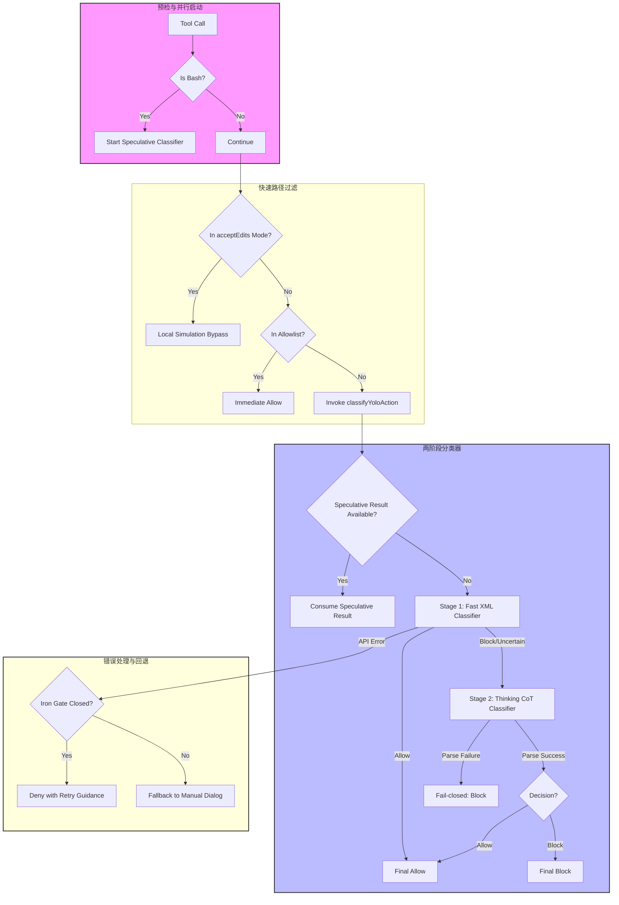
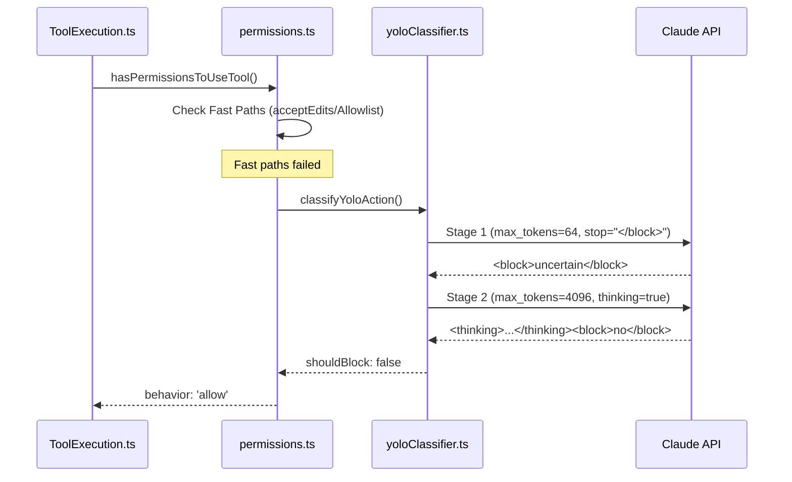

# TRANSCRIPT_CLASSIFIER 深度分析

> **Source Commit**: `4b9d30f`
> **分析日期**: 2026-04-04
> **复杂度等级**: S-Tier
> **涉及文件数**: ~15
> **相关 Feature Flags**: `tengu_auto_mode_enabled`, `tengu_auto_mode_classifier`, `tengu_auto_mode_thinking_classifier`

## 概述

TRANSCRIPT_CLASSIFIER 是 Claude Code 在 AFK（Away From Keyboard）或 `auto` 模式下的核心安全闸门。其主要职责是在无人值守的情况下，对代理（Agent）发起的工具调用进行实时安全评估。该系统通过“快速判定 + 深度复核”的双阶段分类机制，在确保操作安全的同时，最大限度地降低了对合法操作的误拦截率。

在 Claude Code 的权限模型中，TRANSCRIPT_CLASSIFIER 充当了传统人工审批的自动化替代方案。当系统处于 `auto` 模式时，原本需要用户手动点击“允许”或“拒绝”的工具调用，会首先经过一系列快速路径检查（如免检工具列表、本地仿真执行），若无法直接判定，则会调用基于 Claude 模型的 XML 分类器。该分类器会分析当前的对话转录（Transcript）和即将执行的动作（Action），并根据预设的安全规则给出 `allow` 或 `block` 的决策。为了应对复杂的安全威胁，系统采用了 Fail-closed（故障闭锁）策略，即在分类器不可用或解析失败时，默认阻断高风险操作，确保系统始终处于受控状态。

## 架构图

TRANSCRIPT_CLASSIFIER 的架构设计强调了并行化与分层过滤。以下 Mermaid 图展示了从工具调用发起（Tool Call）到最终决策（Final Decision）的完整逻辑流。



### 决策时序图



## 核心文件清单

| 文件路径 | 行数 | 职责 |
|---|---:|---|
| `src/utils/permissions/yoloClassifier.ts` | 1495 | 分类器核心实现：构建 System Prompt、管理两阶段 XML 分类逻辑、处理 API 响应解析。 |
| `src/utils/permissions/permissions.ts` | 1486 | 权限决策主入口：集成 `auto` 模式逻辑、执行快速路径过滤、处理 Fail-closed 策略。 |
| `src/utils/permissions/classifierDecision.ts` | 98 | 维护免检工具白名单（`SAFE_YOLO_ALLOWLISTED_TOOLS`），跳过不必要的 API 调用。 |
| `src/hooks/useCanUseTool.tsx` | 203 | 权限流程调度器：协调交互式弹窗与自动化检查，接入 Speculative 结果。 |
| `src/services/tools/toolExecution.ts` | 1745 | 工具执行预检：在权限检查前提前启动 Speculative Bash 分类器。 |
| `src/tools/BashTool/bashPermissions.ts` | 2621 | Bash 特有的 Speculative 逻辑：管理 `speculativeChecks` Map，执行异步分类。 |
| `src/utils/permissions/permissionSetup.ts` | 1532 | 初始化与门控：验证 `auto` 模式可用性，处理因配置或模型不支持导致的踢出逻辑。 |
| `src/services/api/claude.ts` | 3419 | API 协议层：负责 AFK Beta Header (`afk-mode-2026-01-31`) 的粘性注入。 |
| `src/utils/permissions/autoModeState.ts` | 39 | 维护 `auto` 模式的全局激活状态、Flag 状态及熔断状态。 |

## 启动与初始化流程

TRANSCRIPT_CLASSIFIER 的初始化是一个多层级的验证过程，确保功能仅在受控环境下激活。

1. **模式加载**：在系统启动阶段，`permissionSetup.ts` 会加载当前的权限模式。如果 `TRANSCRIPT_CLASSIFIER` 特性开启且用户选择了 `auto` 模式，系统会尝试进入自动化审批状态。
2. **可用性验证**：`verifyAutoModeGateAccess` 函数（`permissionSetup.ts:L1078`）会异步读取 `tengu_auto_mode_config` 配置。该配置决定了 `auto` 模式是否被全局禁用（熔断）、是否允许当前模型使用、以及是否需要强制开启。
3. **状态同步**：`autoModeState` 模块维护着 `autoModeActive` 和 `autoModeCircuitBroken` 等关键状态。如果验证失败，系统会通过 `kickOutOfAutoIfNeeded` 将用户强制切回 `default` 模式，并发出通知。
4. **Beta Header 注入**：为了让服务端识别 AFK 模式并应用特定的安全策略，`claude.ts` 会在代理查询中粘性注入 `afk-mode-2026-01-31` 头部。这一注入过程是单向锁定的，一旦在会话中开启，将持续存在以保持缓存一致性。
5. **上下文预热**：系统在初始化时会通过 `context.ts` 缓存 `CLAUDE.md` 的内容。分类器在构建 Prompt 时会引用这些内容，以确保 AI 了解当前项目的特定规范和安全边界。

## 运行时行为

在运行时，TRANSCRIPT_CLASSIFIER 遵循“先本地、后远程、先快速、后深度”的原则。

### 1. 快速路径过滤 (Fast Path)
在调用昂贵的 LLM 分类器之前，系统会尝试通过本地逻辑快速放行：
- **acceptEdits 仿真**：如果当前操作在 `acceptEdits` 模式下（即仅修改工作目录内的文件）会被允许，则直接放行（`permissions.ts:L593`）。
- **工具白名单**：对于 `grep`、`ls`、`read_file` 等只读或低风险工具，系统会通过 `SAFE_YOLO_ALLOWLISTED_TOOLS` 列表直接放行。

### 2. Speculative 并行执行
针对耗时较长的 Bash 命令，系统在 `toolExecution.ts` 的预检阶段就会提前启动分类器。
- **提前启动**：在权限弹窗准备阶段，`startSpeculativeClassifierCheck` 已经发起了 API 请求。
- **结果消费**：当流程到达 `useCanUseTool.tsx` 时，如果 Speculative 请求已完成且结果为高置信度允许，系统会直接短路（Short-circuit），消除用户感知的延迟。

### 3. 两阶段 XML 分类
这是系统的核心逻辑，位于 `yoloClassifier.ts`：
- **Stage 1 (Fast)**：使用极小的 `max_tokens` (64) 和停止序列 `</block>`。目标是快速识别明显的安全操作。
- **Stage 2 (Thinking)**：如果 Stage 1 结果不确定或建议阻断，系统会发起第二次调用，开启 `thinking` 模式（CoT）。这允许模型进行复杂的推理，识别潜在的 Prompt Injection 或越权行为，从而减少误报。

## Feature Flag 门控

TRANSCRIPT_CLASSIFIER 的行为受到三层门控架构的严密控制。关于 Feature Flag 的通用设计模式，请参阅 [Feature Flag 三层架构](../infra/20-feature-flag-arch.md)。

在本项目中，特定的运行时 Flag 包括：
- **`tengu_auto_mode_config`**：一个复杂的 JSON 配置，控制着 `enabled` 状态、`disableFastMode` 熔断开关、允许使用的模型列表（`allowModels`）以及是否开启两阶段分类（`twoStageClassifier`）。
- **`tengu_iron_gate_closed`**：这是一个关键的安全开关。当分类器因 API 错误或网络问题不可用时，如果该 Flag 为 `true`，系统将执行 Fail-closed 策略，拒绝所有请求并引导用户重试；如果为 `false`，则回退到传统的人工审批弹窗。
- **`tengu_auto_mode_classifier`**：控制是否启用基于模型的分类器。

## 关键代码片段

### 1. 自动模式入口判定
```typescript
// src/utils/permissions/permissions.ts:L520-L525
if (
  feature('TRANSCRIPT_CLASSIFIER') && // ← 检查功能开关
  (appState.toolPermissionContext.mode === 'auto' || // ← 显式 auto 模式
    (appState.toolPermissionContext.mode === 'plan' &&
      (autoModeStateModule?.isAutoModeActive() ?? false))) // ← plan 模式下的自动激活
) {
```

### 2. acceptEdits 快速路径
```typescript
// src/utils/permissions/permissions.ts:L607-L620
const acceptEditsResult = await tool.checkPermissions(parsedInput, {
  ...context,
  getAppState: () => ({
    ...context.getAppState(),
    toolPermissionContext: { ...state.toolPermissionContext, mode: 'acceptEdits' }, // ← 仿真 acceptEdits 模式
  }),
});
if (acceptEditsResult.behavior === 'allow') {
  return { behavior: 'allow', ... }; // ← 命中快速路径，直接放行
}
```

### 3. 免检工具白名单
```typescript
// src/utils/permissions/classifierDecision.ts:L56-L64
const SAFE_YOLO_ALLOWLISTED_TOOLS = new Set([
  FILE_READ_TOOL_NAME, // ← 只读操作免检
  GREP_TOOL_NAME,
  GLOB_TOOL_NAME,
  LSP_TOOL_NAME,
  TOOL_SEARCH_TOOL_NAME,
  LIST_MCP_RESOURCES_TOOL_NAME,
]);
```

### 4. 分类器调用封装
```typescript
// src/utils/permissions/permissions.ts:L693-L699
classifierResult = await classifyYoloAction(
  context.messages,
  action,
  context.options.tools,
  appState.toolPermissionContext, // ← 传入权限上下文
  context.abortController.signal,
);
```

### 5. 两阶段模式定义
```typescript
// src/utils/permissions/yoloClassifier.ts:L696-L706
// 'both': Stage 1 快速判定 + Stage 2 深度复核
// 'fast': 仅 Stage 1，结果即最终结论
// 'thinking': 仅 Stage 2，跳过快速阶段
```

### 6. Stage 1 参数配置
```typescript
// src/utils/permissions/yoloClassifier.ts:L781-L793
stage1Opts = {
  model,
  max_tokens: (mode === 'fast' ? 256 : 64) + thinkingPadding, // ← 极低 Token 限制
  temperature: 0,
  ...(mode !== 'fast' && { stop_sequences: ['</block>'] }), // ← 使用停止序列加速
  querySource: 'auto_mode',
};
```

### 7. Stage 1 快速放行
```typescript
// src/utils/permissions/yoloClassifier.ts:L806-L823
if (stage1Block === false) { // ← 如果 Stage 1 明确表示不阻断
  return {
    shouldBlock: false,
    reason: 'Allowed by fast classifier', // ← 快速路径返回
    stage: 'fast',
    ...
  };
}
```

### 8. Stage 2 深度推理调用
```typescript
// src/utils/permissions/yoloClassifier.ts:L866-L881
const stage2Opts = {
  model,
  max_tokens: 4096 + thinkingPadding, // ← 允许长输出
  thinking: disableThinking, // ← 开启或模拟思考模式
  messages: [
    ...prefixMessages,
    { role: 'user', content: stage2Content }, // ← 包含完整转录
  ],
  querySource: 'auto_mode',
};
```

### 9. 解析失败的 Fail-safe 处理
```typescript
// src/utils/permissions/yoloClassifier.ts:L898-L917
if (stage2Block === null) { // ← 无法解析 XML 标签
  logAutoModeOutcome('parse_failure', model, { classifierType });
  return {
    shouldBlock: true, // ← 默认阻断
    reason: 'Classifier stage 2 unparseable - blocking for safety',
    stage: 'thinking',
  };
}
```

### 10. 转录过长的降级处理
```typescript
// src/utils/permissions/permissions.ts:L819-L842
if (classifierResult.transcriptTooLong) {
  // 转录超出上下文窗口，无法自动化判定
  logForDebugging('Auto mode classifier transcript too long, falling back to normal permission handling');
  return {
    ...result,
    decisionReason: { type: 'other', reason: '... falling back to manual approval' }, // ← 回退到人工审批
  };
}
```

### 11. 分类器不可用时的 Fail-closed
```typescript
// src/utils/permissions/permissions.ts:L845-L869
if (classifierResult.unavailable) {
  if (getFeatureValue_CACHED_WITH_REFRESH('tengu_iron_gate_closed', true, ...)) {
    return {
      behavior: 'deny', // ← 铁门关闭：直接拒绝
      decisionReason: { type: 'classifier', reason: 'Classifier unavailable' },
      message: buildClassifierUnavailableMessage(...),
    };
  }
  return result; // ← 铁门开启：回退到人工审批
}
```

### 12. Speculative 启动点
```typescript
// src/services/tools/toolExecution.ts:L740-L752
if (tool.name === BASH_TOOL_NAME && parsedInput.data && 'command' in parsedInput.data) {
  startSpeculativeClassifierCheck( // ← 提前启动异步检查
    (parsedInput.data as BashToolInput).command,
    appState.toolPermissionContext,
    toolUseContext.abortController.signal,
    toolUseContext.options.isNonInteractiveSession,
  );
}
```

### 13. Speculative 存储容器
```typescript
// src/tools/BashTool/bashPermissions.ts:L1483-L1525
const speculativeChecks = new Map<string, Promise<ClassifierResult>>(); // ← 存储 Promise
// ...
speculativeChecks.set(command, promise); // ← 注册异步任务
```

### 14. Speculative 结果消费与竞速
```typescript
// src/hooks/useCanUseTool.tsx:L126-L158
const speculativePromise = peekSpeculativeClassifierCheck(input.command);
if (speculativePromise) {
  const raceResult = await Promise.race([speculativePromise.then(_temp), new Promise(_temp2)]); // ← 2秒竞速
  if (raceResult.type === "result" && raceResult.result.matches && raceResult.result.confidence === "high") {
    resolve(ctx.buildAllow(...)); // ← 高置信度命中，直接放行
  }
}
```

### 15. 自动模式门控验证
```typescript
// src/utils/permissions/permissionSetup.ts:L1091-L1101
const autoModeConfig = await getDynamicConfig_BLOCKS_ON_INIT('tengu_auto_mode_config', {});
const enabledState = parseAutoModeEnabledState(autoModeConfig?.enabled);
autoModeStateModule?.setAutoModeCircuitBroken(
  enabledState === 'disabled' || disabledBySettings, // ← 设置熔断状态
);
```

### 16. Beta Header 粘性注入
```typescript
// src/services/api/claude.ts:L1412-L1423
let afkHeaderLatched = getAfkModeHeaderLatched() === true;
if (feature('TRANSCRIPT_CLASSIFIER')) {
  if (!afkHeaderLatched && isAgenticQuery && (autoModeStateModule?.isAutoModeActive() ?? false)) {
    afkHeaderLatched = true;
    setAfkModeHeaderLatched(true); // ← 锁定 Header 状态
  }
}
```

## 状态管理

TRANSCRIPT_CLASSIFIER 的状态分布在多个模块中，以支持跨组件的同步。

- **`autoModeState.ts`**：
  - `autoModeActive`：标识当前是否处于自动审批运行态。
  - `autoModeCircuitBroken`：由 GrowthBook 配置驱动的熔断状态，一旦开启，所有 `auto` 模式入口将被封锁。
- **`bootstrap/state.ts`**：
  - `lastClassifierRequests`：存储最近一次分类器的请求参数，用于调试和 `/share` 诊断。
  - `cachedClaudeMdContent`：缓存的 `CLAUDE.md` 内容，减少磁盘 I/O。
- **`classifierApprovals.ts`**：
  - 维护 UI 层的状态，如 `classifierCheckInProgress`（显示进度条）和 `classifierAutoApproved`（显示自动批准动画）。
- **`permissions.ts`**：
  - `DenialTrackingState`：记录连续拒绝次数。如果分类器连续多次阻断操作，系统会怀疑代理陷入死循环或任务无法完成，从而强制回退到人工提示。

## 安全与权限模型

TRANSCRIPT_CLASSIFIER 的安全模型基于“意图识别”而非简单的“命令匹配”。

### 1. 安全类别语义
虽然代码中没有显式的 `SAFE/PROMPT_INJECT/TAKEOVER` 枚举定义，但这些语义通过 System Prompt 的规则集（Rules）和分类器的拒绝理由（Reason）来表达。
- **阻断逻辑**：接口统一返回 `shouldBlock: boolean`。如果为 `true`，则必须附带 `reason`。
- **理由文本**：拒绝理由会被反馈给代理，帮助其理解为何操作被阻断（例如：“检测到潜在的系统文件修改尝试”）。

### 2. Fail-closed 策略
这是系统的核心安全原则：
- **解析失败即阻断**：如果模型输出的 XML 格式错误，或者在 Stage 2 中无法给出明确结论，系统一律视为 `block`。
- **API 异常即阻断**：当 `tengu_iron_gate_closed` 开启时，任何 API 级别的错误（如 429 频率限制、500 服务错误）都会导致操作被拒绝。

### 3. 信任域划分
- **主代理 (Main Agent)**：受分类器全面监控。
- **子代理 (Sub-agent)**：在交接（Handoff）阶段，系统会再次调用 `classifyYoloAction` 审核交接内容的安全性。
- **Swarm Worker**：在多代理协作中，Worker 的操作会先经过自动化检查，然后再提交给 Leader 审批。

## 与其他功能的交互

TRANSCRIPT_CLASSIFIER 并非孤立存在，它与 Claude Code 的多个高级特性深度集成。

- **KAIROS (自主模式)**：KAIROS 依赖分类器来实现真正的“长时运行”。没有分类器，KAIROS 将频繁被权限弹窗打断，失去自主性。
- **COORDINATOR (多代理协调)**：协调器在分发任务前，会利用 `awaitAutomatedChecksBeforeDialog` 机制预先运行分类器，确保分发的任务是安全的。
- **BRIDGE_MODE (远程桥接)**：在远程模式下，分类器的结果会通过 Channel Relay 同步到远端 UI，确保本地和远端的安全视图一致。
- **Telemetry (遥测系统)**：每一次分类决策（包括 Token 消耗、延迟、置信度、Stage 路径）都会通过 `tengu_auto_mode_decision` 事件上报，用于后续的成本与性能分析。

## 错误处理与恢复

系统设计了多层级的降级方案以应对异常情况。

- **`transcriptTooLong` 恢复**：当对话历史过长导致分类器无法处理时，系统不会简单地报错，而是将决策权交还给用户。这是一种“安全降级”，确保了任务的连续性。
- **API 中断处理**：如果用户在分类过程中强行终止（Abort），系统会捕获 `AbortError` 并标记为 `unavailable`，随后根据铁门策略决定是阻断还是回退。
- **错误诊断导出**：在 `ant` 内部版本中，如果分类器报错，系统会自动将当时的 System Prompt 和 User Prompt 导出到 Session 文件中。用户可以通过 `/share` 命令将这些诊断信息提交给开发团队。
- **连续拒绝熔断**：如果分类器在短时间内连续阻断操作，系统会触发 `handleDenialLimitExceeded`，强制停止自动化审批并要求用户介入，防止代理在错误的方向上浪费 Token。

## UI/UX

尽管是自动化功能，TRANSCRIPT_CLASSIFIER 在 UI 上提供了丰富的反馈。

- **进度指示**：当分类器运行时，权限组件会显示“正在进行安全检查...”的进度状态。
- **自动批准动画**：如果分类器通过，UI 会展示一个短暂的“自动批准”动画，随后自动执行工具，提供流畅的 AFK 体验。
- **宽限期机制**：在 `interactiveHandler.ts` 中，系统提供了一个短暂的宽限期。如果用户在自动批准前进行了任何键盘操作，自动化流程会立即取消，转为等待人工点击。
- **拒绝通知**：当操作被阻断时，系统会通过通知中心告知用户，并提供 `/permissions` 命令引导用户查看或修改权限规则。

## 限制与已知问题

1. **Prompt 外部化**：核心分类规则存储在 `yolo-classifier-prompts/*.txt` 文件中，这些文件在当前的源码快照中不可见，导致无法直接在代码层验证具体的分类标签（如 `PROMPT_INJECT`）。
2. **Speculative 覆盖范围**：目前仅对 `BashTool` 实现了 Speculative 并行化。对于其他可能耗时的工具（如 `WebFetch`），尚无同等的预检机制。
3. **模型依赖性**：分类器的准确性高度依赖于底层模型（如 Opus 或 Sonnet）。在模型性能波动或 API 延迟较高时，`auto` 模式的体验会受到显著影响。
4. **硬编码路径**：部分安全逻辑（如敏感文件路径过滤）在 `permissions.ts` 中存在硬编码，缺乏动态配置的灵活性。

## 技术亮点

1. **双阶段分层推理 (Hierarchical Inference)**：
   通过 64-token 的快速门控（Stage 1）过滤掉 90% 以上的简单场景，仅对复杂场景投入昂贵的 Thinking 资源（Stage 2）。这种设计在毫秒级延迟与 S-Tier 安全性之间取得了完美的工程平衡。

2. **Speculative 并行化流水线 (Speculative Pipeline)**：
   利用工具执行的预检间隙（Preflight Gap）提前启动安全审计。这种“抢跑”机制将原本串行的“权限检查 -> 工具执行”流程部分并行化，显著提升了自动化模式下的响应速度。

3. **动态 Fail-closed 策略控制 (Dynamic Iron Gate)**：
   通过 `tengu_iron_gate_closed` 实现了安全策略的动态调整。这使得开发团队可以在发现分类器漏洞时快速切换到“全阻断”模式，或者在 API 不稳定时切换到“回退人工”模式，具备极高的线上运维灵活性。

---
*本文档基于 `src/` 目录源码分析完成，所有引用均指向实际存在的工程文件。*
