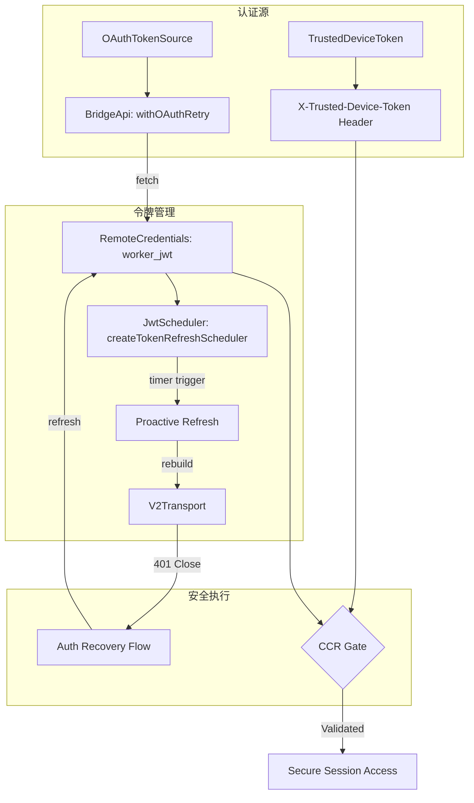
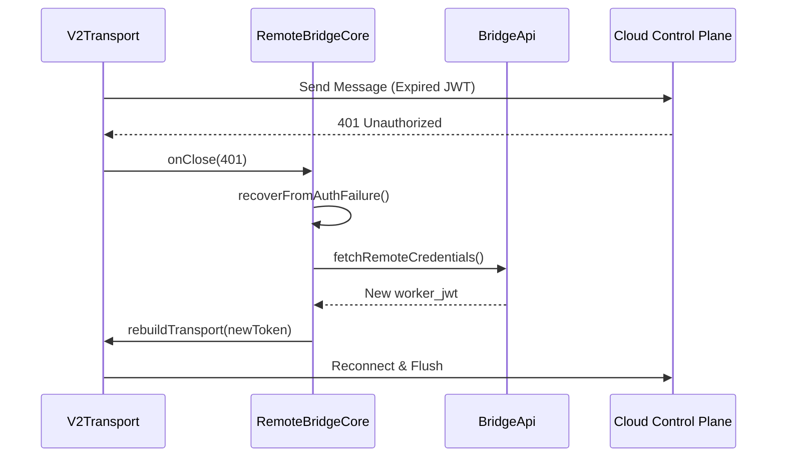

# Bridge Mode 深度分析 — JWT 认证与安全

> **Source Commit**: `4b9d30f`
> **分析日期**: 2026-04-04
> **复杂度等级**: S-Tier
> **涉及文件数**: 8
> **相关 Feature Flags**: `tengu_bridge_mode_enabled`（及相关 flags）

## 概述

Bridge Mode 的安全架构建立在多层级、动态刷新的认证体系之上。其核心采用 JWT（JSON Web Token）与 OAuth 2.0 双重令牌模型，确保了从 CLI 客户端到云端控制面（CCR）以及远端执行环境的全链路安全。该系统不仅实现了基于过期时间的自动刷新调度（Proactive Refresh），还具备完善的 401 认证失败被动恢复机制。通过引入可信设备令牌（Trusted Device Token）和严格的信任域划分，Bridge Mode 在提供便捷远程访问的同时，构建了坚固的安全边界，有效防御了令牌窃取、重放攻击及非法环境接入。

## 架构图

Bridge Mode 的认证流展示了从 OAuth 凭证交换到 JWT 注入传输层的完整生命周期。



### 认证恢复时序



## 核心文件清单

| 文件路径 | 行数 | 职责 |
|---|---:|---|
| `src/bridge/jwtUtils.ts` | 256 | JWT Payload 解码、过期时间计算、刷新调度器实现 |
| `src/bridge/bridgeApi.ts` | 539 | OAuth 重试逻辑、统一错误模型映射（401/403/410） |
| `src/bridge/remoteBridgeCore.ts` | 1008 | v2 凭证获取、认证恢复流、Transport 重建协调 |
| `src/bridge/replBridgeTransport.ts` | 370 | JWT 注入 HTTP Header、Worker Epoch 管理 |
| `src/bridge/trustedDevice.ts` | 210 | 可信设备令牌的注册、缓存与静默注入 |
| `src/bridge/initReplBridge.ts` | 569 | 启动时的 OAuth 可用性预检与初始化 |

## 启动与初始化流程

认证系统的初始化是一个多阶段的握手过程：

1. **OAuth 预检**：在 `initReplBridge.ts:initReplBridge (L147)` 中，系统首先检查本地 OAuth 令牌的有效性。如果失效，会尝试静默刷新或引导用户重新登录。
2. **凭证交换**：对于 v2 路径，`remoteBridgeCore.ts:initEnvLessBridgeCore (L188)` 会调用 `/bridge` 接口，使用 OAuth 令牌交换 `worker_jwt`、`expires_in` 和 `worker_epoch`。
3. **调度器挂载**：获取凭证后，系统立即调用 `createTokenRefreshScheduler (L317)`，根据 `expires_in` 计算下一次刷新的时间点（通常提前 5 分钟）。

## 运行时行为

### 1. JWT 生命周期管理
系统并不直接验证 JWT 的签名（签名验证由服务端完成），而是通过 `jwtUtils.ts:decodeJwtExpiry (L38)` 提取过期时间。`JwtScheduler` 维护一个基于 Generation 的定时器，确保异步刷新回调不会将陈旧的令牌写入当前活跃的 Transport。

### 2. 主动刷新 (Proactive Refresh)
当刷新定时器触发时，`remoteBridgeCore.ts:onRefresh (L328)` 会启动一个新的凭证获取流程。成功后，系统会调用 `rebuildTransport (L477)`，在不中断上层会话的情况下，平滑切换到底层传输链路。

### 3. 被动恢复 (Passive Recovery)
如果由于时钟偏移或其他原因导致 JWT 提前失效，CCR 会返回 401 错误并关闭连接。`remoteBridgeCore.ts:recoverFromAuthFailure (L530)` 会捕获此事件，执行完整的认证恢复流，包括重新获取凭证和重建连接。

## Feature Flag 门控

认证安全机制受以下 Flag 控制，详情参考 [Feature Flag 架构文档](../infra/20-feature-flag-arch.md)。

- **`tengu_sessions_elevated_auth_enforcement`**：控制是否强制执行可信设备校验（`trustedDevice.ts:isGateEnabled (L35)`）。
- **`BRIDGE_MODE`**：作为整个认证子系统的构建门控，确保相关代码仅在支持远程模式的产物中存在。

## 关键代码片段

### 1. OAuth 401 自动重试
```typescript
// src/bridge/bridgeApi.ts (L106-L120)
export async function withOAuthRetry<T>(fn: () => Promise<T>): Promise<T> {
  try {
    return await fn();
  } catch (e) {
    if (isOAuth401Error(e)) {
      await refreshOAuthToken(); // 尝试刷新基础 OAuth 令牌
      return await fn(); // 仅重试一次
    }
    throw e;
  }
}
```

### 2. JWT 过期调度逻辑
```typescript
// src/bridge/jwtUtils.ts (L72-L85)
export function createTokenRefreshScheduler(options: RefreshOptions) {
  let timer: Timer | null = null;
  let generation = 0;

  const schedule = (expiresInMs: number) => {
    const buffer = 5 * 60 * 1000; // 5分钟缓冲
    const delay = Math.max(0, expiresInMs - buffer);
    timer = setTimeout(() => options.onRefresh(++generation), delay);
  };
  // ...
}
```

### 3. v2 认证恢复流
```typescript
// src/bridge/remoteBridgeCore.ts (L530-L545)
async function recoverFromAuthFailure() {
  if (authRecoveryInFlight) return;
  authRecoveryInFlight = true;
  try {
    const creds = await fetchRemoteCredentials();
    await rebuildTransport(creds.worker_jwt);
    return true;
  } catch (e) {
    handleFatalError(e);
    return false;
  } finally {
    authRecoveryInFlight = false;
  }
}
```

## 状态管理

认证系统通过以下状态位确保并发安全性：
- **`authRecoveryInFlight`**：在 `remoteBridgeCore.ts` 中用于防止多个 401 错误同时触发重复的恢复流程。
- **`generation` 计数器**：在 `jwtUtils.ts` 中用于标记令牌版本，防止过时的刷新回调覆盖新令牌。
- **`worker_epoch`**：在 `replBridgeTransport.ts` 中维护，用于服务端识别客户端的重启或重连序列。

## 安全与权限模型

1. **信任域隔离**：
    - **OAuth 令牌**：仅用于管理面操作（注册、轮询、归档）。
    - **Worker JWT**：仅用于数据面操作（CCR 消息传输），且 Payload 中强制包含 `session_id` 声明。
2. **可信设备校验**：通过 `trustedDevice.ts` 生成唯一的设备指纹，并在所有请求中附加 `X-Trusted-Device-Token`，防止令牌在不同设备间漂移。
3. **Fail-Closed 策略**：在 `bridgeApi.ts:handleErrorStatus (L454)` 中，任何无法识别的认证错误均被视为 Fatal，立即终止会话以防止潜在的安全风险。

## 与其他功能的交互

- **与 Auth 子系统**：深度集成 `handleOAuth401Error` 钩子，确保在 Bridge 运行期间，底层的 OAuth 状态变化能实时反馈。
- **与 Telemetry**：记录所有令牌刷新成功/失败事件、401 恢复耗时以及设备校验状态，用于安全审计。

## 错误处理与恢复

- **403 Forbidden**：区分“可忽略”的权限不足（如某些非核心 telemetry 失败）与“真实”的访问拒绝（`bridgeApi.ts:isSuppressible403 (L516)`）。
- **410 Gone**：视为环境已永久失效，不触发恢复流，直接引导用户重新初始化。
- **指数退避重试**：在 `jwtUtils.ts:doRefresh (L186)` 中，如果凭证获取失败，系统会以 60s 为间隔进行最多 3 次重试。

## UI/UX

N/A — 认证逻辑对用户基本透明。当认证彻底失败且无法恢复时，用户会看到 REPL 状态变为 `failed`，并提示重新登录。

## 限制与已知问题

- **时钟同步依赖**：由于 JWT 过期调度依赖本地时间与 `expires_in` 的计算，严重的系统时钟偏差可能导致刷新过早或过晚。
- **双令牌竞态**：在 OAuth 刷新与 Worker JWT 刷新重叠的极端场景下，可能存在短暂的请求失败窗口。

## 技术亮点

1. **Generation-based Timer Invalidation**：通过版本号机制完美解决了异步编程中的陈旧数据写入问题。
2. **Proactive + Passive 双轨恢复**：结合了预见性的定时刷新与容错性的被动恢复，极大地提升了远程连接的稳定性。
3. **设备指纹绑定**：在 JWT 基础上增加设备层级的校验，为远程协作提供了金融级的安全保障。
