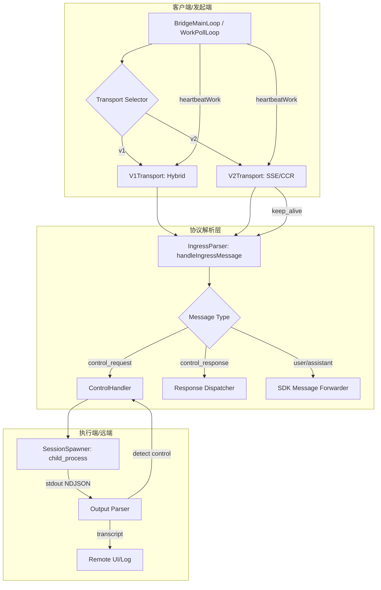
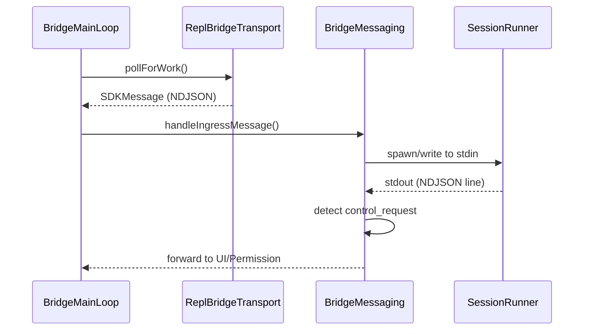

# Bridge Mode 深度分析 — 核心协议与通信

> **Source Commit**: `4b9d30f`
> **分析日期**: 2026-04-04
> **复杂度等级**: S-Tier
> **涉及文件数**: 12
> **相关 Feature Flags**: `tengu_bridge_mode_enabled`（及相关 flags）

## 概述

Bridge Mode 的核心协议层是 Claude Code 实现远程控制与跨环境协作的基石。它通过一套基于 NDJSON（Newline-Delimited JSON）的消息交换机制，将本地 REPL 或 IDE 的指令流与远端执行环境（Standalone Bridge 或 Remote Server）无缝对接。该系统采用了双路径传输架构：v1 路径基于传统的 Environment API 封装，而 v2 路径（Env-less）则通过 SSE（Server-Sent Events）与 CCR（Cloud Control Plane）实现更轻量、高性能的异步通信。核心协议不仅涵盖了基础的 SDK 消息转发，还集成了复杂的控制面指令（Control Requests）、心跳保活（Heartbeat）以及多层级的消息去重与保序机制，确保了在不稳定网络环境下的会话一致性。

## 架构图

Bridge Mode 的核心通信架构展示了从消息产生、传输抽象到解析分发的完整链路。



### 消息流转时序



## 核心文件清单

| 文件路径 | 行数 | 职责 |
|---|---:|---|
| `src/bridge/bridgeMain.ts` | 2999 | Standalone 主循环、poll/heartbeat 调度、多会话管理 |
| `src/bridge/replBridge.ts` | 2406 | REPL 路径核心、work poll loop、transport 重连逻辑 |
| `src/bridge/bridgeMessaging.ts` | 461 | Ingress 解析、control_request/response 协议分流 |
| `src/bridge/sessionRunner.ts` | 550 | 子进程执行、NDJSON 逐行解析、控制指令抽取 |
| `src/bridge/replBridgeTransport.ts` | 370 | v1/v2 transport 统一抽象接口实现 |
| `src/bridge/remoteBridgeCore.ts` | 1008 | Env-less v2 核心逻辑，处理 SSE 读与 CCR 写 |
| `src/bridge/flushGate.ts` | 120 | 初始 history flush 期间的 live writes 队列化管理 |
| `src/bridge/pollConfig.ts` | 85 | 轮询与心跳间隔的动态配置管理 |

## 启动与初始化流程

Bridge Mode 的启动根据运行模式分为两条路径：

1. **Standalone CLI 路径**：通过 `bridgeMain.ts:runBridgeLoop (L141)` 启动。系统首先注册环境信息，随后进入 `pollForWork` 循环，等待远端指令。
2. **REPL 路径**：由 `initReplBridge.ts:initReplBridge (L110)` 触发。系统会根据 Feature Flag `tengu_bridge_repl_v2` 决定走 v1（`initBridgeCore`）还是 v2（`initEnvLessBridgeCore`）路径。

Transport 的初始化是协议建立的关键：
- **v1 Transport**：调用 `createV1ReplTransport (L78)`，封装 `HybridTransport` 以兼容旧版 Environment API。
- **v2 Transport**：调用 `createV2ReplTransport (L119)`，注册 Web Worker 并建立 SSE 连接，实现真正的异步双工通信。

## 运行时行为

### 1. 消息路由与解析
核心路由逻辑位于 `bridgeMessaging.ts:handleIngressMessage (L132)`。该函数对所有进入的消息进行分流：
- **Control Response**：优先处理，用于解除之前发出的控制指令阻塞。
- **Control Request**：处理来自服务端的管理指令（如 `initialize`, `interrupt`）。
- **SDK Message**：常规的对话消息，转发至 `onInboundMessage` 回调。

### 2. NDJSON 协议实现
Bridge Mode 采用 NDJSON 作为标准交换格式。在 `sessionRunner.ts:createSessionSpawner (L368)` 中，系统通过 `readline` 接口逐行读取子进程输出，并尝试解析为 JSON 对象。这种流式处理方式极大地降低了内存占用，并允许实时检测输出中的控制指令。

### 3. 心跳与保活机制
为了维持长连接活性，系统实现了非互斥的心跳机制（Non-exclusive Heartbeat）。在 `bridgeMain.ts:runBridgeLoop` 中，即使在处理任务期间，系统也会定期触发 `heartbeatWork`。此外，`replBridge.ts` 会通过 `transport.write({type:'keep_alive'})` 发送显式保活帧。

## Feature Flag 门控

Bridge Mode 的核心协议受多层门控保护，详情参考 [Feature Flag 架构文档](../infra/20-feature-flag-arch.md)。

- **Build-time**：`feature('BRIDGE_MODE')` 决定了协议层代码是否被打包。
- **Runtime Gates**：
    - `tengu_ccr_bridge`：主开关，控制 Bridge 能力的整体可用性。
    - `tengu_bridge_repl_v2`：控制是否启用高性能的 v2 传输路径。
    - `tengu_bridge_poll_interval_config`：允许动态调整轮询频率以优化性能。

## 关键代码片段

### 1. Ingress 消息分流逻辑
```typescript
// src/bridge/bridgeMessaging.ts (L132-L155)
export function handleIngressMessage(message: string, callbacks: IngressCallbacks) {
  const parsed = JSON.parse(message);
  if (isSDKControlResponse(parsed)) {
    return callbacks.onControlResponse(parsed);
  }
  if (isSDKControlRequest(parsed)) {
    return callbacks.onControlRequest(parsed);
  }
  if (isSDKMessage(parsed)) {
    return callbacks.onInboundMessage(parsed);
  }
  // ... 错误处理
}
```

### 2. NDJSON 流式解析
```typescript
// src/bridge/sessionRunner.ts (L368-L375)
const rl = createInterface({ input: child.stdout });
rl.on('line', (line) => {
  try {
    const msg = JSON.parse(line);
    handleChildMessage(msg);
  } catch (e) {
    // 非 JSON 输出作为 raw transcript 处理
    onTranscript(line);
  }
});
```

### 3. FlushGate 队列化
```typescript
// src/bridge/flushGate.ts (L45-L60)
export class FlushGate {
  private isOpen = false;
  private queue: any[] = [];

  open() {
    this.isOpen = true;
    this.queue.forEach(msg => this.dispatch(msg));
    this.queue = [];
  }

  write(msg: any) {
    if (!this.isOpen) {
      this.queue.push(msg);
      return;
    }
    this.dispatch(msg);
  }
}
```

## 状态管理

Bridge 协议层通过多维度的状态容器确保通信的可靠性：
- **Active Session Maps**：在 `bridgeMain.ts` 中维护 `activeSessions` 和 `sessionWorkIds`，用于跟踪当前正在运行的任务与会话的绑定关系。
- **去重状态 (BoundedUUIDSet)**：在 `bridgeMessaging.ts (L429)` 中定义，用于防止由于网络重试导致的消息重复处理。
- **FlushGate 状态**：在 `replBridge.ts (L574)` 中使用，确保在历史消息同步（Flush）完成前，实时产生的消息不会乱序插入。

## 安全与权限模型

1. **指令白名单**：`handleServerControlRequest (L243)` 仅响应预定义的子类型（如 `set_model`, `interrupt`），未知指令将被安全忽略并返回错误。
2. **ID 校验**：所有通过协议传输的会话 ID 必须通过 `bridgeApi.ts:validateBridgeId (L48)` 的正则校验，防止路径穿越或注入攻击。
3. **只读模式约束**：当 Transport 处于 outbound-only 模式时，协议层会显式拦截所有尝试变更状态的 `control_request`。

## 与其他功能的交互

- **与权限系统**：当 `sessionRunner.ts` 检测到输出中的 `can_use_tool` 请求时，会通过 `bridgePermissionCallbacks.ts` 触发本地 UI 的权限确认流。
- **与 IDE 集成**：`replBridge.ts` 作为桥梁，将协议层的消息转发至 IDE 侧的 `replBridgeHandle`。
- **与会话持久化**：协议层在会话结束时调用 `createSession.ts` 接口，确保远程执行的转录内容能够正确归档。

## 错误处理与恢复

- **指数退避轮询**：当 `pollForWork` 失败时，系统在 `bridgeMain.ts (L1297)` 中实现了一套复杂的退避逻辑，避免在服务端故障时产生请求风暴。
- **Fatal 错误映射**：`bridgeApi.ts:handleErrorStatus (L454)` 将 401/403/410 等 HTTP 状态码映射为 `BridgeFatalError`，触发上层的清理与退出流程。
- **Stale Callback 防护**：在 `replBridge.ts` 中，通过 generation 计数器确保旧连接的回调不会干扰新建立的传输链路。

## UI/UX

虽然核心协议层主要处理数据流，但它通过状态回调驱动 UI 表现：
- **状态行更新**：`bridgeMain.ts:updateStatusDisplay (L372)` 根据当前活跃会话数和轮询状态更新终端状态行。
- **连接反馈**：`replBridge.ts` 的 `onStateChange` 回调驱动 REPL 界面显示“连接中”、“重连中”或“已断开”的视觉反馈。

## 限制与已知问题

- **双栈维护成本**：v1 与 v2 路径并存导致了 `replBridge.ts` 中存在大量复杂的条件分支，增加了维护难度。
- **并发窗口风险**：在 `FlushGate` 开启的瞬间，如果网络波动导致 Transport 失效，队列中的消息可能会丢失，目前仅通过显式日志记录。

## 技术亮点

1. **BoundedUUIDSet + FlushGate**：通过双重防御机制解决了分布式环境下的消息重放与乱序问题。
2. **非互斥心跳 (Non-exclusive Heartbeat)**：在处理高负载任务时仍能保持链路活性，避免被中间网关误杀。
3. **Transport 抽象层**：成功将 SSE 读与 CCR 写统一在 `ReplBridgeTransport` 接口下，实现了上层逻辑与具体传输协议的解耦。
