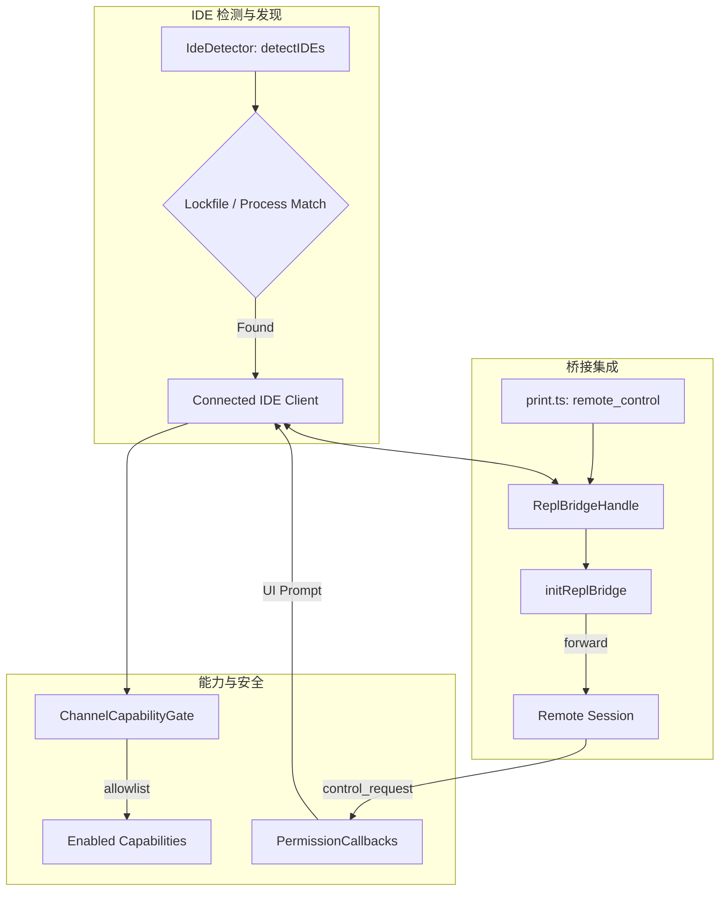
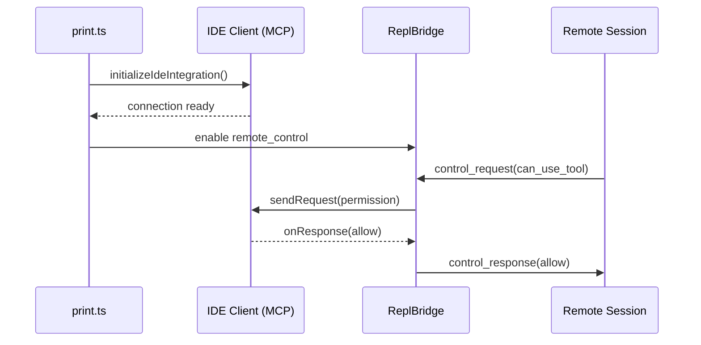

# Bridge Mode 深度分析 — IDE 集成

> **Source Commit**: `4b9d30f`
> **分析日期**: 2026-04-04
> **复杂度等级**: S-Tier
> **涉及文件数**: 7
> **相关 Feature Flags**: `tengu_bridge_mode_enabled`（及相关 flags）

## 概述

Bridge Mode 的 IDE 集成层是连接 Claude Code CLI 与现代集成开发环境（VS Code, JetBrains）的关键纽带。它通过一套基于 MCP（Model Context Protocol）的 IDE 客户端、远程控制桥接器（Remote Control Bridge）以及精密的权限回调机制，实现了终端会话与 IDE 状态的深度同步。该系统不仅支持自动检测并连接运行中的 IDE 实例，还引入了能力协商（Capability Negotiation）与频道门控（Channel Gating）机制，确保只有受信任的 IDE 扩展才能接入核心通信链路。通过将 IDE 的 UI 交互能力（如权限弹窗、文件打开）抽象为标准化的回调契约，Bridge Mode 为用户提供了跨平台的、一致的智能编程体验。

## 架构图

IDE 集成架构展示了从 IDE 检测、连接建立到能力协商与消息转发的完整链路。



### IDE 连接与授权时序



## 核心文件清单

| 文件路径 | 行数 | 职责 |
|---|---:|---|
| `src/bridge/replBridge.ts` | 2406 | REPL 桥接句柄管理、Transport 交互与状态分发 |
| `src/bridge/initReplBridge.ts` | 569 | IDE/REPL 启动入口、v1/v2 路径分流与初始化 |
| `src/bridge/bridgePermissionCallbacks.ts` | 43 | 权限请求/响应回调接口定义与类型校验 |
| `src/cli/print.ts` | 5594 | remote-control 启停、消息增量转发、能力协商门控 |
| `src/utils/ide.ts` | 1494 | VS Code/JetBrains 检测、扩展安装、IDE RPC 客户端实现 |
| `src/bridge/replBridgeHandle.ts` | 180 | 桥接句柄的轻量级封装，用于 print.ts 与 bridge 交互 |

## 启动与初始化流程

IDE 集成的启动是一个异步的发现与握手过程：

1. **IDE 检测**：`ide.ts:detectIDEs (L664)` 通过扫描系统进程和特定目录下的 lockfile，识别当前运行的 IDE 类型（VS Code 或 JetBrains）及其工作目录。
2. **连接建立**：`initializeIdeIntegration (L1288)` 尝试建立 MCP 连接。如果未安装扩展，系统会调用 `maybeInstallIDEExtension (L590)` 引导用户安装。
3. **桥接激活**：在 `print.ts` 中，当检测到 `remote_control` 启用时，系统会创建 `ReplBridgeHandle` 并通过 `forwardMessagesToBridge (L1517)` 开始增量转发历史消息。

## 运行时行为

### 1. 能力协商 (Capability Negotiation)
系统不会盲目信任 IDE 声明的所有能力。在 `print.ts:handleChannelEnable (L4662)` 中，系统会根据连接的 `pluginSource` 进行白名单过滤。只有通过校验的能力（如 `terminal`, `editor`）才会被激活，否则会触发回滚逻辑。

### 2. 权限回调转发
当远端会话发出敏感操作请求（如 `can_use_tool`）时，`replBridge.ts` 会通过 `BridgePermissionCallbacks` 接口将请求转发至 IDE。IDE 侧通过原生弹窗获取用户许可后，将响应回传至 CLI，完成闭环。

### 3. 消息增量同步
为了保证 IDE 侧看到的转录内容与 CLI 一致，`print.ts` 维护了一个 `bridgeLastForwardedIndex`。每当有新消息产生时，系统会计算增量并推送到桥接句柄，确保 IDE 终端的实时更新。

## Feature Flag 门控

IDE 集成受以下 Flag 严格控制，详情参考 [Feature Flag 架构文档](../infra/20-feature-flag-arch.md)。

- **`BRIDGE_MODE`**：主开关，决定 `remote-control` 桥接逻辑是否可用。
- **`KAIROS || KAIROS_CHANNELS`**：控制高级频道能力（如主动通知、异步回调）的开启。

## 关键代码片段

### 1. IDE 类型判定
```typescript
// src/utils/ide.ts (L259-L270)
export function isVSCodeIde(ide: IDEDescription): boolean {
  return ide.type === 'vscode' || ide.type === 'vscode-insiders';
}

export function isJetBrainsIde(ide: IDEDescription): boolean {
  return ide.type === 'jetbrains';
}
```

### 2. 消息增量转发
```typescript
// src/cli/print.ts (L1517-L1531)
function forwardMessagesToBridge(bridge: ReplBridgeHandle, messages: Message[]) {
  const newMessages = messages.slice(bridgeLastForwardedIndex);
  if (newMessages.length > 0) {
    bridge.appendMessages(newMessages);
    bridgeLastForwardedIndex = messages.length;
  }
}
```

### 3. 权限回调契约
```typescript
// src/bridge/bridgePermissionCallbacks.ts (L10-L25)
export interface BridgePermissionCallbacks {
  sendRequest: (request: PermissionRequest) => Promise<void>;
  onResponse: (callback: (response: PermissionResponse) => void) => void;
  cancelRequest: (requestId: string) => void;
}
```

## 状态管理

IDE 集成层通过以下机制维持状态一致性：
- **`currentIDESearch`**：在 `ide.ts (L624)` 中维护，用于防止并发触发多个 IDE 扫描任务。
- **`bridgeHandle`**：在 `print.ts` 生命周期内持久化，作为与远端会话通信的唯一句柄。
- **IDE 客户端缓存**：`getConnectedIdeClient` 会缓存已建立的连接，避免重复的握手开销。

## 安全与权限模型

1. **频道来源校验**：在 `handleChannelEnable` 中，系统会严格校验 `pluginSource`。非官方签名的扩展尝试启用敏感频道将被立即拦截（`print.ts` L4687-L4718）。
2. **权限响应判别**：`isBridgePermissionResponse (L32)` 采用严格的判别式（Discriminant）校验，确保 IDE 回传的响应结构合法，防止伪造授权。
3. **能力预过滤**：在透传 IDE 能力声明前，系统会进行 `allowlist` 预过滤，避免在 UI 上显示“可见但不可用”的功能按钮。

## 与其他功能的交互

- **与 MCP 系统**：IDE 客户端本质上是一个特殊的 MCP Server，复用了 MCP 的消息封装与传输协议。
- **与 Remote Session**：`SessionsWebSocket.ts` 负责处理来自 IDE 的物理连接，并将其映射到逻辑上的 Bridge 会话。

## 错误处理与恢复

- **4001 Transient Error**：当 IDE 连接因网络抖动断开时，`SessionsWebSocket.ts (L234)` 会触发有限次数的重连尝试。
- **4003 Permanent Denial**：如果 IDE 扩展版本过低或权限被撤销，系统会收到 4003 错误，此时将永久关闭桥接并提示用户。

## UI/UX

- **自动安装引导**：当检测到 IDE 但未发现扩展时，CLI 会输出带有深度链接的安装提示（`maybeInstallIDEExtension`）。
- **静默连接**：在配置允许的情况下，IDE 集成会在后台静默完成，用户只需在 IDE 侧确认一次授权即可实现长效连接。

## 限制与已知问题

- **检测依赖性**：IDE 检测高度依赖 lockfile 和进程名匹配，在某些定制化安装的 IDE 环境下可能失效。
- **多实例冲突**：当用户同时运行多个 IDE 实例时，系统目前需要用户通过环境变量或交互式菜单显式指定目标。

## 技术亮点

1. **最小耦合设计**：通过 `ReplBridgeHandle` 实现了 `print.ts`（UI 层）与 `bridge`（协议层）的解耦，使得 IDE 集成逻辑可以平滑嵌入现有的 REPL 流程。
2. **能力协商闭环**：引入了从声明、校验到激活的完整能力协商闭环，兼顾了扩展性与安全性。
3. **增量同步算法**：简单的索引追踪机制有效解决了长会话下的同步性能问题，确保了 IDE 侧的响应灵敏度。
