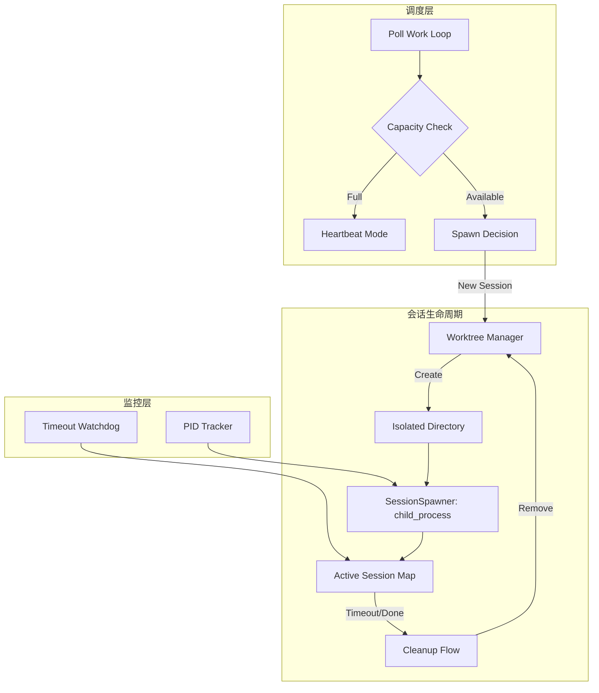
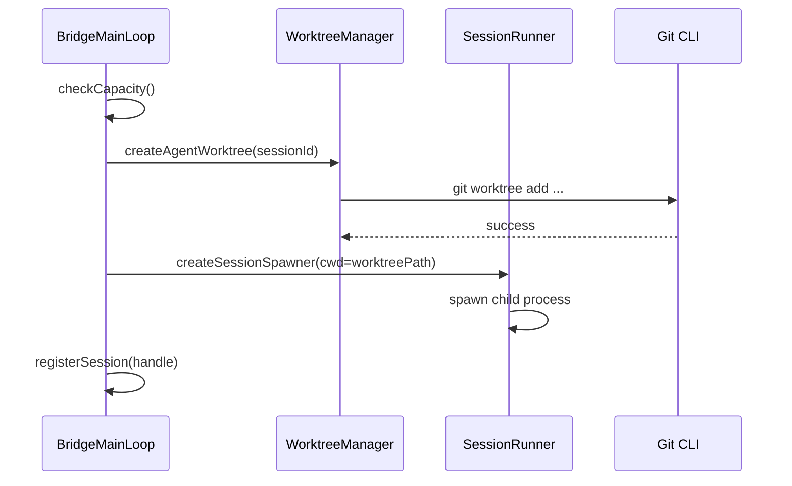

# Bridge Mode 深度分析 — 多会话与 Worktree

> **Source Commit**: `4b9d30f`
> **分析日期**: 2026-04-04
> **复杂度等级**: S-Tier
> **涉及文件数**: 5
> **相关 Feature Flags**: `tengu_bridge_mode_enabled`（及相关 flags）

## 概述

Bridge Mode 的多会话子系统是 Standalone 模式下实现高并发、强隔离执行环境的核心。它通过一套精密的会话注册表（Session Registry）和生成决策（Spawn Decision）机制，支持在同一台远端机器上并行运行多个独立的 Claude Code 实例。为了解决多会话并发修改同一代码库带来的冲突问题，该系统深度集成了 Git Worktree 技术，为每个会话提供独立的文件系统视图。通过 PID 追踪、超时看门狗（Timeout Watchdog）以及统一的异步清理链路，Bridge Mode 确保了会话生命周期的全闭环管理，在提升资源利用率的同时，保障了开发环境的整洁与安全。

## 架构图

多会话管理架构展示了从任务分发到会话销毁的完整生命周期，以及 Worktree 的隔离策略。



### 会话启动时序



## 核心文件清单

| 文件路径 | 行数 | 职责 |
|---|---:|---|
| `src/bridge/bridgeMain.ts` | 2999 | 多会话调度、并发控制、Worktree 生命周期协调 |
| `src/bridge/sessionRunner.ts` | 550 | 子进程管理、PID 追踪、信号处理（SIGINT/SIGKILL） |
| `src/bridge/types.ts` | 262 | SpawnMode、SessionHandle 等核心类型契约定义 |
| `src/utils/worktree.ts` | 350 | Git Worktree 的创建、删除与路径计算实现 |
| `src/bridge/bridgeEnabled.ts` | 150 | 多会话能力的 Feature Flag 门控判定 |

## 启动与初始化流程

多会话系统的行为由启动参数和环境配置共同决定：

1. **参数解析**：`bridgeMain.ts:parseArgs (L1737)` 解析 `--spawn`（会话模式）、`--capacity`（最大并发数）和 `--continue`（恢复模式）。
2. **模式决策**：系统在 `bridgeMain (L2278)` 中根据用户输入和 Feature Flag 计算最终的 `SpawnMode`（`single-session`, `same-dir`, `worktree`）。
3. **预创建会话**：为了降低首次交互延迟，系统支持 `preCreateSession (L2314)` 逻辑，在空闲时提前准备好执行环境。

## 运行时行为

### 1. 并发控制与调度
在 `bridgeMain.ts:runBridgeLoop` 中，系统通过 `activeSessions.size >= config.maxSessions` 进行容量判定。当达到上限时，系统进入 `heartbeat-only` 模式，仅维持现有会话活性，不再拉取新任务。

### 2. Worktree 隔离机制
当 `SpawnMode` 为 `worktree` 时，系统会为每个新会话调用 `createAgentWorktree`。该操作会在 `.git/worktrees/` 下创建一个独立的索引，并将文件检出到临时目录。这确保了 Agent A 的修改不会干扰 Agent B 的运行，且所有修改最终可通过 Git 流程合并。

### 3. 会话恢复 (Resume)
通过 `--continue` 参数，系统可以跨 Worktree 查找之前的会话指针（Pointer）。在 `bridgeMain.ts (L2141)` 中，系统会扫描已知的 Worktree 路径，尝试恢复之前的执行上下文。

## Feature Flag 门控

多会话功能受以下 Flag 严格控制，详情参考 [Feature Flag 架构文档](../infra/20-feature-flag-arch.md)。

- **`tengu_ccr_bridge_multi_session`**：主开关，决定是否允许 Standalone Bridge 开启多会话能力。
- **`KAIROS`**：影响 `--continue` 和 `--session-id` 的可用性，确保长时运行模式下的会话一致性。

## 关键代码片段

### 1. 会话容量判定
```typescript
// src/bridge/bridgeMain.ts (L639-L650)
const atCapacity = activeSessions.size >= config.maxSessions;
if (atCapacity) {
  await heartbeatActiveWorkItems(); // 仅保活
  await sleep(config.pollInterval);
  continue;
}
```

### 2. Worktree 创建与绑定
```typescript
// src/bridge/bridgeMain.ts (L977-L995)
if (spawnModeAtDecision === 'worktree') {
  const worktreePath = await createAgentWorktree(sessionId);
  trackCleanup(() => removeAgentWorktree(worktreePath)); // 注册自动清理
  spawnOptions.cwd = worktreePath;
}
```

### 3. 超时看门狗
```typescript
// src/bridge/bridgeMain.ts (L1678-L1690)
function onSessionTimeout(sessionId: string) {
  const handle = activeSessions.get(sessionId);
  if (handle) {
    timedOutSessions.add(sessionId);
    handle.stop('timeout'); // 触发优雅退出
  }
}
```

## 状态管理

多会话系统维护了一组复杂的内存映射：
- **`activeSessions`**：存储 `SessionHandle`，是会话控制的唯一入口。
- **`sessionStartTimes`**：用于计算会话时长及触发超时。
- **`pendingCleanups`**：在 `trackCleanup (L318)` 中维护，确保在进程退出或会话结束时，异步的 Worktree 删除操作能被可靠执行。

## 安全与权限模型

1. **文件系统隔离**：Worktree 模式提供了物理级别的目录隔离，防止 Agent 误删或误改非本会话相关的文件。
2. **输入校验**：会话 ID 经过 `safeFilenameId` 处理，确保生成的 Worktree 路径不包含非法字符或路径穿越攻击载荷。
3. **僵尸进程防护**：`sessionRunner.ts` 在 `SIGINT` 时会执行两阶段清理：先发送 `SIGTERM` 尝试优雅退出，若超时则强制 `SIGKILL`。

## 与其他功能的交互

- **与 Git 系统**：深度依赖 Git CLI 进行 Worktree 管理，若环境无 Git，系统会自动降级为 `same-dir` 模式。
- **与归档系统**：会话结束时，系统会触发 `archive` 操作，将 Worktree 中的变更（如有）及转录内容同步至主会话记录。

## 错误处理与恢复

- **Spawn 失败清理**：如果子进程启动失败，系统会立即触发 `pendingCleanups` 中的回调，确保不会留下孤立的 Worktree 目录。
- **重连状态同步**：当 Bridge 意外断开并重连时，系统会通过 `sessionWorkIds` 重新关联正在运行的子进程，避免重复启动。

## UI/UX

- **多会话状态行**：`updateStatusDisplay (L372)` 会实时显示当前活跃会话数（如 `[2/5 sessions active]`）。
- **模式选择对话框**：在首次启动且未指定模式时，系统会弹出交互式菜单，允许用户在 `same-dir` 和 `worktree` 间做出选择。

## 限制与已知问题

- **Worktree 性能开销**：在大型仓库中，频繁创建/删除 Worktree 可能带来显著的磁盘 IO 和 Git 索引锁定开销。
- **非 Git 项目限制**：在非 Git 管理的项目中，Worktree 模式不可用，多会话并发安全性降低。

## 技术亮点

1. **原子化 Spawn 决策**：通过先捕获 `spawnModeAtDecision` 再执行异步操作，规避了运行时配置切换导致的统计不一致问题。
2. **收敛的清理链路**：通过 `pendingCleanups` 统一管理所有副作用，确保了即使在异常崩溃场景下也能最大程度恢复环境。
3. **Heartbeat-Wake 机制**：在达到容量上限时通过心跳维持活性，并在会话释放时立即唤醒轮询，实现了高吞吐与低延迟的平衡。
